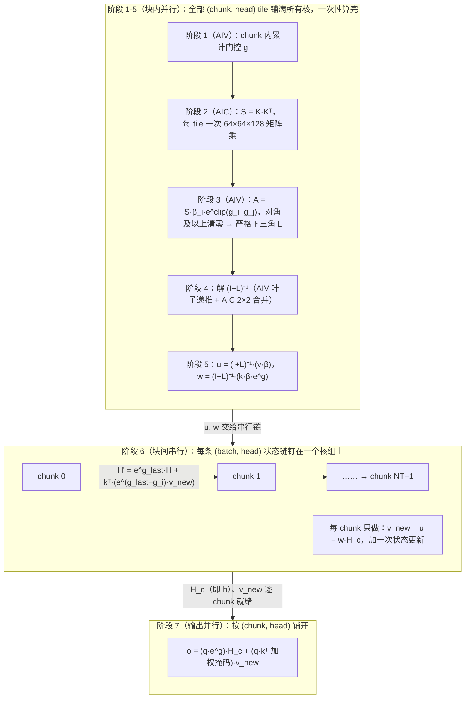
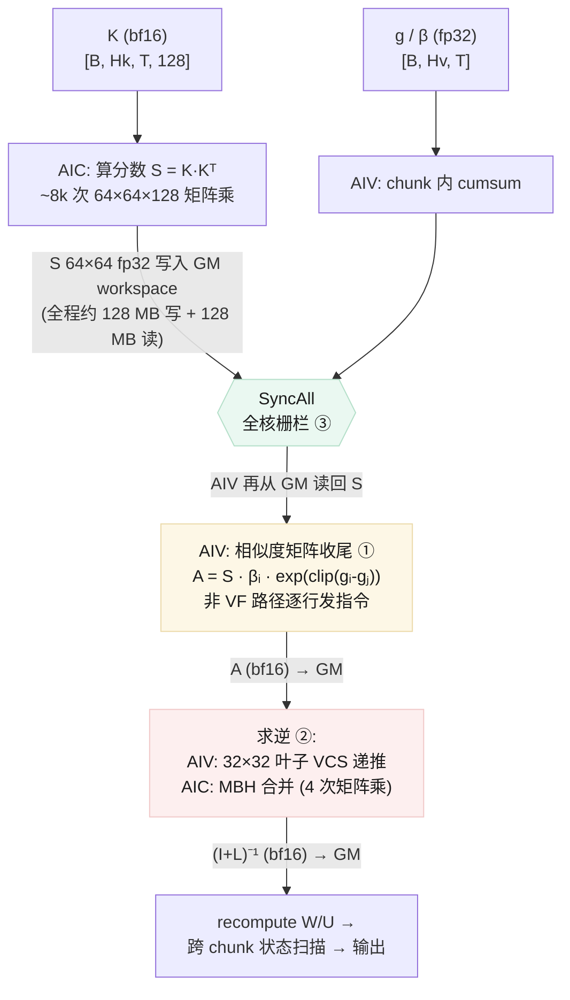

# GDN 算子「矩阵求逆」与「相似度矩阵计算」优化空间评审

**一句话结论：两处都有明确可拿的优化空间。** 相似度矩阵一侧，融合版 kernel 的收尾（epilogue）退回到了「逐行发指令 + 逐行插同步」的旧写法，而更快的两版写法（整块乘 + 掩码清零、VF 寄存器版）代码库里都有，移植即可；求逆一侧，合并阶段的 4 次矩阵乘里有 2 次其实是在「用乘法搬数据」，砍掉后该阶段计算量直接减半；此外相似度分数的 GM 往返与全核栅栏是最值得实测验证的结构性机会。

以下所有分析针对 `flash-linear-attention-npu` 仓库的 `fla/ops/ascendc/gdn/` 目录，重点覆盖 Ascend 950（arch35）主力路径，兼述 Atlas A2（arch22）路径。

---

## 1. 前置原理：块内并行 & 块间串行

### 1.1 GDN 在算什么：token 级天然串行

GDN（gated delta net）的每个 (batch, head) 维护一张「记忆矩阵」 $H$ （形状 $K \times V$ ，本文口径 128×128），从左到右逐 token 读序列、每读一个就更新一次：

$$H_t = e^{g_t - g_{t-1}} \left( I - \beta_t k_t k_t^{\mathsf T} \right) H_{t-1} + \beta_t k_t v_t^{\mathsf T}, \qquad o_t = q_t^{\mathsf T} H_t$$

三个动作，每个 token 一步：

- **遗忘**： $e^{g_t - g_{t-1}}$ 是 token $t$ 的单步衰减系数（ $g$ 是门控增量的累计和，代码按 chunk 内累计，chunk 起点 $g = 0$ ）；
- **delta 修正**： $\left( I - \beta_t k_t k_t^{\mathsf T} \right) H_{t-1}$ 把旧记忆里「与 $k_t$ 同向的成分」按强度 $\beta_t$ 擦掉——这是 delta rule 名字的由来；
- **写入**： $\beta_t k_t v_t^{\mathsf T}$ 把当前 token 的键值对写进记忆。

$H_t$ 依赖 $H_{t-1}$ ，这是网络的本性：**token 级天然串行**。（状态矩阵记 $H$ 而非 $S$ ，是为了不与后文的分数矩阵 $S$ 撞名； $H_t$ 是 token 粒度、 $H_c$ 是 chunk 粒度，两者是同一矩阵在不同时刻的采样。）

### 1.2 chunk 化：把块内串行折叠成矩阵算子

把序列切成 $NT$ 个 chunk（本文口径 $BT = 64$ 个 token 一块）后，GDN 的 chunk 化做法是：**块内 64 步串行的「遗忘 × 修正 × 写入」互相纠缠，全部效果可以解析地浓缩为一个 64×64 严格下三角矩阵**

$$L_{ij} = \beta_i \, e^{g_i - g_j} \, k_i^{\mathsf T} k_j \qquad (i > j)$$

它正是求逆阶段所解的 $\left( I + L \right)^{-1}$ 中的 $L$ 。有了 $\left( I + L \right)^{-1}$ ，块内所有中间量都能用几个 64×64 矩阵算子一次得到：

$$u = \left( I + L \right)^{-1} \left( v \cdot \beta \right), \qquad w = \left( I + L \right)^{-1} \left( k \cdot \beta \cdot e^{g} \right), \qquad v_{new} = u - w \cdot H_c$$

其中 $H_c$ 是进入 chunk $c$ 时的记忆。64 个 token 的耦合被这一个三角方程解掉，块内完全并行。块与块之间只剩一条**线性递推**：

$$H_{c+1} = e^{g_{last}} \cdot H_c + \sum_i k_i \left( e^{g_{last} - g_i} \cdot v_{new,i} \right)^{\mathsf T}$$

只能逐 chunk 串行。但不同 (batch, head) 的状态链彼此独立，可以一链钉在一个核组上、链与链铺满所有核并行跑。这就是「**块内并行 & 块间串行**」。代码还做了一个重要的排布决定：所有能并行的阶段（阶段 1-5）针对**全部** chunk 一次性算完，真正串行的阶段 6 每 chunk 只剩三次小矩阵乘加一次状态更新——串行段被压到了最短。

图 1 是这条原理在代码里的执行结构（阶段编号与 §1.3 对照表一致）：

*图 1：GDN 前向的「块内并行 & 块间串行」执行结构（arch35 融合版）。阶段 1-5 对所有 chunk 一次并行算完；阶段 6 是唯一的串行段，逐 chunk 推进状态；阶段 7 消费串行链的产出并行算输出。*

### 1.3 原理-代码对照

下表把 §1.1/§1.2 的每一条原理钉到代码上。表中路径省略公共前缀 `fla/ops/ascendc/gdn/chunk_gdn_fwd/`（仓库根为 `flash-linear-attention-npu/`），行号已逐一回读核对；「AIC/AIV」指昇腾 Cube 核 / Vector 核。

| 原理 | 代码落点（路径省略公共前缀） | 对应关系 |
| --- | --- | --- |
| 切块 $NT = \lceil T / BT \rceil$ | `chunk_gated_delta_rule_fwd/op_kernel/internal/arch35/chunk_gated_delta_rule_fwd_arch35.cpp:133-134`（`BT`/`NT` 写入 device tiling） | host 算好切块参数下发，kernel 按 tile 分派 |
| 阶段 1：chunk 内累计门控 $g$（AIV） | `chunk_gated_delta_rule_fwd_arch35.cpp:12-14`（融合内嵌 `chunk_local_cumsum` 实现）；独立算子 `chunk_local_cumsum/` | 公式 $e^{g_i - g_j}$ 里的 $g$；输出 `gCumsumOut` 即「chunk 内门控累加结果」 |
| 阶段 2：块内分数 $S = K \cdot K^{\mathsf T}$（AIC） | `chunk_gated_delta_rule_fwd_arch35.cpp:350-353`；key-head 间算一次、同组 value head 复用见 `chunk_gated_delta_rule_fwd/op_kernel/internal/coefficient_generation/chunk_gated_delta_rule_kkt_cube.h:279-284` | $L_{ij}$ 中的 $k_i^{\mathsf T} k_j$ ；每个 (chunk, key-head) 一次 64×64×128 Mmad |
| 阶段 3：门控收尾 $A = S \cdot \beta_i \cdot e^{\mathrm{clip}(g_i - g_j)}$，对角及以上清零（AIV） | `chunk_gated_delta_rule_fwd/op_kernel/internal/coefficient_generation/chunk_gated_delta_rule_cumsum_kkt.h:539-544`（行广播 $g_i$ 做差）、`:548-561`（clip ±50 + Exp）、`:564-569`（广播行 $\beta_i$ 相乘）、`:581-586`（只算行前缀 $j < i$，对角及以上为 0） | **逐项构造出 $L$** ： $L_{ij} = \beta_i e^{g_i - g_j} k_i^{\mathsf T} k_j$ （ $i > j$ ），与 §1.2 公式完全一致 |
| 阶段 4：解 $\left( I + L \right)^{-1}$（AIV 叶子递推 + AIC 2×2 合并） | `solve_tri/op_kernel/arch35/solve_tri_ascend950_64.h`（结构与浪费分析见 §3） | 64 步串行 delta 修正的解析解；这就是「矩阵求逆」问题的本体 |
| 阶段 5：WY 系数 $u$ 与 $w$ | 公式：`recompute_w_u_fwd/README.md:17-21`（`u = A @ vb`、`w = A @ kbg_exp`，A 即阶段 4 输出）；调用：`chunk_gated_delta_rule_fwd_arch35.cpp:425-437` | $u = \left( I + L \right)^{-1} \left( v \cdot \beta \right)$ 、 $w = \left( I + L \right)^{-1} \left( k \cdot \beta \cdot e^{g} \right)$ ，块内串行被打包进这两个矩阵乘 |
| 阶段 6：块间串行状态递推 | 公式：`chunk_fwd_h/README.md:34-53`（`V_new = U − W@H`、`R_{c+1} = E(g_last)·R_c + D_c`、`D_c = kᵀ@V_new_g`）；kernel：`chunk_gated_delta_rule_fwd/op_kernel/internal/operators/chunk_gated_delta_rule_fwd_h/op_kernel/arch35/gemm/kernel/gdn_fwd_h_kernel.hpp:677-679`（Cube 侧 `C1: v_work = w @ h[i]` 等 stage）、`:984-992`（状态驻留 UB ping-pong 槽跨 chunk 复用） | $v_{new} = u - w \cdot H_c$ 与 $H_{c+1} = e^{g_{last}} \cdot H_c + \sum_i k_i \left( e^{g_{last} - g_i} \cdot v_{new,i} \right)^{\mathsf T}$ 的逐字实现（README 内部名 `R_c` 即本文 $H_c$ ，落盘张量名 `h`） |
| 串行性的实现证据：每核组认领 $B \times H_v$ 条链，链内 chunk 逐个推进 | `chunk_gated_delta_rule_fwd/op_kernel/internal/operators/chunk_gated_delta_rule_fwd_h/op_kernel/arch35/gemm/block/block_scheduler_gdn_fwd_h.hpp:213-231`（`taskNum = batch * vNumHead`、`taskStride` 跨核步进、`stream.chunkIdx = 0` 起步） | 串行被限制在单条链内；链间 (batch, head) 互相独立、跨核并行 |
| 每 chunk 状态一算完立即发布 | `gdn_fwd_h_kernel.hpp:325-341`（`SignalChunkReady` 按 (batch, chunk, head) 发布 ready flag） | 让输出阶段不必等整条链走完 |
| 阶段 7：输出 = 块间 + 块内 | 公式：`chunk_fwd_o/README.md:13-14`（`q * exp(g) @ h` + `(q @ k^T * mask) @ v`）；块内 $v$ 在链路里接的就是 $v_{new}$ ：`chunk_gated_delta_rule_fwd_arch35.cpp:463-464`（`DispatchFwdO` 传 `vNew`） | $o = \left( q \cdot e^{g} \right) \cdot H_c + \left( q \cdot k^{\mathsf T} \ \text{加权掩码} \right) \cdot v_{new}$ |
| H/O 生产者-消费者流水（满足条件时启用） | `chunk_gated_delta_rule_fwd_arch35.cpp:110-117`（`producerGroups`/`consumerGroups` 划分）、`:442-469`（`DispatchFwdH` → 视条件 `SyncAll` → `DispatchFwdO`） | 串行链（生产者核组）与输出（消费者核组）重叠执行 |
| 六阶段等价公开算子链（精度标杆） | `chunk_gated_delta_rule_fwd/README.md:13-20`（1. Cumsum → 2. Kkt → 3. SolveTri → 4. RecomputeWU → 5. FwdH → 6. FwdO） | 融合 kernel 内部等价实现同一原理，公开链只作 ATK 对拍基准 |

本节及全文符号的物理含义与取值口径，统一见 §2 的符号表。

---

## 2. 先把两个问题放进整条链路里

GDN（gated delta net）前向被切成固定大小的 chunk（本文口径 `BT = 64` 个 token 一块）。每个 chunk 内部要做三件事，其中前两件正是用户问的两个问题：

1. **算相似度矩阵 S = K·Kᵀ 再收尾成 A**（对应独立算子 `ChunkScaledDotKkt`，以及融合 kernel 里的同名组件）——问「相似度矩阵的计算步骤」指的就是它；
2. **对 A 做求逆，得到 (I + L)⁻¹**（对应独立算子 `SolveTri`，以及融合 kernel 的 solve 阶段）——问「矩阵求逆」指的是它。数学上 A 经过 UT 变换后是单位下三角矩阵的搭档，求逆等价于解一个块内三角方程；
3. 用求逆结果重算中间量 W/U，再做跨 chunk 的状态扫描（本报告不覆盖）。

图 2 是当前代码（arch35 融合版，Phase6）的实际数据流，**①②③ 就是后文的三条优化点**：

*图 2：GDN 前向 Phase6 中两个被评审环节的数据流（arch35 融合版）。黄色格 = 优化点 ①，红色格 = 优化点 ②，绿色格 = 优化点 ③。*

### 符号表

| 符号 | 全称 | 物理含义 | 本文口径取值 |
| --- | --- | --- | --- |
| $B$ | batch | 序列条数 | 1 |
| $T$ | 序列长度 | 一条序列的 token 数 | 32768 |
| $NT$ | chunk 数 | $T / BT$，序列被切成多少块 | 512 |
| $BT$ | chunk size | 一个 chunk 的 token 数，也是块内方阵的边长 | 64 |
| $H_k$ / $H_v$ | head 数 | k 的 head 数 / v 的 head 数，可以不同（GQA 式） | 各 16 |
| $K$ | key head dim | 单个 k head 的维数，即内积被收缩的维度 | 128 |
| $S$ | 分数矩阵 | $S = K \cdot K^{\mathsf T}$，形状 $[BT, BT]$ fp32 | 64×64 |
| $g, \beta$ | 门控量 | 每个token一个标量：衰减累积量、写入强度，形状 $[B, H_v, T]$ fp32 | — |
| $A$ | 相似度矩阵成品 | $A_{ij} = S_{ij} \cdot \beta_i \cdot \exp(\mathrm{clip}(g_i - g_j))$，下三角 | 64×64 |
| $L$ / $(I+L)^{-1}$ | 块内求逆对象 | $A$ 经 UT 变换后的单位下三角矩阵及其逆 | 64×64 |
| $q, k, v$ | query / key / value 向量 | token 的三个输入向量；小写 $k_t$ 是 token $t$ 的 key 向量，与大写 $K$（head 维数）区分 | $[K]$ / $[K]$ / $[V]$，均 128 |
| $H$ | 状态（记忆）矩阵 | GDN 逐 token 更新的记忆，形状 $[K,V]$； $H_t$ 为 token 粒度、 $H_c$ 为 chunk 粒度，代码里 `ChunkFwdH` 的 `R_c`、逐 chunk 落盘的 `h` 张量 | 128×128 |
| $v_{new}$ | delta 修正后的 value | $v_{new} = u - w \cdot H_c$，块内并行算出，供状态递推与输出共用 | $[BT, V]$ |
| $u, w$ | WY 系数 | $u = \left( I+L \right)^{-1} \left( v \cdot \beta \right)$ 与 $w = \left( I+L \right)^{-1} \left( k \cdot \beta \cdot e^{g} \right)$，把块内 64 步串行修正打包成矩阵乘（§1.2 阶段 5） | $[BT,V]$ / $[BT,K]$ |
| Mmad | Matrix Multiply and Add | 昇腾 Cube 单元的矩阵乘累加指令 | — |
| VCS / MBH | 求逆的两级算法 | 叶子级逐元素递推求逆 / 块级 2×2 合并（见 §3.1） | — |
| GM / UB / L1 / L0 | 存储层级 | 全局内存 / 统一缓冲 / Cube 侧一级缓存 / Matrix 单元私有缓存 | — |

### 代码出处基准

下文引用一律写「仓库内完整相对路径 + 行号」，仓库根为 `flash-linear-attention-npu/`。涉及三个主角文件（同名不同路径的文件在本工程里大量存在，只写文件名必然指错）：

- 融合版相似度矩阵组件：`fla/ops/ascendc/gdn/chunk_gdn_fwd/chunk_gated_delta_rule_fwd/op_kernel/internal/coefficient_generation/chunk_gated_delta_rule_cumsum_kkt.h`（下称「融合版 KKT」）；
- 独立求逆算子（arch35）：`fla/ops/ascendc/gdn/chunk_gdn_fwd/solve_tri/op_kernel/arch35/solve_tri_ascend950_64.h`（下称「A5 求逆」）；
- 独立求逆算子（arch22）：`fla/ops/ascendc/gdn/chunk_gdn_fwd/solve_tri/op_kernel/solve_tri_cube.h`（下称「A2 求逆」）。

---

## 3. 问题一：矩阵求逆算法高效吗？

**回答：算法选型本身是合理的、有取舍的；但实现里有一块明晃晃的浪费——合并阶段的 4 次矩阵乘里有 2 次不是在算数学，而是在「用矩阵乘搬运数据」。**

### 3.1 现状：求逆是怎么做的（讲人话版）

64×64 的三角矩阵求逆分两级（见 A5 求逆头部注释 `solve_tri_ascend950_64.h:10-31`）：

**第一级（叶子）**：AIV 用 VF 标量单元做 32×32 块的逐元素递推——第 1 行直接可得，第 2 行要用第 1 行的结果，第 3 行要用前两行的……像剥洋葱一样从上往下剥。这一步本质是串行的（31 步依赖链），`MulReduceScatterVF32`（`solve_tri_ascend950_common.h:161-194`）把两个 32×32 叶子打包成 32×64 一起算，已是缓解后的形态。**串行不等于低效**：每步只做 32 个元素的乘加归约，VF 单元干这个正合适。

**第二级（合并，MBH）**：两个 32×32 的逆拼成 64×64 的逆，用 2×2 分块公式：

$$Y = I + X \cdot (-A_{21}), \qquad Out = X + Y \cdot A_{12}$$

其中 $X$ 是对角块逆拼成的块对角阵， $A_{21}$、 $A_{12}$ 是原矩阵的下三角块。AIC 上对应 4 次 Mmad（`MbhLevelAic`，`solve_tri_ascend950_64.h:492-512`）。

### 3.2 浪费在哪：两次「假乘法」

把 `MbhLevelAic` 的 4 次 Mmad 逐一对照公式（行号引自 A5 求逆）：

| 行号 | 指令 | 算的是什么 | 性质 |
| --- | --- | --- | --- |
| `:496` | `MbhMatmulToL0C(l1_I, l1_I, …, true)` | $I \cdot I = I$ | **搬运**：为了让 L0C 里出现「初值 = 单位阵」，专门做了一次 64×64×64 的矩阵乘 |
| `:497` | `MbhMatmulToL0C(l1_X, l1_MNEG, …, false)` | $X \cdot (-A_{21})$ | 真计算 |
| `:504` | `MbhMatmulToL0C(l1_I, l1_X, …, true)` | $I \cdot X = X$ | **搬运**：为了往 L0C 里加 $X$，又是乘一遍单位阵 |
| `:505` | `MbhMatmulToL0C(l1_Y, l1_INPUT, …, false)` | $Y \cdot A_{12}$ | 真计算 |

打个比方：为了往黑板上写一个常数 1，专门开动了一台印刷机印满整页。**4 次矩阵乘里一半的算力花在了「把加法伪装成乘法」上**——因为 Mmad 的累加器 L0C 没有「从 L1 直接装载数据」的指令，只能先乘个单位阵把数据「抬」进去，再靠累加模式把真正的结果加上去。

这不是 arch35 独有的习惯，A2 求逆的 `RecursiveMerge` 里同样是这个模式（`solve_tri_cube.h:991` 的 `MatmulToL0C(SLOT_I, SLOT_I, true)`、`:1030-1038` 的用 $I \cdot \text{driving}$ 把 driving 块加进 L0C；MCH 迭代里 `:896-899` 的 $X \cdot I$ 同理）。

这个浪费的量级值得注意：单次 $64^3$ 的 Mmad 看似不大，但它是**每个 chunk × 每个 head 都要来一遍**的。按本文口径（ $B{=}1, T{=}32768, H_v{=}16, BT{=}64$，共 8192 个 tile）静态估算：MBH 阶段全程 $8192 \times 4 \times 64^3 \approx 8.6$ GMAC，其中搬运型的 $8192 \times 2 \times 64^3 \approx 4.3$ GMAC——**恰好等于整个相似度矩阵 $K \cdot K^{\mathsf T}$ 的计算量**（ $512 \times 16 \times 64 \times 64 \times 128 \approx 4.3$ GMAC）。也就是说，求逆合并阶段浪费的那一半算力，够把相似度分数重新算一遍。（静态估算，落地前必须实测占比。）

### 3.3 顺带一提：A2 路径的 MCH 级数是「聪明的算法、粗放的实施」

arch22 上 BT=64 走的是 FP32 版 `SolveTriCubeFp32`（`solve_tri.cpp:96-98`），16/32/128 走 `SolveTriCube`，其算法是 MCH 级数迭代： $X \leftarrow X + X \cdot Y$， $Y \leftarrow Y^2$，迭代 3 次（`solve_tri_cube.h:858`）。MCH 级数迭代数学上很漂亮——对 16×16 的严格下三角阵， $A^{16} = 0$，3 次平方迭代恰好覆盖到 $A^{15}$，**级数是精确的而非近似的**。但实施上它把「块对角矩阵的乘法」当稠密矩阵乘： $D^2$ 只需 4 次 16×16×16 的小乘，现在做的是一次 64×64×64 全量乘（16 倍冗余）。若现网主力已是 arch35（VCS+MBH 路线天然没有这个问题），这条留作 A2 维护项即可。

---

## 4. 问题二：相似度矩阵的计算步骤有更优解吗？

**回答：计算步骤的骨架（AIC 算分数 + AIV 收尾）是对的；但收尾的指令形态和数据流转方式都有现成的更优解，而且其中一个更快版本的代码就在同一个仓库里。**

### 4.1 现状：三步走

以融合版（Phase6 主路径）为准（`chunk_gated_delta_rule_fwd_arch35.cpp:350-373`）：

1. **AIC 算分数**：每个 (chunk, key-head) 做一次 64×64×128 的 Mmad， $S = K \cdot K^{\mathsf T}$，fp32 结果写入 GM workspace（`:350-353`）。分数只按 key head 算一次、fan-out 给同组的 value head 复用（`chunk_gated_delta_rule_kkt_cube.h:279-284` 的注释写明了这个正确的去重设计）；
2. **全核栅栏** `SyncAll`（`:362`），等 AIV 侧的 cumsum 和 AIC 侧的全部分数都落盘；
3. **AIV 收尾**（`chunk_gated_delta_rule_cumsum_kkt.h:392-402` 的 `ProcessEpilogueForSolve`）：从 GM 把 $S$ 读回 UB，逐块算门控 $g_i - g_j$ 的差、截断、指数、乘 $\beta_i$、乘 $S$、把对角及以上清零，cast 成 bf16 写 GM。

### 4.2 浪费在哪（一）：收尾的「逐行指令流」

融合版收尾有一个关键分支：**只有 `BT==64 && btAlign==64 && valid==64` 的整块才走 VF 寄存器版**（`chunk_gated_delta_rule_cumsum_kkt.h:267-287`），其余情况——包括所有尾块、变长序列的短块、arch22 全部——都回落到老的逐行路径。

逐行路径慢在形态（行号引自融合版 KKT）：

- `ComputeEpilogueRow`（`:574-589`）：**每行发 4 条指令**——`Duplicate` 清一行（`:581`）+ `PipeBarrier`（`:582`）+ 变长的 `Mul`（`:586`）+ `PipeBarrier`（`:587`）。BT=64 就是 64 行 × 4 ≈ 256 条指令，其中 128 个是同步屏障；实际有效数据只有下三角约 2016 个元素，**指令数是有效元素数的上百倍**；
- `ComputeGateBlock`（`:548-562`）：截断和指数也是逐行发（三个 `for lane` 循环，每行一条 `Maxs`/`Mins`/`Exp`）；
- 逐行 `Mul` 之间各行写的是**互不相交**的行，行与行之间本无依赖，`PipeBarrier` 是被「逐行发指令」这个形态绑架出来的过度同步。

而更快的两版写法都现成存在：

- **整块乘 + 掩码清零**（独立算子的 A2 路径，`chunk_scaled_dot_kkt/op_kernel/chunk_scaled_dot_kkt.h:595-656`）：先一条 `Mul` 乘完整块（`:630`），再逐行只做一次带掩码的 `Duplicate` 清零（`:635-646`），并且利用「行内 32 字节块互不相交」的特性**免掉行间屏障**（`:632-634` 注释写明了这一点）；
- **VF 寄存器版**（`chunk_gated_delta_rule_kkt_vector.h:40-106`）：寄存器内一行 64 元素一次算完，掩码清零也在寄存器里做（`:95-102`），全程无逐行屏障。

也就是说，融合版在合入时丢掉了独立版已经做完的向量化优化，只在「最标准的形状」上开了快车道。

### 4.3 浪费在哪（二）：分数的 GM 往返 + 全核栅栏

AIC 辛苦算出的 $S$ 必须先写 GM、AIV 再从 GM 读回来——每个 tile 16 KB 写 + 16 KB 读，全程约 256 MB 的纯中转流量。这本身是 Cube→Vector 交接的常规代价；真正的问题是在融合版里，这个交接被 **`SyncAll` 全核栅栏**焊死成了「两段批处理」：所有 AIC 把全部分数算完 → 全体核到齐 → 才有第一个 AIV 开始收尾。生产者和消费者之间没有任何流水重叠。

独立版算子**没有这个问题**：它的 `ProcessAicCatlassImpl`（`chunk_scaled_dot_kkt.h:414-484`）用 3 个 workspace slot + `scoreReadyFlag`/`scoreDoneFlag` 配对 flag 做了生产者-消费者流水——AIV 消费上一个 slot 的同时，AIC 已经在算下一组（`:442-445` 只在 slot 轮转回来时才等）。融合版为什么退回 `SyncAll`？`chunk_gated_delta_rule_fwd_arch35.cpp:358-361` 的注释给了答案：因为 cumsum 和 epilogue 的 AIV 任务映射不同，epilogue 可能消费**别的核**写的 cumsum tile，只能全核栅栏保证可见性。**但分数不需要这个强度的保证**：分数是 AIC 产的，epilogue 的任务划分恰好按配对核分派（`ProcessEpilogueForSolve` 用 `GetBlockIdx()/subBlockNum` 对齐 `tilesPerCore`，与 AIC 的 `kktCube.Process` 同一套划分，见 `chunk_gated_delta_rule_kkt_cube.h:116-129` 与 `chunk_gated_delta_rule_cumsum_kkt.h:379-390`），配对核内一对 flag 就够。栅栏只需要保护 cumsum。

---

## 5. 三条优化点（按「收益 ÷ 改动量」从高到低）

### 优化点 ①：把收尾的向量化快车道补齐（对应图 2 黄色格）

- **原理**：如 §4.2，非 VF 路径的指令数是有效数据量的上百倍，一半以上是同步屏障。独立版 A2 的「整块乘 + 掩码清零」和 VF 寄存器版都已在仓库里跑通，不存在算法风险。
- **做法**：三件事，可独立落地——
  1. 把 VF 路径的准入条件（`chunk_gated_delta_rule_cumsum_kkt.h:268-270`）从 `valid == 64` 放宽到尾块：VF 版内部本来就处理了 `validCols` 掩码（`chunk_gated_delta_rule_kkt_vector.h:99-102`），外层条件是保守写死的；
  2. 非 VF 回退路径回移独立版的「整块 `Mul` + 行内掩码 `Duplicate`、免行间屏障」形态（对照 `chunk_scaled_dot_kkt.h:630-646`）；
  3. `ComputeGateBlock` 的截断/指数从三个逐行循环改成整块指令（对照独立版 `chunk_scaled_dot_kkt.h:1082-1088` 的整块 `Maxs/Mins/Exp` 写法）。
- **预期收益**：收尾阶段的 AIV 指令数与屏障数各降数倍；尾块（变长序列场景）从最慢路径直接换到最快路径。**静态估算，落地前需实测该阶段在核内时间线的占比。**
- **门槛**：纯 kernel 内部改动，不动接口、不动同步结构；回归用现有 `chunk_scaled_dot_kkt/test/test.py` 与融合版精度对拍即可。

### 优化点 ②：砍掉求逆合并阶段的「搬运型矩阵乘」（对应图 2 红色格）

- **原理**：如 §3.2，`MbhLevelAic` 的 4 次 Mmad 中 `:496`（ $I \cdot I$）与 `:504`（ $I \cdot X$）是为「往累加器里放初值/加一项」而做的假乘法，占总 Mmad 数的一半。
- **做法**：两条路线任选其一——
  1. **k 维拼接**（改动半径小）： $Y = I + X \cdot (-A_{21})$ 写成一次 k=128 的 Mmad： $[X \mid I]_{64 \times 128} \cdot [[-A_{21}]; [I]]_{128 \times 64}$， $Out$ 同理拼 $[Y \mid X]$。L0A/L0B 各需 64×128 fp32（32 KB），arch35 的 L0A/L0B 容量可容纳，需核对与双缓冲布局的冲突。Mmad 从 4 次减为 2 次发射，串行依赖链减半；
  2. **加法挪到 AIV**（收益更彻底）：`X` 本来就是 AIV 算好后散上 L1 的（`solve_tri_ascend950_64.h:416-447` 的 `AivScatterLeavesToL1`），AIV 手里有现成数据。AIC 只算两次真乘法，结果 Fixpipe 落 UB，由配对 AIV 做两次向量加法。省的是实打实的 $2 \times 64^3$ MAC/tile，代价是每次 tile 多一对 CrossCore flag 交接。
  - arch22 的 `RecursiveMerge`（`solve_tri_cube.h:991`、`:1030-1038`）有同款问题，可同步修。
- **预期收益**：MBH 阶段 Mmad 次数与 MAC 数减半（路线 2）。按本文口径全程省约 4.3 GMAC——相当于整个相似度分数计算量。**静态估算**；该收益的体感取决于求逆阶段在核内的实际占比（参见分册经验：块内构造阶段约占关键路径两成），落地前先实测。
- **门槛**：路线 1 需核对 L0A/L0B 容量与现有双缓冲布局；路线 2 需引入一对 AIC↔AIV 交接 flag（`ENABLE_UB2L1` 的实测教训——「同步开销可能吃掉搬运节省」——在这里同样适用，见 §6）。可做成显式开关、可回退。

### 优化点 ③：把分数交接从「全核栅栏」改回「配对核流水」（对应图 2 绿色格）

- **原理**：如 §4.3，`SyncAll`（`chunk_gated_delta_rule_fwd_arch35.cpp:362`）把分数生产（AIC）与收尾消费（AIV）焊成两段批处理。栅栏的真实诉求是保护 cumsum 的跨核可见性，分数本身按配对核分派，用一对 flag 足够。
- **做法**：保留 cumsum 的栅栏语义（或改为逐 tile 的发布 flag），分数侧改用独立版已验证的 3-slot + ready/done flag 流水（`chunk_scaled_dot_kkt.h:414-484` 的形态），让 AIV 收尾与 AIC 后续分数计算重叠。
- **预期收益**：Phase6 前半段时间从「max(cumsum, 全部分数) + 全部收尾」压缩为「约 max(cumsum, 分数+收尾流水)」。收益上限取决于两个阶段各占多少——**占比未实测前不要动手**（判据：两段加起来低于该核关键路径四成就不值得做）。注意与优化点 ① 的累进关系：收尾被 ① 加速后，可被流水藏住的绝对时间变小，但重叠的比例收益依然成立。
- **门槛**：改动半径最大（任务映射 + 同步结构），且本类型已有「细粒度同步反而更慢」的前车之鉴（§6 的 `ENABLE_UB2L1`）。建议先在一对配对核上做小规模原型验证同步开销，再全局铺开。

### 汇总表

| 优先级 | 动作 | 位置（完整相对路径 + 行号） | 预期收益 | 门槛 | 怎么验 |
| --- | --- | --- | --- | --- | --- |
| 1 | 收尾向量化快车道补齐（VF 放宽准入 + 整块乘回移 + 截断/指数整块化） | `fla/ops/ascendc/gdn/chunk_gdn_fwd/chunk_gated_delta_rule_fwd/op_kernel/internal/coefficient_generation/chunk_gated_delta_rule_cumsum_kkt.h:268-270`、`:574-589`、`:548-562` | 收尾阶段指令数/屏障数降数倍 | 低，纯 kernel 内部 | 现有 test.py 对拍 + 单核 timeline 采样 |
| 2 | 求逆合并砍搬运型 Mmad（k 拼接或加法挪 AIV） | `fla/ops/ascendc/gdn/chunk_gdn_fwd/solve_tri/op_kernel/arch35/solve_tri_ascend950_64.h:496`、`:504`（arch22 同款：`solve_tri_cube.h:991`、`:1030-1038`） | MBH 阶段 Mmad 减半，全程约 4.3 GMAC | 中，需核对 L0 容量或加一对交接 flag | 求逆单算子 benchmark + 数值对拍 |
| 3 | 分数交接改配对核流水，SyncAll 只保 cumsum | `fla/ops/ascendc/gdn/chunk_gdn_fwd/chunk_gated_delta_rule_fwd/op_kernel/internal/arch35/chunk_gated_delta_rule_fwd_arch35.cpp:362`（参照 `chunk_scaled_dot_kkt.h:414-484`） | AIC/AIV 两阶段重叠 | 高，先实测占比 ≥ 40% 再动 | 先配对核原型，再全网格 |

---

## 6. 已评估、暂不做

- **逆矩阵用更大的块做级数展开（如 64×64 直接 MCH）**：历史实测否掉——FLOP ×8.4 且伤 ieee 精度，净负（经验分册记录，非本仓库注释）。
- **叶子级 VCS 递推并行化**：31 步依赖链本质串行，历史尝试引入数值误差与额外屏障，被否（经验分册记录）。
- **`ENABLE_UB2L1`（UB→L1 直连省 GM 往返）**：已实测否掉。源码原话在 `fla/ops/ascendc/gdn/chunk_gdn_fwd/chunk_fwd_o/op_kernel/arch35/gemm/kernel/gdn_fwd_o_kernel.hpp:97`：`ENABLE_UB2L1 = false; // accurate but slower (1.02x vs 1.09x l0c2ub-only): sync overhead exceeds the GM-roundtrip saving`。含义对优化点 ③ 同样是警示：细粒度同步的开销必须先小规模验证。
- **A2 路径 MCH 的块对角 16 倍 FLOP 冗余**（`solve_tri_cube.h:844-969`）：真实存在，但 arch35 已换 VCS+MBH 路线；若 A2 仍在现网服务，作为独立维护项，不进本次三条。
- **逐 tile 重搬 g/β 小向量**（`chunk_gated_delta_rule_cumsum_kkt.h:405-416`）：每次 256 B，量级 KB 级，收益≈0。
- **A5 求逆中非零 L0C→L1 仍绕 GM**（`solve_tri_ascend950_64.h:155-162` 的 `FixpipeL0cToL1`，头部注释 `:29` 明说「非零 L0C→L1 仍 ChannelSplit 绕 GM；全零 Fixpipe 直写 L1」，而 `:164-175` 的 `FixpipeZeroToL1` 证明直写通路硬件上存在）：值得追问为什么非零路径不能用——但大概率是 NZ 分型布局或 ChannelSplit 的硬件约束，属于需要硬件资料才能确认的方向，先挂账不动。

---

## 7. 不确定性说明

- 本文全部收益数字（4.3 GMAC、256 MB、指令数倍数）均为**静态估算**，基于 $B{=}1, T{=}32768, H_k{=}H_v{=}16, BT{=}64, K{=}128$ 口径；未做核内 timeline 采样。
- 优化点 ② 的收益上界成立条件是「MBH 阶段确实出现在核的关键路径上」；下界情况是求逆被其它阶段（状态扫描）完全遮蔽，此时只剩 Mmad 次数减半的边际收益。
- 优化点 ③ 的收益区间很宽：两段串行占比越高收益越大；若 AIC 分数阶段远快于 AIV 收尾（或反之），流水只能藏住短板那一段。
- 本仓库同时维护 arch22 与 arch35 两套 kernel，未确认现网各形态的实际混跑比例；涉及 arch22 的结论（§3.3）按「维护项」而非「主攻方向」对待。
