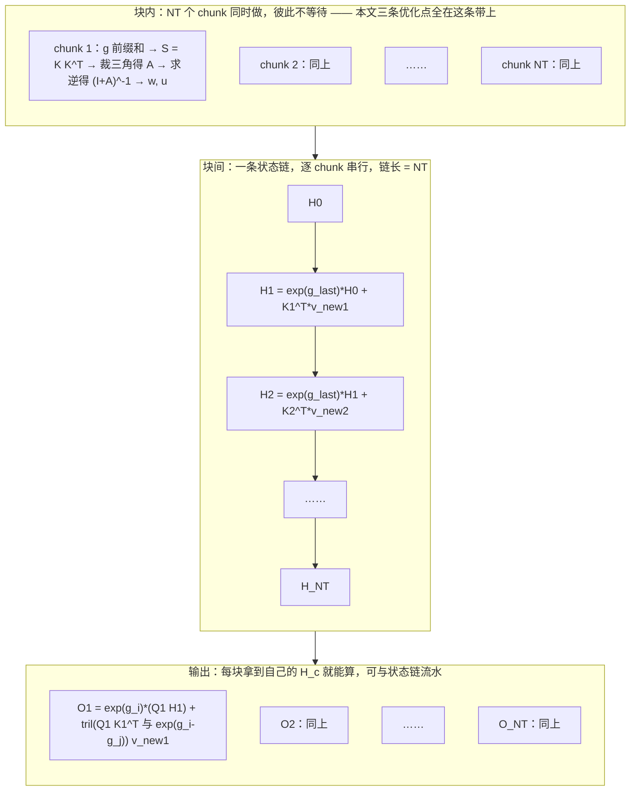
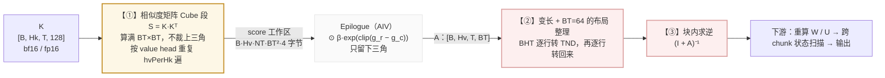

# GDN 算子评审：块内求逆（SolveTri）与相似度矩阵（KKT）

**代码出处基准**：本文所有行号均相对 `flash-linear-attention-npu/fla/ops/ascendc/gdn/`，主链为 `chunk_gdn_fwd/chunk_gated_delta_rule_fwd/`；独立算子为 `chunk_gdn_fwd/chunk_scaled_dot_kkt/` 与 `chunk_gdn_fwd/solve_tri/`。arch22 = Atlas A2（`__CCE_AICORE__ == 220`），arch35 = Ascend 950（`__CCE_AICORE__ == 310`）。

---

## 0. 原理：块内并行、块间串行

下面先用最朴素的方式把 GDN 的数学讲清楚：**从一个 token 的更新公式（ $H_{t-1} \to H_t$ ）讲起**，再说明这条逐 token 的串行链为什么可以被切成"块内并行 + 块间串行"。原理的每一步在第 0.5 节都有对应的代码位置。

### 0.1 一个 token 的递推（最原始的公式）

GDN 的全部记忆是一个矩阵 $H$，形状 $[K, V]$ —— $K$ 是 key 的维度（恒为 128）， $V$ 是 value 的维度（恒为 128）。第 $t$ 个 token 带来三个向量： $k_t$（key，长度 $K$）、 $v_t$（value，长度 $V$）、 $q_t$（query，长度 $K$）。

**先看不带门控的版本**，处理第 $t$ 个 token 就是三句话。

**① 用旧记忆猜一次**（拿新 key 去查旧记忆）：

$$
\hat{y}_t = H_{t-1}^{\top} k_t
$$

**② 按"猜错多少"写入**（只补没记住的那部分）：

$$
H_t = H_{t-1} + \beta_t k_t \left( v_t - \hat{y}_t \right)^{\top}
$$

**③ 用新记忆读出输出**：

$$
o_t = H_t^{\top} q_t
$$

第 ① 步得到的是**旧记忆对这个 token 的预测值**；第 ② 步里 $v_t - \hat{y}_t$ 是**预测误差**，只把没记住的那部分补写进记忆、已经记住的就不重复写——这就是 DeltaNet 的 **delta 规则**； $\beta_t \in (0, 1)$ 是**写入强度**（由 `beta` 张量经 sigmoid 得到）。

把第 ② 步展开整理成"旧记忆乘一个矩阵、再加一项"的形式（下一节要用）：

$$
H_t = \left( I - \beta_t k_t k_t^{\top} \right) H_{t-1} + \beta_t k_t v_t^{\top}
$$

**GDN 相对 DeltaNet 的唯一改动，就是让旧记忆先忘掉一部分再参与**：

$$
H_t = \alpha_t \left( I - \beta_t k_t k_t^{\top} \right) H_{t-1} + \beta_t k_t v_t^{\top}
$$

$\alpha_t = \exp(g_t) \in (0, 1]$ 是**旧记忆的保留比例**（ $1 - \alpha_t$ 就是忘掉的比例）， $g_t \le 0$ 是第 $t$ 个 token 的**对数门控**（对数衰减）——核内算作 $g_t = -\exp(A_{\log}) \odot \mathrm{softplus}(dt_t + b)$（`A_log` 与 `dt_bias` 的取值见下表），代码里把这个量叫 `g_tok`，见 0.3 节 P 行。

**式里三个量分别是怎么来的**（都取自算子输入张量，不是中间结果）：

| 量          | 是什么                                                                                                | 形状 / 取值                            | 每个 token 都不同吗                               |
| ---------- | -------------------------------------------------------------------------------------------------- | ---------------------------------- | ------------------------------------------- |
| $A_{\log}$ | 模型学出来的**对数衰减率**参数，对应算子输入 `a_log`；正的衰减系数是 $\exp(A_{\log})$                                          | `[Hv]`，**每个 value head 一个标量**      | **不随 token 变**（同一个 head 的 64 个 token 共用一个值） |
| $dt_t$     | 第 $t$ 个 token 的**原始门控 logit**，对应算子输入 `g` （`use_gate_in_kernel=True` 时才是 raw dt logits，**还没有做前缀和**） | `[B, T, Hv]`，每个 (token, head) 一个标量 | **每个 token 都不同**（它是唯一逐 token 变化的一项）         |
| $b$        | 模型学出来的**偏置**，对应算子输入 `dt_bias`，加在原始 logit 上再进 softplus；缺省时按 0 处理                                    | `[Hv]`，**每个 value head 一个标量**      | **不随 token 变**                              |
| $g_t$      | **对数门控**（对数衰减，代码 `g_tok`）；由 $dt_t$ 经上式算出，再做 chunk 内前缀和得到 $g_i$ （`g_cumsum`）                        | `[B, T, Hv]`， $\le 0$              | **每个 token 都不同**（只经由 $dt_t$ 变化）             |

代码落点：`chunk_gdn_fwd/chunk_gated_delta_rule_fwd_prepare/op_kernel/arch35/chunk_gated_delta_rule_fwd_prepare.h:381-388` 用 `gmALog.GetValue(hv)` 与 `gmDt.GetValue(hv)` 各取**一个标量**（没有传入 `dt_bias` 时 `dt = 0.0f`），再交给 `GateSoftplusVF(...)`（同目录 `chunk_gated_delta_rule_fwd_prepare_vf.h:368-404`）逐元素算；该函数按 `softplus(x) = relu(x) + ln(1 + exp(-|x|))` 展开，而 $A_{\log}$ 与 $b$ 全程以**标量广播**（`Adds` / `Duplicate`）参与，所以式子里的 `⊙` 实际是**标量乘**、不是逐通道乘。仓库自己的写法见 `chunk_gdn_fwd/chunk_gated_delta_rule_fwd_prepare/README.md:20`——`g_tok[t] = -exp(A_log[hv]) * softplus(g[t] + dt_bias[hv])`，其中 `a_log` 与 `dt_bias` 的形状都是 `[HV]`（同文件 `:77-78`），都是**可学习参数**（模型侧常见初始化：`A_log = log(rand × 15.99 + 0.01)`、`dt_bias = ones`，见 `examples/flash_gated_delta_rule.py:1333-1334`）。

**四点提醒**：

① **命名对照**（也是最容易被问"是不是写反了"的地方）：本文 $g_t$ 是逐 token 的**对数门控**，正是其他资料里"取指数之前"的那个 $g_t$ ——所以其他资料的 $\alpha_t = \exp(g_t)$ 与本文的 $\alpha_t = \exp(g_t)$ **是同一个式子**。本文额外给**算子输入**取了个名字 $dt_t$ ，它在其他资料里通常不出现。

② **同一个输入张量 `g` 在本仓有两义**：`use_gate_in_kernel=True` 时它是 raw dt logits，核内做完 softplus 才成为 $g_t$ ；`False` 时它**已经是算好的 log-gate**（即本文的 $g_t$ ），核内只做 cumsum。口径见 `chunk_gdn_fwd/chunk_gated_delta_rule_fwd_prepare/README.md:75`；而 `recurrent_gdn/recurrent_gated_delta_rule/README.md:26` 直接把输入写成 $\alpha_t = e^{g_t}$ 。

③ $g_t$ 与 §0.2、§2.2 里的 $g_i$ 密切相关但不是同一个量： $g_i$ 是 $g_t$ 的块内**前缀和**（代码 `g_cumsum`）——同一个字母在两个粒度上复用，与代码里 `g = chunk_local_cumsum(g)` 的写法一致。

④ 这条融合只在 `use_gate_in_kernel=True` 时启用（`prepare` 算子），主前向算子 `chunk_gated_delta_rule_fwd` 目前把 `a_log` 与 `dt_bias` 标为「当前未支持，必须为空」（`chunk_gdn_fwd/chunk_gated_delta_rule_fwd/README.md:37-38`），也就是此时 `g` 要由调用方**在算子外先算好**再传进来。

**问题在哪**：这两行公式是**逐 token** 的。序列有多长就要串行更新多少次—— $T = 32768$ 个 token 就是 32768 次前后依赖的更新，一条纯粹的串行链，一点并行度都没有。分块的动机就在这里。

### 0.2 为什么可以分块：块内并行、块间串行

**第一步：把递推按时间展开。** 记 $T_t = \alpha_t \left( I - \beta_t k_t k_t^{\top} \right)$，把 $H_t = T_t H_{t-1} + \beta_t k_t v_t^{\top}$ 反复代入：

$$
H_t = \left( T_t T_{t-1} \cdots T_1 \right) H_0 + \sum_{j \le t} \left( T_t T_{t-1} \cdots T_{j+1} \right) \beta_j k_j v_j^{\top}
$$

这个式子说明两件事：

1. **要"接力"的东西只有 $H$ 这一个矩阵**（大小 $[K, V]$），和 chunk 数无关。所以只要把 $H$ 在块边界上一次一次传下去，串行链的长度就能从 $T$ 降到 $\mathrm{NT} = T / \mathrm{BT}$——**这是分块唯一想拿到的收益**。
2. **但块内 token 的贡献不能各算各的就完。** 上式里 $T_t T_{t-1} \cdots T_{j+1}$ 的每个因子都含 $\left( I - \beta_i k_i k_i^{\top} \right)$，意思是"第 $j$ 个 token 的写入，会被它后面每一个 token 的'去重修正'再改一道"。这正是 delta 规则"重复内容不重复记"的来源。想把这层耦合解开，就要在**块内解一个线性方程组**——下面第二步会把这个方程组长什么样、以及其中那个矩阵 $A$ 是怎么来的，从头一步步算出来。

**第二步：块内解耦合。** 这一步是全文最容易卡住的地方，拆成 5 小步，每步只做一件事。

先统一两个说法。上面展开式里， $(T_i T_{i-1} \cdots T_1) H_c$ 是"上一块留下的旧账"；**剩下的整串**

$$
\sum_{j \le i} \left( T_i T_{i-1} \cdots T_{j+1} \right) \beta_j k_j v_j^{\top}
$$

**就是"块内贡献"**——块内这些 token 各自往记忆里写进去的东西。另一个反复出现的 $A$ ，是一个 $[\mathrm{BT}, \mathrm{BT}]$ 的**严格下三角矩阵**（对角线与上三角全为 0），它记录"块内 token 之间的相互修正系数"；至于它为什么长成下文那样，② ③ 两小步会当场把它比出来。

**① 换一个写法：块首记忆只按衰减传，块内每个 token 只"写一次"。** 把序列按 $\mathrm{BT}$ 切开，第 $c$ 块从下标 $i_0 = c \cdot \mathrm{BT}$ 开始，块首的记忆记作 $H_c$（就是代码里的 `h` 张量，由上一块交出来）。下面这个式子是我们要的**目标形态**：

$$
H_i = e^{g_i} H_c + \sum_{j \le i} e^{g_i - g_j} k_j \left( v_{j}^{\mathrm{new}} \right)^{\top}
$$

右边第一项是旧记忆按累积衰减 $e^{g_i}$ 传下来，第二项是块内每个 token "写一次" $k_j \left( v_{j}^{\mathrm{new}} \right)^{\top}$ ，再乘上它到 token $i$ 为止的衰减 $e^{g_i - g_j}$ 。这里做了一个看起来有点像"作弊"的动作：原来 $(I - \beta_i k_i k_i^{\top})$ 这些因子是夹在旧记忆外面的，现在把它们从"旧记忆"上摘下来、塞进新的未知量 $v^{\mathrm{new}}$ 里，旧记忆只保留纯衰减。摘下来的那部分不会丢——它会在第 ⑤ 小步里以 $w H_c$ 的形式原样出现。代价是 $v^{\mathrm{new}}$ 不再等于原来的 $v_j$ ，得重新解出来。

**② 先看块内前两个 token，把 $A$ 是怎么冒出来的演一遍。**（块内下标从 1 开始）

**第 1 个 token**：直接把 $H_1 = \alpha_1 \left( I - \beta_1 k_1 k_1^{\top} \right) H_c + \beta_1 k_1 v_1^{\top}$ 整理成目标形态：

$$
H_1 = e^{g_1} H_c + k_1 \left( \beta_1 v_1 - \beta_1 e^{g_1} H_c^{\top} k_1 \right)^{\top}
$$

对照可知 $v_{1}^{\mathrm{new}} = \beta_1 v_1 - \beta_1 e^{g_1} H_c^{\top} k_1$ 。它只跟自己有关，**还没有别的 token 掺进来**。

**第 2 个 token**：代入 $H_2 = \alpha_2 \left( I - \beta_2 k_2 k_2^{\top} \right) H_1 + \beta_2 k_2 v_2^{\top}$ ，并把上面那行 $H_1$ 代进去：

$$
H_2 = e^{g_2} H_c + e^{g_2 - g_1} k_1 \left( v_{1}^{\mathrm{new}} \right)^{\top} + k_2 \left[ \beta_2 v_2 - \beta_2 e^{g_2} H_c^{\top} k_2 - \beta_2 e^{g_2 - g_1} \left( k_2^{\top} k_1 \right) v_{1}^{\mathrm{new}} \right]^{\top}
$$

对照目标形态在 $i = 2$ 时的写法，立刻得到：

$$
v_{2}^{\mathrm{new}} = \beta_2 v_2 - \beta_2 e^{g_2} H_c^{\top} k_2 - \underbrace{\beta_2 \left( k_2^{\top} k_1 \right) e^{g_2 - g_1}}_{A[2, 1]} v_{1}^{\mathrm{new}}
$$

最后一项就是那个"耦合"：**第 2 个 token 的净写入量，比它自己想写的少了一块，少掉的这一块与第 1 个 token 写了多少成正比**；比例系数正是框出来的 $A[2, 1]$ 。

**③ 一般情形。** 一行一行往下做，第 $i$ 个 token 的净写入量满足：

$$
v_{i}^{\mathrm{new}} + \sum_{j < i} \beta_i \left( k_i^{\top} k_j \right) e^{g_i - g_j} v_{j}^{\mathrm{new}} = \beta_i v_i - \beta_i e^{g_i} H_c^{\top} k_i
$$

把左边求和里那个系数记成 $A[i, j] = \beta_i \left( k_i^{\top} k_j \right) e^{g_i - g_j}$（ $j < i$ ，否则为 0），整块 $\mathrm{BT}$ 个 token 写在一起就是：

$$
(I + A) v^{\mathrm{new}} = \beta \odot v - \left( \beta \odot e^{g} \odot K \right) H_c
$$

**这就是"解一个下三角方程组"**： $\mathrm{BT}$ 个 token 对应 $\mathrm{BT}$ 个方程，第 $i$ 个方程只用到 $j < i$ 的未知量，从第 1 行往下逐行解就行，所以叫下三角方程组。仓库注释里那个 $(I + A)^{-1}$ 就是这个方程组的逆——把它乘到右边，就等于"解完了"。

**④ $A[i, j]$ 的三个因子各自管什么。**

| 因子 | 含义 |
| --- | --- |
| $\beta_i$ | 修正是由第 $i$ 个 token 发起的，所以带上它的写入强度 |
| $k_i^{\top} k_j$ | 第 $i$ 个与第 $j$ 个 token 的 key 有多像；**越像，被"去重"抵消掉的越多** |
| $e^{g_i - g_j}$ | 从 $j$ 到 $i$ 的累积衰减；隔得越远忘得越多，抵消得越少 |

三者相乘，就是"第 $j$ 个 token 写进去的量，在第 $i$ 个 token 做去重修正时会被抵消掉多少"。要强调的是：**这个式子是上面一行行比出来的，不是另外拍出来的定义**。也正因为 $k_i^{\top} k_j$ 出现在里面，相似度矩阵 $K K^{\top}$ 才会长在这条链上—— $A$ 的全部非零元都靠两两 key 的点积撑起来。

**⑤ 把方程右边按来源拆成两块，就得到 $w$ 与 $u$ 。** 右端第一块 $\beta \odot v$ 是 token 自己带进来的新信息，第二块含 $H_c$ 的是刚刚"摘下来"的旧记忆去重项。两边同乘 $(I + A)^{-1}$ ，把含 $H_c$ 的部分提出去，就得到：

$$
\begin{aligned}
A[i, j] &= \beta_i \left( k_i^{\top} k_j \right) \exp\left( g_i - g_j \right), \quad j < i \\
w &= (I + A)^{-1} \left( \beta \odot k \odot e^{g} \right) \\
u &= (I + A)^{-1} \left( \beta \odot v \right) \\
v^{\mathrm{new}} &= u - w H_c
\end{aligned}
$$

逐项解释（本文要评审的两个环节全在这里）：

- $A$ 里的 $k_i^{\top} k_j$ 是**两个 token 的 key 点积，也就是它们的相似度**——把块内 token 两两算一遍得到的那张表，就是**相似度矩阵**（代码里叫 KKT，本文评审对象之一）； $e^{g_i - g_j}$ 是**从第 $j$ 个到第 $i$ 个 token 累积的保留比例**（即 $\alpha_{j+1} \alpha_{j+2} \cdots \alpha_i$ ），而块内**前缀和**记作 $g_i$ ，即 $g_i = \sum_{s \le i} g_s$ （代码里叫 `g_cumsum`，在 KKT 核里就直接写作 `g`），所以写差 $g_i - g_j$ 就直接得到那段衰减。
- $j < i$ 才留：只有"早的 token 影响晚的 token"，反过来没有因果。乘完门控再裁掉上三角，得到的就是 $A$——它**严格下三角，对角线全 0**。
- $(I + A)^{-1}$ 是解上面那个方程组要乘的逆，也就是本文要评审的**块内求逆**。因为 $A$ 严格下三角，所以 $A$ 是幂零矩阵， $(I + A)^{-1} = I - A + A^2 - A^3 + \cdots$ 只有**有限项**——既不需要通用矩阵求逆，也不需要任何跨 chunk 迭代。仓库口径见 `chunk_gdn_fwd/solve_tri/README.md:9-11`：「计算 $(I + A)^{-1}$，其中 $A$ 是严格下三角矩阵（对角线为 0）」。

**第三步：块间只剩一条状态链。** 块内全部算完之后，块与块之间只传 $H$：

$$
H_{c+1} = e^{g_{\mathrm{last}}} H_c + K_c^{\top} v_{c}^{\mathrm{new}}
$$

其中 $g_{\mathrm{last}}$ 是本块最后一个 token 的 $g$。 $K_c$ 是本块的 key 矩阵（形状 $[\mathrm{BT}, K]$）， $K_c^{\top} v_{c}^{\mathrm{new}}$ 就是本块所有 token 贡献的合成。这一步**必须等上一块交出 $H$**，所以串行；但不同序列、不同 value head 之间互不相关，并行度就开在这一维。（代码里为了少做一次逐元素乘，把衰减折进了 $v^{\mathrm{new}}$，实际算的是 $K_c^{\top} \left( e^{g_{\mathrm{last}} - g_i} \odot v_{i}^{\mathrm{new}} \right)$，与本式等价。）

**第四步：输出也是块内并行。** 第 $c$ 块的输出是

$$
O_c = e^{g_i} \odot \left( Q_c H_c \right) + \mathrm{tril}\left( Q_c K_c^{\top} \odot e^{g_i - g_j} \right) v_{c}^{\mathrm{new}}
$$

前半是"跨块"部分（拿块首状态读记忆），后半是"块内"部分（块内 token 之间的注意力）。两者都只用本块的输入和本块的 $H_c$，所以可以并行；而且 $H_c$ 一到手就能开工，**不必等整条状态链走完**——这就给"状态链与输出流水"留出了空间。

**一句话总结**：块内四步（门控前缀和、相似度矩阵 $K K^{\top}$、块内求逆 $(I + A)^{-1}$、以及重算 $w$ 与 $u$）只依赖本块数据，**全部并行**；块间只传一个 $H$，**串行但链短**（长度是 $\mathrm{NT}$ 而不是 $T$）。本文的三条优化点全部落在块内那四步上。

### 0.3 六个阶段：谁并行、谁串行

| 阶段                 | 这一步在算什么                                                                                             | 依赖谁                                      | 并行性                                |
| ------------------ | --------------------------------------------------------------------------------------------------- | ---------------------------------------- | ---------------------------------- |
| **P** 块内门控前缀和      | $g_{\mathrm{cumsum}}[t] = \sum_{s \le t} g_s$                                                       | 只依赖本 chunk 的 `g`                         | 块内并行                               |
| **KKT** 相似度矩阵      | $S = K K^{\top}$，再乘门控与 $\beta$、只保留严格下三角得 $A$                                                        | 只依赖本 chunk 的 `k` / `g` / `β`             | 块内并行                               |
| **Solve** 块内求逆     | $(I + A)^{-1}$                                                                                      | 只依赖本 chunk 的 `A`                         | 块内并行                               |
| **WU** 重算中间量       | $w = (I + A)^{-1}(\beta \odot k \odot e^{g})$、 $u = (I + A)^{-1}(\beta \odot v)$                    | 只依赖本 chunk 的 `A` / `k` / `v` / `β` / `g` | 块内并行                               |
| **H** 跨 chunk 状态递推 | $v^{\mathrm{new}} = u - w H_c$； $H_{c+1} = e^{g_{\mathrm{last}}} H_c + K_c^{\top} v^{\mathrm{new}}$ | **依赖上一块的 `H`**                           | **块间串行**（不同序列、不同 value head 之间仍并行） |
| **O** 输出           | $O_c = e^{g_i} \odot (Q H_c) + \mathrm{tril}(Q K^{\top} \odot e^{g_i - g_j}) v^{\mathrm{new}}$      | 只依赖本 chunk 的 `H_c`                       | 块内并行，且可与 H 流水                      |

P / KKT / Solve / WU 四步是**块内**部分，本文三条优化点全部落在这一段；H / O 两步是**块间**部分。

### 0.4 一张图看清两个方向（图1）



图1 里三条带的关系是**单向**的：块内四步全部做完，状态链才能拿到 `w` / `u`；状态链交出第 `c` 块的 `H`，第 `c` 块的输出才能算。**并行发生在带内，串行发生在带与带之间、以及状态链内部。** 换句话说：`NT` 越大（序列越长），能摊开的并行度越大；但状态链的长度同时也变成 `NT`，串行段的总代价随序列长度线性增长——这正是"H 段在关键路径上占多大比"，成为本文一条硬门槛的原因。


### 0.5 原理 → 代码 对照表

表中路径均相对 `flash-linear-attention-npu/fla/ops/ascendc/gdn/`。"这段代码在做什么"一栏全部由源码原文回读得到（含仓库注释原话），可直接跳过去逐条核对。

| 阶段               | 原理（这一步的数学语义）                                                                        | 代码位置                                                                                                                                                                                                                                                                                                                                                                                                                                                                                  | 这段代码在做什么                                                                                                                                                                                                                                                                                                                                         |
| ---------------- | ----------------------------------------------------------------------------------- | ------------------------------------------------------------------------------------------------------------------------------------------------------------------------------------------------------------------------------------------------------------------------------------------------------------------------------------------------------------------------------------------------------------------------------------------------------------------------------------- | ------------------------------------------------------------------------------------------------------------------------------------------------------------------------------------------------------------------------------------------------------------------------------------------------------------------------------------------------ |
| 总入口              | 整条前向由**一个** MIX（AIC : AIV = 1 : 2）kernel 承担，内部按阶段串接                                 | `chunk_gdn_fwd/chunk_gated_delta_rule_fwd/op_kernel/chunk_gated_delta_rule_fwd.cpp:5-9`；`.../op_kernel/internal/arch22/chunk_gated_delta_rule_fwd_arch22.cpp:673-702`；`.../op_kernel/internal/arch35/chunk_gated_delta_rule_fwd_arch35.cpp:475-504`                                                                                                                                                                                                                                   | `#if __CCE_AICORE__ == 310` 走 arch35 私有实现、否则 arch22；`extern "C" __global__ void chunk_gated_delta_rule_fwd(...)` 按 `TILING_KEY_IS(1..4)` 分派，每支都在 `KERNEL_TASK_TYPE(..., KERNEL_TYPE_MIX_AIC_1_2)` 之后调 `GDN::RunPhase6<...>(...)`                                                                                                                 |
| 总编排              | 上面那个 kernel 内部按序串起 P → KKT → Solve → WU → H → O                                     | `.../internal/arch22/chunk_gated_delta_rule_fwd_arch22.cpp:471-668`；`.../internal/arch35/chunk_gated_delta_rule_fwd_arch35.cpp:323-470`                                                                                                                                                                                                                                                                                                                                               | 两个 `RunPhase6` 与 0.3 表的四步块内 + 两步块间一一对应；都以 `DispatchFwdH`、`DispatchFwdO` 收尾，之间用 `SyncAll` 划 phase 边界                                                                                                                                                                                                                                              |
| 切块               | 把 `T` 切成 `NT = T / BT` 个 chunk；变长序列由 `chunk_indices` 给出每个 chunk 的 `(序列号, chunk 序号)` | `.../op_host/op_tiling/arch22/chunk_gated_delta_rule_fwd_arch22_tiling.cpp:378-379`；解码在 `.../op_kernel/internal/arch22/chunk_gated_delta_rule_fwd_arch22.cpp:183-184`                                                                                                                                                                                                                                                                                                                 | tiling：`abc.BT = chunkSize;`、`abc.NT = isVarlen ? varlenChunks : CeilDiv(abc.T, abc.BT);`。kernel：`indices.GetValue(chunk * 2)` 取序列号、`GetValue(chunk * 2 + 1)` 取 chunk 序号                                                                                                                                                                         |
| **P** 块内门控前缀和    | 在 chunk 内做前缀和：`out[b,h,t] = scale * Σ_{k = chunk_start}^{t} g[b,h,k]`               | 语义：`chunk_gdn_fwd/chunk_local_cumsum/README.md:16-20`。arch22：`.../internal/arch22/chunk_gated_delta_rule_fwd_arch22.cpp:500-514`；arch35：`.../internal/arch35/chunk_gated_delta_rule_fwd_arch35.cpp:287-321`                                                                                                                                                                                                                                                                           | arch22：`GdnCumsumPrepare::Kernel prepare; prepare.Init(prepareArgs); prepare.ProcessMixed();`，紧邻注释写明任务队列是「one task per batch/chunk; each task writes all value heads」。arch35：`ChunkLocalCumsumKernel<float, float> cumsum; cumsum.Init(...); cumsum.Process();`                                                                                  |
| **KKT** 相似度矩阵    | Cube 上算满块 `S = K·Kᵀ`，`K` 是收缩维 `Dk = 128`                                            | 调度：arch22 `.../internal/arch22/chunk_gated_delta_rule_fwd_arch22.cpp:494-499`、arch35 `.../internal/arch35/chunk_gated_delta_rule_fwd_arch35.cpp:350-353`。实现：arch22 `.../internal/arch22/operators/chunk_kkt_solve_tri/op_kernel/chunk_kkt_cube.h:193-224`、`:246-249`；arch35 `.../internal/coefficient_generation/chunk_gated_delta_rule_kkt_cube.h:84-85`、`:179-188`                                                                                                                  | 调度都是 `NsChunkKktCube::ChunkKktCube<InputT> kktCube; kktCube.Process(k, cuSeqlens, chunkIndices, scoreWorkspace, &abc);`（只有 AIC 执行）。实现里 `scoreMatmul` 是 `matmul::MatmulImpl<...>`，按 task 循环、以 `scoreOffset = task * BT * BT` 写 `scoreWorkspace`。任务轴由 tiling `:382` 给出：`abc.taskNum = abc.B * abc.Hv * abc.NT`                                     |
| **KKT** 门控 + 裁三角 | `A[i,j] = S[i,j] · β_i · exp(clip(g_i − g_j, −50, 50))`，只保留 `j < i`（严格下三角）          | 公式原话：`.../internal/coefficient_generation/chunk_gated_delta_rule_kkt_vector.h:38`（实现 `:85-94`）。arch22 epilogue：`.../internal/arch22/operators/chunk_scaled_dot_kkt/op_kernel/chunk_scaled_dot_kkt.h:545-601`、`:603-618`；arch35 epilogue：`.../internal/coefficient_generation/chunk_gated_delta_rule_cumsum_kkt.h:522-570`、`:581-586`                                                                                                                                                  | 注释即公式：`out[row,col] = score[row,col] * beta[row] * exp(clip(g[row]-g[col], -50, 50))`。`ComputeGateBlock` 依次做：复制 `g` → `Brcb` 广播行首 `g_i` → `Sub` 得 `g_i − g_j` → `Maxs/Mins` 夹到 ±50 → `Exp` → 乘 `β_i`；`ComputeEpilogueRow` 先 `Duplicate(outRow, 0.0f, BT_)` 整行清零，再 `Mul(outRow, scoreRow, gateRow, prefix = row)` **只保留前 `row` 列**——严格下三角就是在这里落地的 |
| **Solve** 块内求逆   | `(I + A)⁻¹`，`A` 严格下三角                                                               | 语义：`chunk_gdn_fwd/solve_tri/README.md:9-11`。调度：`.../internal/coefficient_generation/chunk_gated_delta_rule_coefficient_generation.cpp:19-79`。调用点：arch22 `.../internal/arch22/chunk_gated_delta_rule_fwd_arch22.cpp:556-585`、arch35 `.../internal/arch35/chunk_gated_delta_rule_fwd_arch35.cpp:375-384`                                                                                                                                                                                | `RunSolvePhase`：arch22 走 `:63-78`（AIC 用 `NsSolveTri::SolveTriCube<MATRIX_SIZE, T>`，AIV 用 `SolveTriVector` 生成向量侧常数）；arch35 走 `:54-62`（`MATRIX_SIZE == 64` 时 `SolveTri64<T, T, Sync::kHeadMajorSolve64>`，否则 `SolveTri128<T, T>`）                                                                                                                   |
| **WU** 重算中间量     | `w = (I+A)⁻¹(β·k⊙e^{g'})`，`u = (I+A)⁻¹(β·v)`                                        | 语义：`chunk_gdn_fwd/chunk_gated_delta_rule_fwd_prepare/README.md:10-16`。调度：arch22 `.../internal/arch22/operators/chunk_recompute_wu_fwd_ho/op_kernel/chunk_recompute_wu_fwd_ho.cpp:275-291`、arch35 `.../internal/gated_delta_rule_state_update_output/chunk_gated_delta_rule_state_update_output.cpp:166-204`。调用点：arch22 `.../internal/arch22/chunk_gated_delta_rule_fwd_arch22.cpp:594-602`、arch35 `.../internal/arch35/chunk_gated_delta_rule_fwd_arch35.cpp:419-437`                 | `DispatchRecompute<InputT, float, VDim, true>` 按 `VDim ∈ {128, 256}` 选 tile shape（`RecomputeWUFwdTileShapes128/256`）后进 `RunRecompute` → `RecomputeWUFwdProcess`（AIC Cube）+ `RecomputeWUFwdVectorProcess`（AIV）。向量侧产出的 `kbgOut` 就是 `k · β · e^{g}`                                                                                                 |
| **H** 状态递推（串行段）  | `v_new = u − w·H_c`；`H_{c+1} = e^{g_last}·H_c + K_cᵀ·v_new`                         | 语义原话：`chunk_gdn_fwd/chunk_fwd_h/docs/design.md:15-34`。调度：arch22 `.../internal/arch22/operators/chunk_recompute_wu_fwd_ho/op_kernel/chunk_recompute_wu_fwd_ho.cpp:42-98`、arch35 `.../internal/gated_delta_rule_state_update_output/chunk_gated_delta_rule_state_update_output.cpp:40-110`。内核：`.../internal/operators/chunk_gated_delta_rule_fwd_h/op_kernel/gemm/kernel/gdn_fwd_h_kernel.hpp:539`、`:573-574`、`:740-744`、`:759-767`、`:581`、`:597`、`:617-619`、`:776`、`:795-806`          | 两侧最终都构造同一个 `Catlass::Gemm::Kernel::GDNFwdHKernel<...>` 并 `Process()`。内核按 stage 交替：**C1**（注释 `:539`）`v_work = w @ h[i]`；**V1**（注释 `:740-744`）先 `v_new = u − v_work`、再乘 `exp(g_last − g_i)`；**C2**（注释 `:581`、`:597`）`h_work = kᵀ @ v_new`；**V2**（注释 `:776`）`h[i+1] += h_work`                                                                      |
| **H** 递推两半的落点    | 上式里"乘 `e^{g_last}`"与"加 `h_work`"两件事                                                 | `.../internal/operators/chunk_gated_delta_rule_fwd_h/op_kernel/epilogue/block/block_epilogue_gdn_fwdh_update.hpp:204-224`、`:271`、`:319`                                                                                                                                                                                                                                                                                                                                               | `:204-224` 取 `g_cumsum[chunkSize - 1]` 算出 `muls = exp(g_last)`（`useExp2` 时先乘 `LN2`）；`:271` `Muls(calcUbTensor, calcUbTensor, muls, ...)` 完成 `e^{g_last} · H_c`；`:319` `Add<float>(hUpdateUbTensor, calcUbTensor, hUpdateUbTensor, ...)` 完成 `+ K_cᵀ·v_new`                                                                                        |
| **H** 为什么是串行     | 同一个 `(batch, value head)` 的 chunk 必须一块接一块                                           | `.../internal/operators/chunk_gated_delta_rule_fwd_h/op_kernel/gemm/block/block_scheduler_gdn_fwd_h.hpp:342-359`、`:313-314`、`:334`；设计原话 `chunk_gdn_fwd/chunk_fwd_h/docs/design.md:182`                                                                                                                                                                                                                                                                                                | `InitTasks()` 每次只让 `stream.chunkIdx += 1`（`:347`），即**一次推进一个 chunk**；`:313-314` 用 `chunkIdx == 0` / `chunkIdx == batchChunks - 1` 判断首块/末块，`:334` 据此算尾块有效行数。设计文档原话：「每个 head 的全部 chunk 递推仍固定在同一核并顺序执行，不依赖 block 启动顺序建立状态依赖」                                                                                                                         |
| **H** 块间并行的部分    | 不同序列、不同 value head 之间没有依赖                                                           | `chunk_gdn_fwd/chunk_fwd_h/docs/design.md:176-182`                                                                                                                                                                                                                                                                                                                                                                                                                                    | 「Host 将 `(sequence, value_head)` 展平为连续 head task……`totalHeadTasks = N*HV`、`headsPerCore = ceil(totalHeadTasks / C)`」——并行度开在 head task 这一维                                                                                                                                                                                                        |
| **O** 输出         | `O_c = e^{g_i}⊙(Q·H_c) + tril(Q·Kᵀ ⊙ e^{g_i − g_j})·v_new`                          | 调度：arch22 `.../internal/arch22/operators/chunk_recompute_wu_fwd_ho/op_kernel/chunk_recompute_wu_fwd_ho.cpp:293-302`、arch35 `.../internal/gated_delta_rule_state_update_output/chunk_gated_delta_rule_state_update_output.cpp:151-164`。公式落点：arch22 `.../internal/operators/chunk_fwd_o/op_kernel/epilogue/block/block_epilogue_gdn_fwdo_output.hpp:233-237`；arch35 `.../internal/operators/chunk_fwd_o/op_kernel/arch35/epilogue/block/block_epilogue_gdn_fwdo_output.hpp:26`、`:62-72` | 两侧都构造 `Catlass::Gemm::Kernel::GDNFwdOKernel<...>` 并 `Process()`。arch22 epilogue：`Mul(gbrcUpUbTensor, hUbTensor, gbrcLeftcastUbTensor[...])` 做 `e^{g_i} ⊙ (Q·H_c)`，紧跟 `Add(gbrcUpUbTensor, aUbTensor, gbrcUpUbTensor, ...)` 加上块内注意力项。arch35 的 regbase 版注释原话即 `Mul(H, exp(g)) → Add(attn) → Muls(scale)`                                           |
| **H↔O 流水**       | `O_c` 只等本 chunk 的 `H_c`，不必等整条链                                                      | arch35：`.../internal/arch35/chunk_gated_delta_rule_fwd_arch35.cpp:65-122`、`:442-464`；arch22：`.../internal/arch22/chunk_gated_delta_rule_fwd_arch22.cpp:229-340`、`:628-653`                                                                                                                                                                                                                                                                                                            | arch35 用 `BuildHoPipelineContext` 把核分成"生产者前缀（做 H）"与"消费者后缀（做 O）"，让 H 与 O 重叠；arch22 用 `ResolveHoIdlePipeline` 在设备侧独立复核同一组结构条件。条件不满足时退回"H 全做完 → `SyncAll` → O"的顺序路径                                                                                                                                                                                 |
| phase 边界         | H 写出 `h/vNew`、O 读入之间必须有一次可见性收口                                                      | arch22 `.../internal/arch22/chunk_gated_delta_rule_fwd_arch22.cpp:632-641`；arch35 `.../internal/arch35/chunk_gated_delta_rule_fwd_arch35.cpp:446-455`                                                                                                                                                                                                                                                                                                                                 | arch35 用 `AscendC::SyncAll<false, PHASE6_HO_SYNC_CONFIG>()`，把全局收口**限制在 MTE3/MTE2 两条 pipe**、而不是 drain 全部 pipe（注释原话）；arch22（DAV_2201）只支持全 pipe 的 `SyncAll<false>()`                                                                                                                                                                                |

### 0.6 读这张表的三个须知

1. **"这段代码在做什么"全是回读原文**，不是从数学式反推的；行号可以直接跳过去核对。凡写进表里的仓库注释原话（例如 `:539` 的 `v_work = w @ h[i]`、`:740-744`、`:776`、`:581`、arch35 epilogue 的 `Mul(H, exp(g)) → Add(attn) → Muls(scale)`），都是源码里逐字存在的注释。
2. **arch22 与 arch35 共享同一套阶段划分和任务轴**，差异只在实现：求逆算法（`SolveTriCube` vs `SolveTri64`）、全局收口覆盖的 pipe 范围、以及 H/O 是否流水。表里给出两处锚点时格式为 `arch22 文件:行` / `arch35 文件:行`；只给一处时是两边共用同一份代码。
3. 本节的"并行 / 串行"说的是**数据依赖**。硬件上还叠了一层核间同步协议（`SyncAll`、`CrossCoreSetFlag/WaitFlag`、`CrossCoreBarrier`），那属于实现细节；本文关心的是：**块内这四步里，哪一步还有零重叠的串行等待**——这正是后面三条优化点的共同形态。

---

## 1. 一句话结论

**两个问题都有优化空间，但"是不是高效"的答案不一样：**

- **块内求逆：不高效，而且是全仓最贵的一份实现。** 融合路径在 arch35 上跑的是 `SolveTriCubeFp32`——每个 64×64 小块要做 6 次稠密 64³ GEMM 加 4 次合并 GEMM，**同一个 chunk 里，求逆阶段在 Cube 上的乘加数是相似度矩阵阶段的 3.2 倍，其中 88% 是确定乘在零块上的**；而且这 10 次 GEMM 之间每一次都要停下来和配对 Vector 核握一次手，一个 tile 约 21 次跨核 flag 操作，**全程零重叠**。同一个仓库里其实已经有两份更便宜的等价实现（arch35 独立算子的 `SolveTri64`、arch22 融合路径的 `GdnFp32Solve`），融合路径没有复用。
- **相似度矩阵：计算步骤本身是对的，但有两处可以直接改。** 一是 **GVA 场景下 `K·Kᵀ` 被按 value head 重复算了 `hvPerHk` 遍**（独立算子已经改成"一个 key head 只算一次"，融合路径没有跟上），顺带让 score 工作区被放大 `hvPerHk` 倍；二是变长 + BT=64 时，算出来的 A 被**逐行**转成 TND 布局再逐行转回来，而仓库里 `solve_tri_cube.h` 早就实现了这个场景真正需要的 BNSD 直读模式——**这笔税可以完全不交**。

---

## 2. 先认识这两个环节

### 2.1 它们各自在算什么

整条链已在 §0 讲完，本节只看本文关注的两个环节——它们是"块内"四步里的第二、第三步。块内有两个必做的前置步骤：

1. **相似度矩阵**（代码里叫 KKT）：算 `K·Kᵀ`，再乘上门控衰减 `exp(clip(g_r − g_c))` 和缩放系数 `β_r`，然后只保留下三角（对角线及以上清零）。结果记为 `A`。
2. **块内求逆**（SolveTri）：算 `(I + A)⁻¹`。因为 `A` 是**严格下三角**（对角线是 0），矩阵是幂零的，`(I+A)⁻¹ = I − A + A² − A³ + …` 是一个有限级数，所以求逆可以拆成"对角小块各自求逆 + 逐层合并"，不需要通用矩阵求逆。

求出来的 `A⁻¹` 被下游拿去重算 `W/U` 中间量，再进跨 chunk 的状态扫描。**`A⁻¹` 只用一次，但它是硬串行链上的一环**——块内这一步没算完，后面全都得等。

### 2.2 符号表（全文用到的符号都在这张表里，含 §0 中已经出现过的）

| 符号                    | 全称 / 物理含义                                                                                                                                                                                       | 本文口径取值          | 怎么来的                                               |
| --------------------- | ----------------------------------------------------------------------------------------------------------------------------------------------------------------------------------------------- | --------------- | -------------------------------------------------- |
| `B`                   | batch，一次跑几条序列                                                                                                                                                                                   | 1               | 调用方决定                                              |
| `T`                   | token 数，序列长度                                                                                                                                                                                    | 32768           | 调用方决定                                              |
| `H_t`                 | 处理完第 `t` 个 token 之后的记忆矩阵（**token 粒度**）；与 `H_c` 是同一个矩阵，只是采样点不同                                                                                                                                   | 128×128         | 逐 token 递推，见 §0.1                                  |
| `k_t` / `v_t` / `q_t` | 第 `t` 个 token 的 key / value / query 向量                                                                                                                                                          | 128 / 128 / 128 | 输入张量按行取出                                           |
| `β_t`                 | 第 `t` 个 token 的**写入强度**，delta 规则里"补写多少"                                                                                                                                                         | (0, 1)          | `beta` 张量（可选 sigmoid）                              |
| `α_t`                 | `exp(g_t)`，第 `t` 个 token 对旧记忆的**保留比例**；`1 − α_t` 就是忘掉的比例                                                                                                                                        | (0, 1]          | 由 `g_t` 取指数                                        |
| `dt_t`                | 第 `t` 个 token 的**原始门控 logit**（算子输入 `g`；仅在 `use_gate_in_kernel=True` 时是 raw dt logits，否则它已经是 log-gate）。它就是 §0.1 式子里 softplus 的自变量                                                                | —               | 输入张量                                               |
| `g_t`                 | 第 `t` 个 token 的**对数门控**（对数衰减），即代码里的 `g_tok`：`− exp(A_log[hv]) · softplus(g[t] + dt_bias[hv])`（代码里这个输入张量就叫 `g`）。`A_log` 与 `dt_bias` 是**逐 value head 的标量**，逐 token 变化的只有 `dt[t]`——三个量的来历见 §0.1 的表 | ≤ 0             | gate 分支算出                                          |
| `Hk`                  | q/k 的 **head 数**，相似度矩阵按它分组                                                                                                                                                                      | 4               | 调用方决定；`k` 的形状是 `[B,Hk,T,128]`                      |
| `Hv`                  | v 的 **head 数**，块内 `A` 与状态递推按它分组                                                                                                                                                                 | 16              | 调用方决定；`Hv` 必须能被 `Hk` 整除                            |
| `hvPerHk`             | `Hv / Hk`。GVA（分组查询注意力）下**一个 k head 被几个 v head 共享**                                                                                                                                              | 4（= 16 / 4）     | `chunk_gated_delta_rule_fwd_arch22_tiling.cpp:375` |
| `Dk` / `K`            | **单个 k head 的维数**，同时是相似度矩阵的**收缩维**                                                                                                                                                              | 128（固定）         | `SUPPORTED_K_DIM`                                  |
| `BT`                  | chunk size。一个 chunk 含多少 token，**同时就是块内方阵 `A` 的边长**                                                                                                                                              | 64              | 只允许 16 / 32 / 64 / 128                             |
| `NT`                  | 一条序列被切成多少个 chunk = `T / BT`                                                                                                                                                                     | 512             | 变长时由 `chunk_indices` 给出                            |
| `A`                   | 块内矩阵，形状 `[BT, BT]` 的严格下三角                                                                                                                                                                       | 64×64           | 相似度矩阵的输出                                           |
| `S`                   | 相似度矩阵的**原始分数** `K·Kᵀ`，形状 `[BT, BT]`；还没乘门控、没乘 `β`、没裁三角。**注意这里的 `S` 是分数矩阵，不是 §0 里的状态矩阵**（状态矩阵在本文一律记作 `H`）                                                                                         | 64×64           | Cube 段直接从 `k` 算出                                   |
| `g_i`                 | 块内门控**累加值**（第 `i` 个 token），即 `g_cumsum[i]`；公式里的 `exp(g_i − g_j)` 是两 token 间的衰减权重                                                                                                                | —               | 块内前缀和，见 §0.3 表 P 行                                 |
| `g_last`              | 本 chunk 最后一个 token 的 `g_i`，即 `g_cumsum[BT−1]`；状态链的衰减因子就是 `exp(g_last)`                                                                                                                          | —               | 同上                                                 |
| `H_c`                 | 第 `c` 个 chunk **开始**时的状态矩阵，形状 `[K, V]`；块间唯一的串行载体。`H_{c+1}` 是本块递推出来、交给下一块的                                                                                                                       | 128×128         | 初始状态，或上一块交出来的结果                                    |
| `v_new`               | 块内解耦合之后真正写进状态的 value：`v_new = u − w·H_c`；代码里把块内衰减折了进来，等价于 `e^{g_last − g_i} ⊙ (u − w·H_c)`                                                                                                      | 64×128          | 由 `u` / `w` / `H_c` 三者算出                           |
| MCH                   | 把矩阵拆成小对角块、各块独立求逆、再逐层向上合并的一类做法                                                                                                                                                                   | —               | `solve_tri_fp32.h` 用的是这一类                          |
| VCS                   | Vector Compute Solve，**用向量单元**直接算小方阵的逆（不占 Cube）                                                                                                                                                 | —               | arch35 独立算子用这一招                                    |

> 口径提醒：上表的 `Hk=4 / Hv=16` 是**举例**，用来把收益算成具体数字。若实际是 MHA（`Hv == Hk`，即 `hvPerHk == 1`），本文优化点一会**完全不成立**——先把这两个数确认下来。

### 2.3 一张图看清优化点落在哪（图2）



图2 里三处加粗描边的格子就是后面的三条优化点，编号与后文一一对应：**【①】相似度矩阵 Cube 段与它写出的 score 工作区**（优化点一）、**【②】变长路径的布局整理**（优化点二）、**【③】块内求逆**（优化点三）。中间的 Epilogue 是中性的——它有一个粒度问题，但按"收益 ÷ 改动量"排不进前三，放在文末"已评估、暂不做"里。

---

## 3. 优化点

### 优化点一 ｜ 相似度矩阵：GVA 下 `K·Kᵀ` 被重复算 `hvPerHk` 遍

**原理（现在慢在哪）**

相似度矩阵 `K·Kᵀ` **只取决于 `k`，跟 `v` 一点关系都没有**。但融合路径 Phase6 的任务队列是**按 value head 展开**的：

```cpp
// op_host/op_tiling/arch22/chunk_gated_delta_rule_fwd_arch22_tiling.cpp:380-382
// ABC produces one KKT/solve tile per value head. K is shared by the
// contiguous group of hvPerHk value heads mapped to one logical K head.
abc.taskNum = abc.B * abc.Hv * abc.NT;
```

于是 `taskHeads == Hv`，Cube 段再把 value head 映射回 key head：

```cpp
// op_kernel/internal/arch22/operators/chunk_kkt_solve_tri/op_kernel/chunk_kkt_cube.h:193-204
const int64_t chunk = task % tiling->NT;
const int64_t taskHeads = tiling->B * tiling->NT > 0
                              ? tiling->taskNum / (tiling->B * tiling->NT)   // = Hv
                              : tiling->Hk;
const int64_t taskHead  = (task / tiling->NT) % taskHeads;
const int64_t h = (taskHeads == tiling->Hv && tiling->hvPerHk > 0)
                      ? taskHead / tiling->hvPerHk                    // ← 除法，多个 task 落到同一个 h
                      : taskHead;
```

紧接着 `chunk_kkt_cube.h:223-224` 的输入偏移 `inputOffset = ((b*Hk + h)*T + rowStart)*K` **只由 `(b, h, chunk)` 决定**，而 `chunk_kkt_cube.h:247-249` 的输出槽却按 `task` 分配：

```cpp
const uint64_t scoreOffset = task * BT * BT;
```

结论就是：**`hvPerHk` 个任务读同一块 `k`、算同一个 `K·Kᵀ`、写进 `hvPerHk` 个不同的槽位**。按上表口径，同一个 chunk 里 Cube 要做 `Hv = 16` 次 64×64×128 的全等矩阵乘，而实际上只需要 `Hk = 4` 次——**75% 是纯重复**。

这不是"没想到"，而是**独立算子想到了、融合路径没跟上**：

```cpp
// op_kernel/chunk_scaled_dot_kkt/op_kernel/chunk_scaled_dot_kkt.h:436
// Score blocks are computed once per key head; epilogue fans each block out to hvPerHk value heads.
const int64_t scoreBlockTaskNum = B_ * NT_ * Hk_ * ScoreRowBlockCount();
```

独立算子的任务数用的是 `Hk_`，还配了 `CopyOutTile` 之外的 fan-out 逻辑（`:549-559` 的注释同样写着 "Score blocks are computed once per key head"）。

**做法**

改动集中在三处，都不动接口：

1. 在 tiling 里给 Cube + score 工作区单独设一个任务轴，例如 `scoreTaskNum = B * Hk * NT`，并按它算 `scoreWorkspaceBytes`（现在是 `abc.taskNum * BT * BT * sizeof(float)`，`:386-388`）。`A` 的输出轴仍然保持 `B * Hv * NT`，不用动。
2. `chunk_kkt_cube.h` 里把 `DecodeTask` 的 `taskHeads` 换成 `Hk`，`task` 与 `scoreOffset` 的关系改成按 key head 去重的索引。
3. 融合版 Epilogue 的 score 索引同步改：`op_kernel/internal/arch22/operators/chunk_scaled_dot_kkt/op_kernel/chunk_scaled_dot_kkt.h:269` 的 `scoreBaseOffset = task * BT_ * BT_` 要换成同一个去重后索引；`:270` 的 `outBaseOffset = ((b*taskHeads_ + h)*T + rowStart)*BT_` 保持不变（`A` 仍按 value head 输出）。

> 等价的最小改法：任务队列不动，只在 Cube 循环里 `if (taskHead % hvPerHk != 0) continue;` 且把 score 索引换成 leader 的索引。这样每个物理核组的 GEMM 次数同样降到 `1/hvPerHk`，代价是部分核组会提前做完并空转——因为整段本来就以一次全核 `SyncAll` 收口（`chunk_gated_delta_rule_fwd_arch22.cpp:498` 的 `SCORE_READY_FLAG` 之后），墙钟时间仍按最慢的那组算，所以**省不省得下来要看任务区间切得巧不巧**，优先用前面的正规改法。

**预期收益（静态估算，落地前必须实测）**

- Cube 段：矩阵乘次数 ÷ `hvPerHk`（GVA 4:1 时降到 1/4，2:1 时降到 1/2）。按上表口径，全序列 8192 个任务、每个 64×64×128 = 52.4 万乘加，合计 4.29 G 乘加 → 去重后 1.07 G 乘加。
- score 工作区：`B·Hv·NT·BT²·4` 字节 = **134 MB → 33.6 MB**（省 100 MB 量级）。这一条在大 batch / 长序列下比算力收益更值钱，因为它同时减少 GM 写 + GM 读。
- **但要注意占比**：这一段的纯计算量本身不大。按同一口径粗算，Cube 段约 4.3 G 乘加除以 24 个 Cube 核，单核 179 M 乘加，在 4096 MAC/cycle 量级下约 4.4 万 cycle，也就是**几十微秒量级**——它相对整个 kernel 的占比很可能只有个位数。所以这条的定位是"**改动极小、收益确定但绝对值不大**"，属于顺手就该拿的；别指望它扛大指标。
- 前提：`hvPerHk > 1`（GVA）。MHA 下收益为零，直接跳过。

---

### 优化点二 ｜ 变长 + BT=64 的布局税：这笔钱可以一分不交

**原理（现在慢在哪）**

arch35 的融合路径在 `BT == 64` 且变长时，会把算好的 `A` 从自然布局 `BHT = [B, Hv, T, BT]` **物理转成 TND**，求完逆再**转回来**：

```cpp
// op_kernel/internal/arch22/chunk_gated_delta_rule_fwd_arch22.cpp:558-574
if (abc.BT == 64 && abc.isVarlen != 0) {
    // Match the public BT64 SolveTri path exactly: physical TND layout,
    // chunk-to-head task order, and the native FP32 implementation.
    AscendC::SyncAll<false>();
    NsPhase6SolveLayoutStaging::TransposeBhtTnd<InputT>(aWorkspace, tndInput, &abc, true);
    AscendC::SyncAll<false>();
    ... RunSolvePhase<InputT, 64>(tndInput, ...);
    AscendC::SyncAll<false>();
    NsPhase6SolveLayoutStaging::TransposeBhtTnd<InputT>(tndOutput, A, &abc, false);
    AscendC::SyncAll<false>();
}
```

而这两个转置的实现是**逐行的、且零重叠**：

```cpp
// op_kernel/internal/arch22/operators/chunk_kkt_solve_tri/op_kernel/solve_layout_staging.h:48-63
for (int64_t row = vectorIndex; row < rowCount; row += vectorCount) {
    ...
    AscendC::DataCopyPad(rowLocal, sourceGm[sourceOffset], rowParams, padParams);
    AscendC::SetFlag<AscendC::HardEvent::MTE2_MTE3>(mte2ToMte3);
    AscendC::WaitFlag<AscendC::HardEvent::MTE2_MTE3>(mte2ToMte3);   // ← 中间没有任何其它指令
    AscendC::DataCopyPad(destinationGm[destinationOffset], rowLocal, rowParams);
    AscendC::SetFlag<AscendC::HardEvent::MTE3_MTE2>(mte3ToMte2);
    AscendC::WaitFlag<AscendC::HardEvent::MTE3_MTE2>(mte3ToMte2);   // ← 又一次
}
```

打个比方：仓库里有一批货（`A`，`B·Hv·T` 行）要换个货架摆，现在是一行一趟——**取一行必然等车停稳，放一行必然等车回库，而且一辆车只在两个货架之间来回跑，中间不许发下一趟**。`rowParams` 的 `blockLen` 只有 `BT · sizeof(T)` = **128 字节**（`solve_layout_staging.h:36`），远低于搬运效率门槛。货一点没多搬，时间全耗在起步停车上。

按上表口径：`rowCount = B·Hv·T = 1×16×32768 = 524288` 行，转过去 + 转回来共 **1,048,576 次单行往返**；分摊到 48 个 Vector 核，每核 **21,844 行**，每行两次串行 flag 等待。

**关键点是：这段代码根本不必要。** 仓库自己已经留了两条互相印证的证据：

1. **tiling 里明确说 A 恒为 BNSD，且这个模式就是为变长预备的**：

```cpp
// op_host/op_tiling/arch22/chunk_gated_delta_rule_fwd_arch22_tiling.cpp:415-420
// Public A is always BNSD [B, Hv, T, BT]. The fused KKT producer also
// enumerates B -> Hv -> chunk, so varlen uses the private SolveTri mode 4
// (BNSD + cu_seqlens/chunk_indices). Mode 3 is reserved for standalone
// SolveTri's public NTD layout and must not be reused here.
abc.layoutMode = isVarlen ? 4 : 0;
```

1. **mode 4 已经实现了**，只不过实现在另一份求逆里：

```cpp
// op_kernel/internal/arch22/operators/solve_tri/op_kernel/solve_tri_cube.h:299-313
if (layoutMode_ == 4) {
    // Phase6 fused varlen: A is public BNSD [B, H, T, BT]. ...
    int64_t chunk_global_idx = tileIdx % totalChunks_;
    int64_t h = (tileIdx / totalChunks_) % H;
    int64_t b = tileIdx / (totalChunks_ * H);
    int64_t seq_idx = chunkIndicesGM_.GetValue(chunk_global_idx * 2);
    int64_t chunk_in_seq = chunkIndicesGM_.GetValue(chunk_global_idx * 2 + 1);
    int64_t bos = cuSeqLensGM_.GetValue(seq_idx);
    return b * H * seqLen_ * BT + h * seqLen_ * BT + (bos + chunk_in_seq * BT) * BT;
}
```

问题在于：`BT == 64` 走的是 **`SolveTriCubeFp32` / `SolveTriVectorFp32`**（`chunk_cumsum_kkt_solve_tri.cpp:33-57`），它们基于 `solve_tri_fp32.h` 里的 `SolveTriFp32Base`，而那个基类的 `GetTileGMOffset`（`solve_tri_fp32.h:65-104`）只认 `layoutMode` 0 / 1 / 2 / 3，**没有 mode 4**；变长时 `numChunks_` 被 tiling 设成 0（`chunk_gated_delta_rule_fwd_arch22_tiling.cpp:412`），落进 mode 0 分支会直接除零。所以代码只能绕道：先把物理布局掰成 mode 2 认识的 TND，再让求逆去读。

**做法**

给 `SolveTriFp32Base::GetTileGMOffset` / `GetTileValidSize` 补上 mode 4 分支，**逐行照抄 `solve_tri_cube.h:299-313` 与 `:371-393` 的逻辑**（任务枚举顺序、`chunkIndices` 解码、尾块有效行数都照搬即可，两份实现的任务顺序本来就是一致的），然后把 `chunk_gated_delta_rule_fwd_arch22.cpp:558-574` 整段换成和定长分支一样的一行：

```cpp
RunSolvePhase<InputT, 64>(aWorkspace, cuSeqlens, chunkIndices, A, solveWorkspaceBase, &abc);
```

顺带消掉的还有这一段的 4 次 `SyncAll<false>()` 中的 2 次。

**预期收益（静态估算，落地前必须实测）**

- 消掉 **2 × B·Hv·T** 次零重叠单行搬运（上表口径 1,048,576 次）；`T_bw` 不变（流量一样），收益全部来自"少停几次"。
- 消掉 2 次全核 `SyncAll<false>()`。
- 与优化点一是同一条链条上前后相接的两段，但**收益不可乘性叠加**：优化点一缩短 Cube 段，本缩短的是它后面那一段，两者在关键路径上是相加关系，各自按自己的占比兑现。
- **门槛：只在"变长 + BT=64 + arch35"三条件同时成立时生效。** 定长路径不转置（`chunk_gated_delta_rule_fwd_arch22.cpp:575-585` 的 `else if (abc.BT == 64)` 直接调 `RunSolvePhase`），arch22 上走的是 `RunFrontBatch` → `GdnFp32Solve`（`chunk_gated_delta_rule_fwd_arch22.cpp:436-439`），本来就没有这一步。所以**落地前必须先问清线上变长序列的占比**；如果线上全是定长，这条收益为零。

---

### 优化点三 ｜ 块内求逆：融合路径用的是全仓最贵的一份实现

**原理（现在慢在哪）**

同仓库里 `BT = 64` 的块内求逆有**三份互不相同的实现**，代价差得非常远：

| 用在哪                   | 实现                                              | 叶子求逆                 | Cube 上要做的事                          |
| --------------------- | ----------------------------------------------- | -------------------- | ----------------------------------- |
| arch35 **融合**路径（本文重点） | `SolveTriCubeFp32`（`solve_tri_fp32.h`）          | 无（全在 Cube 上做）        | **6 次稠密 64³ GEMM（MCH）+ 4 次合并 GEMM** |
| arch22 融合路径           | `GdnFp32Solve`（`solve_tri_pipeline.h`）          | 向量单元做 16×16 叶子逆      | 合并 16→32、32→64，每次 ≤32×32×32         |
| arch35 **独立算子**       | `SolveTri64`（`arch35/solve_tri_ascend950_64.h`） | 向量单元做 32×32 叶子逆（VCS） | **1 层合并（2 组 64³ Mmad，共 4 次 Mmad）**  |

而 arch35 融合路径选的恰恰是最贵的那份。它的 CPU 侧流程是（`solve_tri_fp32.h:292-328`）：

```
1) Y = A²                              ← 1 次稠密 64³ GEMM
2) 迭代 3 轮：X ← X + X·Y，Y ← Y·Y      ← 5 次稠密 64³ GEMM
3) 合并 16→32、32→64                    ← 4 次 GEMM（这一步是必要的）
```

两层问题：

**第一层，也是最扎眼的：MCH 那 6 次 GEMM 里 93.75% 的乘加是白做的。** 因为这一步的左右操作数都是**块对角**的——`X` 槽里只有 4 个对角 16×16 块非零，`Y = A²` 同理（`solve_tri_fp32.h:296` 的注释 "MCH initialization: Y=A^2. AIV converts A to X=I-A afterwards" 与 `:784-793` 的 "Keep only the four 16x16 diagonal blocks for MCH" 是同一件事）。但 `RunDenseGemm`（`:383-400`）喂进去的是 `m = n = k = 64` 的稠密 GEMM：`tileMmad` 老老实实把 4×4 = 16 个 16×16 块积全算了一遍，其中只有 4 个对角块是有意义的。**有效乘加只占 1/16。**

**第二层：每做完一次 GEMM 都要握一次手，10 次 GEMM 串成一条零重叠的链。** `SignalAiv()` / `WaitAiv()`（`solve_tri_fp32.h:533-541`）在每个 GEMM 之后紧跟着成对出现，中间没有任何其它指令：

```cpp
// solve_tri_fp32.h:292-328（节选）
for (int64_t tileIdx = startTile; tileIdx < endTile; ++tileIdx) {
    WaitAiv();
    RunMchGemm(blockMmad, FP32_SLOT_X, FP32_SLOT_X, FP32_SLOT_Y);
    SignalAiv();
    WaitAiv();
    for (int32_t iter = 0; iter < 3; ++iter) {
        RunMchGemm(blockMmad, FP32_SLOT_X, FP32_SLOT_Y, FP32_SLOT_TMP);
        SignalAiv();  WaitAiv();
        if (iter < 2) { RunMchGemm(blockMmad, FP32_SLOT_Y, FP32_SLOT_Y, FP32_SLOT_TMP); SignalAiv(); WaitAiv(); }
    }
    for (int32_t blockSize = 16; blockSize < FP32_MATRIX_SIZE; blockSize *= 2) {
        WaitAiv(); RunMergeFirstGemm(blockMmad, blockSize);  SignalAiv(); WaitAiv();
                   RunMergeSecondGemm(blockMmad, blockSize); SignalAiv(); WaitAiv();
    }
    WaitAiv();
}
```

数一下：**10 次 GEMM + 约 21 次跨核 flag 操作，每个 tile 一遍，全程相互等待。** 对比 `SolveTri64`——`arch35/solve_tri_ascend950_64.h:536 / 552 / 575-576` 在整个 tile 里只有 `CrossCoreWaitFlag<0x4>(0x1)`、`CrossCoreSetFlag<0x4, PIPE_MTE3>(0x2)`、`CrossCoreSetFlag<0x4, PIPE_FIX>(0x1)` 这三处，也就是**约 2 次跨核握手**。差了一个数量级。

**同一口径下的对比数字（同轮比同轮，都按"一个 chunk"算）**：

| 阶段           | 每个 chunk 在 Cube 上的乘加                   | 其中确定打在零块上的           |
| ------------ | -------------------------------------- | -------------------- |
| 相似度矩阵 `K·Kᵀ` | 8.39 M（= `Hv · BT² · K` = 16 × 52.4 万） | 0                    |
| 块内求逆（现实现）    | **26.7 M**（= 16 个 tile × 1.67 M）       | **23.6 M（占该阶段 88%）** |

也就是说：**求逆阶段比相似度矩阵阶段多花 3.2 倍的 Cube 乘加，而其中 88% 是确定乘在零块上的。** 这还没算 arch22 那份实现只要约 0.07 M 乘加/tile（23 倍差距）。

需要说明的是，`SolveTri64` 也不是白送——它把叶子求逆挪到了向量单元（`MulReduceScatterVF32`，`solve_tri_ascend950_common.h:161-194`），向量那边要跑 31 轮 mul + reduce。所以这不是"把活变没了"，而是**把活从最贵的单元（Cube，还是原生 FP32 速率）挪到便宜的单元，并且把 10 次串行握手压成 2 次**。arch35 那份头注释自己写得很清楚，这个方向已经验证过一轮：

```cpp
// solve_tri_ascend950_64.h:11-13
// SolveTri64 —— chunk=64，ascend950：单 Vector VCS(32×32) + 一层 MBH，全程 FP32
// 备份：solve_tri_ascend950_64_16leaf.h（4×16×16 VCS + 两层 MBH 16→32→64）
```

**做法**

融合路径的 `BT == 64` 分支改为复用 `chunk_gdn_fwd/solve_tri/op_kernel/arch35/solve_tri_ascend950_64.h` 的 `SolveTri64`，替换掉 `chunk_gdn_fwd/chunk_gated_delta_rule_fwd/op_kernel/internal/arch22/operators/chunk_kkt_solve_tri/op_kernel/chunk_cumsum_kkt_solve_tri.cpp:33-57` 里现在调用的 `SolveTriCubeFp32` / `SolveTriVectorFp32`。落地要处理三件配套事：

1. **任务轴对齐**：`SolveTri64::Process`（`solve_tri_ascend950_64.h:514-585`）按 `chunk_num_total` 做 grid-stride，融合路径现在按 `tilesPerCore` 区间切，需要把 `GdnFusedSolveTriFp32TilingData` 字段映射到 `SolveTriTilingData`。
2. **布局模式**：`SolveTri64` 的 `ComputeTile`（`:206-255`）只处理 mode 0/1/2/3，变长需要补和优化点二同款的 mode 4。
3. **工作区**：`SolveTri64` 用每核一份 64×64 的 FP32 私有工作区（`:104-110`，`kWsElems64`），与现有 `solveWorkspacePerCoreBytes` 的 arena 布局不同，需要重新算 workspace 大小。

> 如果先落地优化点二（给 `SolveTriFp32Base` 补 mode 4），这里的模式 4 逻辑可以**直接平移**过去，不用重写。反过来先做本条，也能顺带覆盖优化点二——**两条择一即可，别重复做同一件事**。

**预期收益（静态估算，落地前必须实测）**

- 每个 tile 的串行握手次数：**约 21 → 约 2**（`solve_tri_fp32.h:292-328` vs `solve_tri_ascend950_64.h:536-582`）。
- Cube 上的稠密 64³ GEMM 次数：**10 次 → 4 次 Mmad**（且其中 2 次的 `l1_I · l1_I` 只是为了给 L0C 铺初值），乘加 1.67 M → 1.05 M/tile。
- **真正的大头是那 88% 的无效乘加和数量级的握手减少**：这一段是全串行链，收益直接反映成墙钟时间，不会像优化点一那样被占比稀释。
- 上界/下界：如果实测发现该阶段在关键路径上占比很高（本条的静态特征指向这个方向：全串行 + 无流水 + 最贵单元），收益接近"握手次数比"；如果实测发现它其实被别的阶段盖住了，收益会掉到"纯 Cube 乘加比"（约 1.6 倍）。**两种情况下都建议先测占比再动手**——这是本项目的一条硬门槛：**占比低于 40% 就不值得为它换实现**。
- 代价（必须一起权衡）：`SolveTri64` 的向量侧要扛 31 轮 mul + reduce，向量单元本来就是 KKT epilogue 的战场，两边会抢 Vector 资源；另外 `SolveTri64` 的 `warp_local` 式调度（`AivScatterLeavesToL1`，`:416-447`）把两片叶子分给同一向量，移植到融合路径时任务映射要重新对一遍。

---

## 4. 优先级与验证方式

按「**收益 ÷ 改动量**」从高到低排。改动半径由小到大依次是：kernel 内部换参数 / 换索引 → 加分支、删除调用 → 换实现 / 改任务划分。

| # | 优化点                  | 动作                                                      | 位置（相对 `gdn/`）                                                                                                                                                                                                                                          | 预期收益                                                        | 门槛 / 前提                        | 怎么验                                                                      |
| - | -------------------- | ------------------------------------------------------- | ------------------------------------------------------------------------------------------------------------------------------------------------------------------------------------------------------------------------------------------------------ | ----------------------------------------------------------- | ------------------------------ | ------------------------------------------------------------------------ |
| 1 | 相似度矩阵 GVA 去重         | Cube + score 任务轴从 `B·Hv·NT` 换成 `B·Hk·NT`，Epilogue 同步改索引 | `.../op_host/op_tiling/arch22/chunk_gated_delta_rule_fwd_arch22_tiling.cpp:380-388`；`.../arch22/operators/chunk_kkt_solve_tri/op_kernel/chunk_kkt_cube.h:193-249`；`.../arch22/operators/chunk_scaled_dot_kkt/op_kernel/chunk_scaled_dot_kkt.h:269-270` | Cube 段矩阵乘次数 ÷ `hvPerHk`；score 工作区 134 MB → 33.6 MB          | `hvPerHk > 1`（GVA）；MHA 下收益为 0  | 插桩统计 Cube 段墙钟；对比 score workspace 实际分配字节；数值上与独立 `chunk_scaled_dot_kkt` 对拍 |
| 2 | 免掉变长 BT=64 的 TND 布局税 | 给 `SolveTriFp32Base` 补 mode 4，删掉两次 `TransposeBhtTnd`    | `.../arch22/operators/solve_tri/op_kernel/solve_tri_fp32.h:65-121`（照抄 `solve_tri_cube.h:299-313`、`:371-393`）；`.../arch22/chunk_gated_delta_rule_fwd_arch22.cpp:558-574`                                                                                | 消掉 2 × `B·Hv·T` 次零重叠单行搬运 + 2 次全核 `SyncAll`                  | 线上必须存在"变长 + BT=64 + arch35"的流量 | 单独给两次 staging 加 cycle 计数；先量它在关键路径的占比，低于 40% 则不做                          |
| 3 | 融合路径 BT=64 求逆换轻量实现   | 融合路径改调 `SolveTri64`（VCS 32×32 + 单层 MBH）                 | `.../arch22/operators/chunk_kkt_solve_tri/op_kernel/chunk_cumsum_kkt_solve_tri.cpp:33-57`；目标实现 `chunk_gdn_fwd/solve_tri/op_kernel/arch35/solve_tri_ascend950_64.h`                                                                                     | 每 tile 串行握手 ~21 → ~2；稠密 64³ GEMM 10 → 4 次 Mmad；消掉 88% 的无效乘加 | 无（所有 arch35 BT=64 场景）；但改动半径最大  | 用 A5 独立 `solve_tri` 的用例对拍数值；统计 AIC↔AIV flag 次数与 solve 段墙钟                |

**累进关系（必须注意，收益不可乘性叠加）**

- 第 1 条做完后，相似度矩阵阶段变短，第 2、3 条所服务的求逆段**在关键路径上的占比会变大**——这反而让第 2、3 条更值，所以顺序上"先做便宜的、再做贵的"是安全的。
- 第 2 与第 3 条**互为替代**：两条都要"让求逆认识 BNSD 变长布局"，而第 3 条换掉实现后第 2 条的改动会被覆盖。**建议只做一条**——先做第 2 条（便宜、能立刻兑现），第 3 条留到实测出占比之后再决定。
- 三条没有一条依赖另外两条才能生效。

---

## 5. 已评估、暂不做

一句一条，附源码原话或口径数字，回答"为什么不做"：

- **只算下三角的相似度矩阵**：数学上只需要严格下三角，能省约 37.5% 的 Cube 乘加。但当前 L1 的 N 向分块就等于 `BT`（`chunk_scaled_dot_kkt.h:427-428` 的 `L1TileShape = Shape<ROW_BLOCK_VALUE, BT_VALUE, 128>`），下三角边界和分块边界对不上，要按 16/32 行重切才能兑现——**收益受该段占比限制，先不做**。
- **KKT epilogue 的粒度**：融合版是**逐行**做的——每行一次 `Duplicate` 清零加一次长度等于行号的 `Mul`（`.../arch22/operators/chunk_scaled_dot_kkt/op_kernel/chunk_scaled_dot_kkt.h:603-618`），行首那个 `for` 循环外还有 `ComputeGateBlock` 里 8 次 `PipeBarrier<PIPE_V>`（`:545-601`）；一个 64×64 tile 上累计约 **190 次向量屏障**、每次操作的向量长度都不超过 64 个元素。改成"预先算好一张常数下三角 0/1 mask，最后做一次整块乘法"能把指令数压到约 1/7。**这是真的机会，但收益还没实测出占比，排在三条之后，不进正式清单。**
- **`K·Kᵀ` 结果经 GM 往返**（Cube 写 `scoreGm` → AIV 读回）：arch22 没有 L0C→UB 直连通路，而这条路线上一次已经做过的尝试结论是负面的——`chunk_fwd_o/op_kernel/arch35/gemm/kernel/gdn_fwd_o_kernel.hpp:97`：`static constexpr bool ENABLE_UB2L1 = false; // accurate but slower (1.02x vs 1.09x l0c2ub-only): sync overhead exceeds the GM-roundtrip saving`。**先做了、输了，不再提。**
- **epilogue 里门控指数在行尾之后仍在算**：`ComputeGateBlock` 的 `exp` 覆盖到 `cols = rowBase + rows`，比该行真正需要的列数多算一截。按 64×64 数出来是 2304 vs 2016 个元素，**约 14% 的浪费，量级不够进清单**。
- **合并一串紧凑的 `PipeBarrier<PIPE_V>`**：`ComputeGateBlock` 里 8 次屏障逐条查过，每一条后面都紧跟依赖它结果的指令（`Copy → Brcb → Sub → Maxs → Mins → Exp → Brcb → Mul`），**合并会算错**。
- **用更小的叶子块做级数展开**：`SolveTri64` 曾经有过 `4×16×16 VCS + 两层 MBH` 的版本（`solve_tri_ascend950_64.h:13` 注明是备份），已被 `32×32 VCS + 一层 MBH` 替换。**方向是叶子越大、Cube 层数越少越好**，不要反向走。
- **arch22 那份"逐块对角求逆"的浮点累加顺序**：`solve_tri_pipeline.h:129-139` 的 `full_convert` 与 `:266-309` 的逐任务流水，是为了 bit-wise 可复现刻意写成串行次序的（配合全仓 `SetAtomicAdd = 0` 的约定），**确定性不应被当成优化点**。

---

## 6. 不确定性交代

- 本文所有"乘加数""字节数""握手次数"都是**按源码逐条数出来的静态量**，可复现；所有"多少毫秒"都是**没有跑过的推算**，只用来判断量级和排优先级。
- 优化点一的收益上限受两件事影响，本文都没有数据：一是相似度矩阵段在关键路径上的真实占比；二是 `hvPerHk` 的实际取值。**建议第一件事就是把这两个数测出来**——如果相似度矩阵段占比本来就低，第 1 条的价值主要落在 100 MB 的工作区上，而不是时间。
- 优化点三的收益区间很宽（1.6 倍到 10 倍以上），分水岭就是"该段占比"。**占比低于 40% 时，这一条不该做**——换实现的调试成本和回归风险会盖过收益。
- 优化点二的触发条件是三条件与（变长 + BT=64 + arch35），最依赖线上业务形态。定长流量下这条收益严格为 0。

---

*报告基准：`flash-linear-attention-npu/fla/ops/ascendc/gdn/`，行号已逐条回读核对。*
