# QUILT 精读：稀疏注意力 prefill 的跨查询共享执行

## 0. 一眼看懂

| 维度 | 结论 |
| --- | --- |
| 要解决的问题 | 稀疏注意力 prefill 内核按 query 并行执行，相邻查询反复加载、反复反量化同一批 KV；QUILT 改为按组执行，让共享的 KV 被处理一次 |
| 核心观察 | 组大小为 2 时，相邻查询的 Top-K 重叠率在 Qasper / GovReport 上分别不低于 85.91% / 78.06%，首层可超过 90.03% |
| 关键数字（内核） | GLM-5.3 上内核延迟平均降 53.8%（TP）/ 43.4%（SP）；已处理的 KV 条目数平均降 54.7%（GLM-5.3）/ 30.4%（DeepSeek-3.2） |
| 关键数字（端到端） | TTFT 平均降 35.6%（GLM-5.3，TP）/ 10.4%（SP）；单点最高 36.8% |
| 精度代价 | 21 个 LongBench 数据集上平均绝对分差 0.42 分（GLM-5.3）/ 0.75 分（DeepSeek-3.2）；全篇唯一的近似步骤是按打分裁剪尾部残差 KV |
| 最值得带走的三条 | ① 稀疏注意力内核的瓶颈常在数据通路而非矩阵计算（GLM-5.3、32K 时 KV 加载与反量化约占内核时间的 55%）；② 结构性优化必须连同"新增开销怎么被隐藏"一起设计，朴素的集合交并会让内核慢 21.84 倍；③ 共享粒度没有跨模型通用的固定值，GLM-5.3 的最优固定分组是 4、DeepSeek-3.2 是 2 |
| 最稀缺的部分 | 论文把五个反直觉结果都写进了消融并给出机理：朴素实现有多慢、固定分组为何必然次优、削减逻辑工作量为何换不来等比例的硬件时间、近似裁剪的伤害取决于裁谁 |

---

## 1. 背景：稀疏注意力改写了注意力内核的形状

### 1.1 稀疏注意力在做什么

长上下文使注意力成为 prefill 阶段增长最快的一项。稀疏注意力的做法是让每个查询先用一个轻量索引器（indexer）估出前文各 KV 条目的相关性，再只对其中的 Top-K 子集做注意力，而 $K$ 通常远小于上下文长度。为了进一步压低 KV 的显存占用与带宽，KV 缓存常以低精度存放，被选中的条目在参与计算前才反量化。图1 给出这条流水线：索引器先从量化 KV 缓存中挑出 Top-K，选中的条目反量化后与查询一起进入注意力计算。

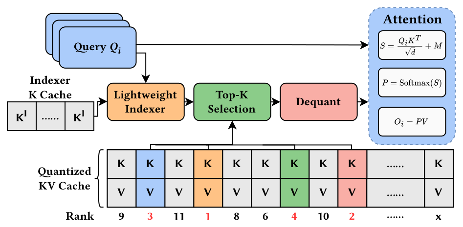

形式上，标准注意力的表达没有变：

$$S = \frac{QK^{\top}}{\sqrt{d}} + M, \qquad P = \mathrm{softmax}(S), \qquad O = PV$$

其中 $M$ 是因果掩码。变化的是**哪些 KV 条目参与这次计算**——它由每个查询自己的 Top-K 列表决定。

### 1.2 稀疏化如何改掉执行结构

这是全文的起点。稠密注意力中，多个查询可以打包在一起、针对规整的 KV tile 联合计算，形成足够大的矩阵操作；稀疏注意力引入了"每查询各不相同"的 KV 选择，这种多查询打包变得不实用，于是现有内核退回到**查询并行**：不同查询映射到不同计算核，各自独立地 gather、反量化、计算自己选中的 KV。

图2 把两种执行结构并排画出：左侧稠密路径是"多个查询 + 规整 KV tile"，右侧稀疏路径是"每个查询一份自己的 Top-K（示例中 Q1 选 `[1,2,3,5]`、Q2 选 `[1,2,5,6]`）+ 独立的 gather 与反量化"。同一个 KV 条目被两个查询同时选中时，会被加载两次、反量化两次。

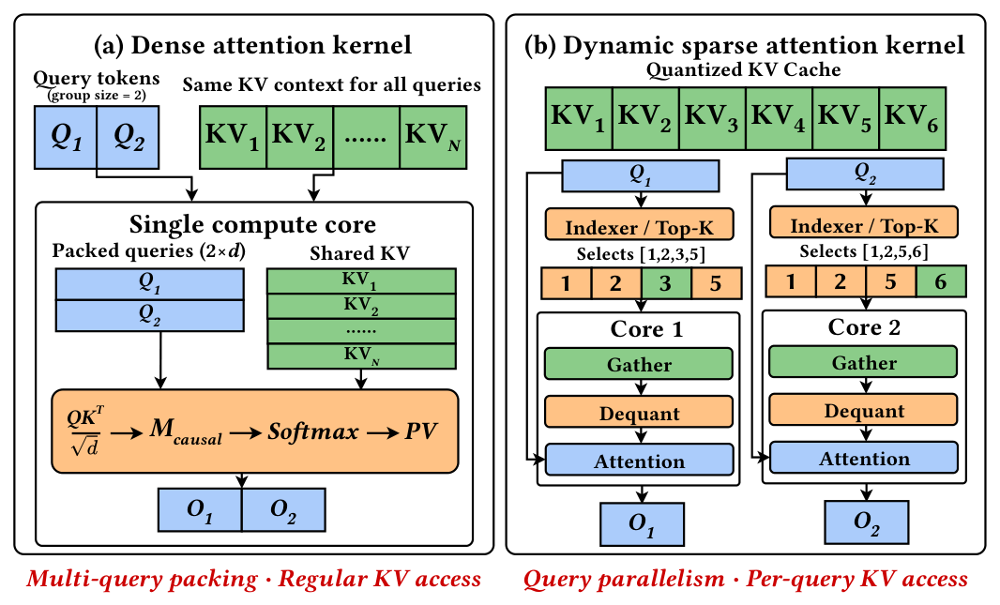

论文同时交代了两条使该问题具备普遍性的背景：其一，稀疏化正在从"训练后改造"走向"模型原生"——NSA 证明稀疏注意力可以端到端训练，DeepSeek-V3.2-Exp 把 DSA 作为组件并入大模型，GLM-5 系列、DeepSeek-V4 系列、Hunyuan-4 系列沿用并扩展了这一设计；其二，现代加速器的算力由分工不同的单元组成——矩阵单元（GPU 的 Tensor Core、Ascend 的 Cube）与通用/向量单元（SIMT 核、Vector）可以并发，配合分层片上内存与 tile 化执行，为"把集合运算塞进向量空档"提供了硬件前提。

值得单独指出的是 QUILT 的**定位**：它不改变"哪些 KV 应该被选中"，只处理索引器已经产出的那批查询私有稀疏集合。因此它与 MInference、FlexPrefill、XAttention 这类训练后稀疏化，以及 DSA 这类模型原生稀疏化都是正交的，可以直接叠加。

---

## 2. 论证结构：先把地图画出来

原文的论证是"一个现象 → 三个挑战 → 四个机制 → 一组证据"的线性叙事。把它压成一张四列的对照图之后，每一格都可以单独核对：左列是观察到的现象，第二列是把它变成性能收益时必须解决的挑战，第三列是论文给出的机制，右列是该机制对应的量化证据（模型统一为 GLM-5.3 的张量并行配置）。

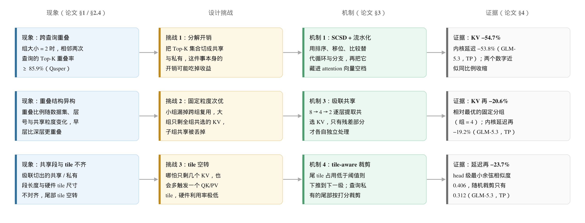

这张图最有信息量的地方在**第二列**：三个挑战并不是三个并列的工程问题，而是三种不同性质的障碍。第一个是"新增开销"问题——机制本身要花的钱可能超过它省下的钱；第二个是"结构不匹配"问题——复用机会的粒度在模型、层、数据集之间不一致；第三个是"逻辑量与硬件时间不等价"问题——少处理了 KV 条目，不等于少花了硬件时间。这三个性质不同，对应的解法也就不能互换：

- 针对"新增开销"，解法是**把开销换成规则的数据并行原语，再把它移出关键路径**（SCSD + 流水化）。
- 针对"结构不匹配"，解法是**不锁定单一粒度**（级联共享）。
- 针对"逻辑量与硬件时间不等价"，解法是**让切分结果去迁就 tile**（tile-aware 裁剪）。

---

## 3. 动机：重叠是真的，冗余也是真的

### 3.1 相邻查询的 Top-K 高度重叠

论文在 GLM-5.3 上、LongBench 的两个数据集上做了画像。图4 的上排是"KV 重叠率"随查询—令牌距离的变化，下排是"共享 KV ÷ Top-K"随窗口大小的变化；每张子图里不同曲线 / 柱组对应不同层号。

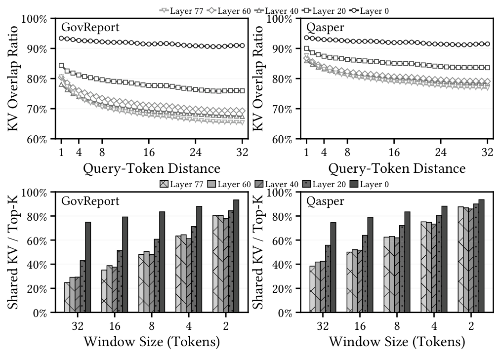

三个可以直接引用的读数：

- 组大小为 2 时，重叠率**在所有层上都**不低于 **85.91%**（Qasper）与 **78.06%**（GovReport），首层超过 **90.03%**。
- 重叠随组大小增大而下降，但大多数层上仍保持可观水平——这就是"固定粒度必然次优"的来源。
- 上排曲线的横轴是查询—令牌距离：距离为 1 时重叠已经很高，说明复用的机会在**相邻**查询之间，而不是在远处。

### 3.2 冗余的代价落在 KV 加载与反量化上

仅仅"重叠高"还不足以说明值得动手；真正的问题是这些冗余在计时里占多大。论文用一张四联堆积柱状图回答，但没有把占比写成数字。本文按像素量取了这张图的柱高与分界，结果如下（横轴分别为 prefill 长度与查询头数）：

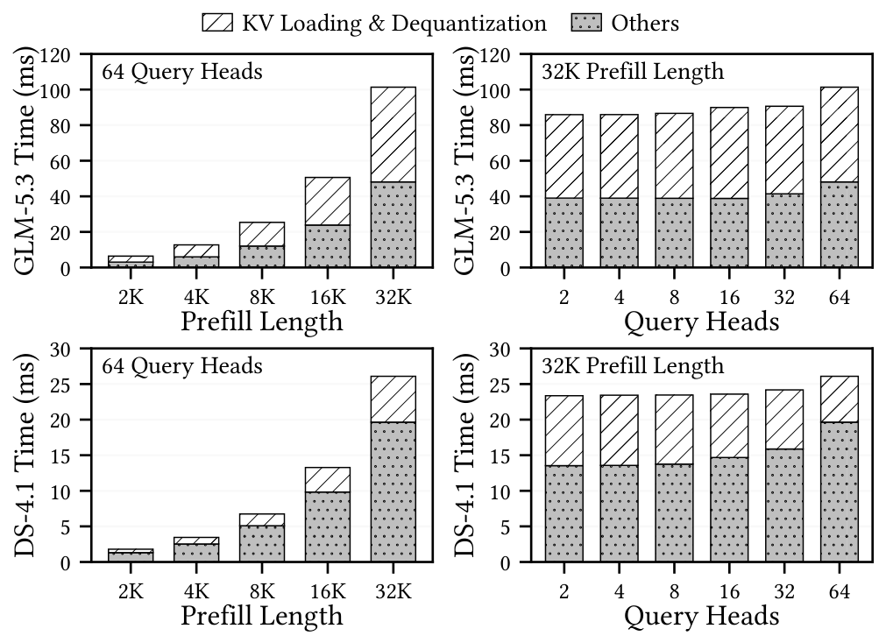

| 设置（Ascend 910C） | 内核总耗时 | 其中 KV 加载与反量化 | 占比 |
| --- | --- | --- | --- |
| GLM-5.3，64 头，4K prefill | 约 13.3 ms | 约 6.4 ms | 约 48% |
| GLM-5.3，64 头，16K prefill | 约 51.1 ms | 约 28.0 ms | 约 55% |
| GLM-5.3，64 头，32K prefill | 约 101.8 ms | 约 56.6 ms | 约 56% |
| GLM-5.3，32K prefill，16 头 | 约 90.0 ms | 约 50.2 ms | 约 56% |
| GLM-5.3，32K prefill，64 头 | 约 101.8 ms | 约 53.1 ms | 约 52% |
| DeepSeek-4.1，64 头，32K prefill | 约 26.3 ms | 约 6.4 ms | 约 24% |

**量取口径**：按柱状图坐标轴标定像素—毫秒换算，再沿柱心竖直扫描，取"点状填充段"与"斜线填充段"的分界作为 Others 与 KV 的分界。读数误差约 ±3 个百分点，绝对耗时约 ±2 ms（上方表格全部为本文推算，不是原文数字）。两条趋势是稳的：

1. **GLM-5.3 的 KV 占比随序列长度单调上升**，从 4K 的约 48% 到 32K 的约 56%，并且对查询头数不敏感（16 到 64 头都在 52%–56%）。
2. **两个模型的量级差得很远**：同为 32K prefill、64 头，GLM-5.3 的内核要 101.8 ms，DeepSeek-4.1 只要 26.3 ms，且 DeepSeek-4.1 的 KV 占比只有约 24%。

第 2 条与第 8 节的结果方向一致：QUILT 在 GLM-5.3 上拿到 53.8% 的内核延迟降幅，在 DeepSeek 系列上只有 28.7%。需要提醒的是，这张动机图用的是 **DeepSeek-4.1**，而第 8 节的主实验用的是 **DeepSeek-3.2**——两者不是同一个模型版本，这个对照只能作方向性参考。

---

## 4. 机制一：SCSD —— 把集合交并变成规则的数据并行原语

### 4.1 为什么朴素的集合运算不行

分组执行的第一步是把相邻查询的 Top-K 列表切成"共享"与"私有"。论文给出了三条朴素路线的判词：标量遍历、显式循环、两两成员检查。任一条都会引入串行控制流与不规则比较，而稀疏注意力单查询的计算量本来就小，留不出记账空间——开销可能直接超过省下来的 KV 搬运。

### 4.2 Shift-and-Compare Set Decomposition

SCSD 的构造只有三步，图6 用两个长度各为 4 的索引集合给了完整算例。

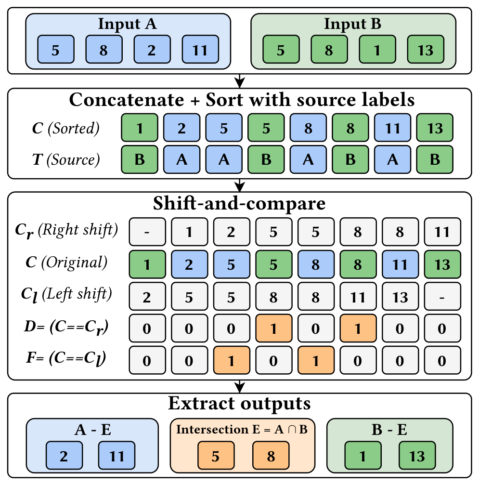

**第一步，拼接排序。** 把两个列表拼成 $2N$ 长的序列并排序，同时跟踪每个元素的来源标签：

$$(C, T) = \mathrm{Sort}(A \Vert B)$$

由于每个 Top-K 列表内部无重复，同时出现在 $A$ 与 $B$ 中的索引在 $C$ 里必然相邻。

**第二步，双向移位比较。** 构造右移序列 $C_r$ 与左移序列 $C_l$，各自做一次逐元素相等比较：

$$D = (C = C_r), \qquad F = (C = C_l)$$

对每个共享索引，它的两份拷贝分别被 $D$ 和 $F$ 捕获；任取一份即得交集：

$$E = C[D] = A \cap B$$

**第三步，取反与按源筛选。** 与左右邻居都不相等的元素只出现在一个输入里：

$$G = \neg\,(D \vee F)$$

再把它们按来源标签分开，就得到两个差集：

$$A - E = C[\,G \wedge (T = 0)\,], \qquad B - E = C[\,G \wedge (T = 1)\,]$$

整个过程的算子只有排序、移位、逐元素比较、布尔运算和掩码选择——全部是规则的数据并行原语，可以在 Top-K 序列上并发，不出现分支或标量指针推进。论文用同样的原理推广到多路分解。

### 4.3 效果：从"慢 21.84 倍"回到基线附近

第 10 节的反例表会展开讲这一步的落差，这里先给结论：朴素 Torch 实现的内核延迟是基线的 **21.84 倍（TP）/ 33.65 倍（SP）**；换成 SCSD 后延迟下降 **96.1% / 97.3%**。但即便如此，它也只是把内核拉回基线附近——真正拿到收益还要靠下一步。

---

## 5. 机制二：流水化 —— 把 SCSD 藏进向量空档

### 5.1 为什么还要流水

SCSD 把集合运算变规则了，但如果把它当成一个独立的预处理阶段，它的延迟仍然直接落在关键路径上，内核耗时变成"集合分解 + 注意力"之和。

论文的着眼点在于**现代加速器的矩阵单元与向量单元可以并发**。稀疏注意力里 $QK$ 与 $PV$ 主要由矩阵单元承担，而 softmax / 更新以及 SCSD 主要吃向量资源。在稳态流水线中，向量侧的负载通常短于并发的矩阵计算，留下未被利用的向量执行槽位。SCSD 恰好只由排序、移位、比较和布尔运算构成，可以直接填进这些空档。

图7 是这条流水线的结构示意：矩阵侧（Cube）执行 $QK$ 与 $PV$ 的 tile，向量侧（Vector）在相邻的流水槽里准备"下一段要用的 KV 段"。

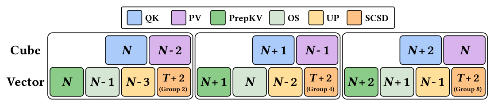

### 5.2 先热身，再稳态

实现上分两步走：

- **热身**：先算出一小批初始 Top-K 段把流水线顶起来，打断"SCSD 与注意力之间"的即时生产者—消费者依赖。
- **稳态**：矩阵侧对当前段做 $QK$ 或 $PV$，向量侧同时构造未来某一段所需的共享段或私有段。

为进一步提高重叠度，论文把"构造一个 Top-K 段"再切成多个更细的阶段，分摊到连续几个流水槽里；每个阶段只占用一部分向量容量，从而在不拖慢矩阵侧的前提下填满空闲向量资源。效果是：SCSD + Attn 从"求和"变成"取较大者"，额外的记账开销基本从关键路径上消失。

---

## 6. 机制三：级联共享 —— 不锁定单一粒度

### 6.1 固定分组的两难

分组能带来复用，但固定组大小会掉进一个两难：

- **组小**：组内重叠率高，但跨组的复用机会全部丢失；
- **组大**：覆盖面广，可是能共享的只有"全组都选了"的那一小撮 KV，只被部分查询选中的条目仍然要退回冗余执行。

图8 是论文给出的四查询算例，四个相邻查询的 Top-K 集合分别是 `{A,B,C,E}`、`{A,B,C,F}`、`{A,B,D,G}` 与 `{A,B,D,H}`。

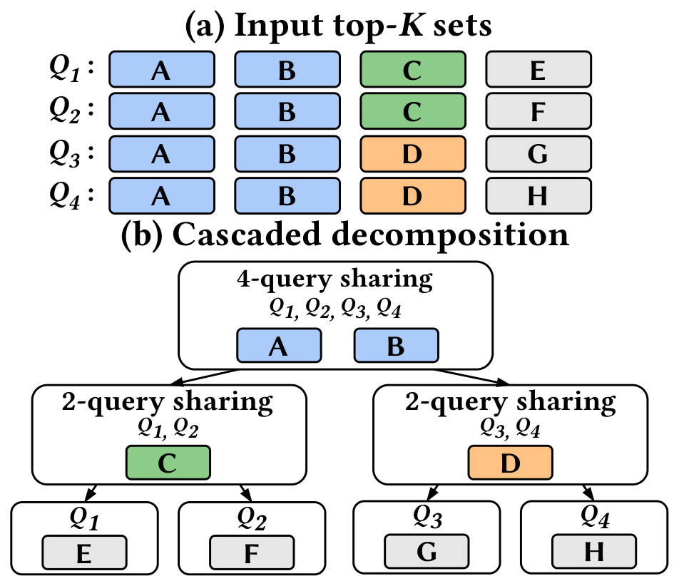

### 6.2 三级分解

**第一级（四路共享）**：先取四个集合的交集 `{A, B}`，加载并反量化一次，四个查询共用。

**第二级（两路共享）**：把共享条目从各自的集合里删掉，残差变成 `{C,E}`、`{C,F}`、`{D,G}` 与 `{D,H}`；四查询组再劈成两个子组 `{Q1,Q2}` 与 `{Q3,Q4}`，各自提取出还能共享的 `C` 与 `D`。

**第三级（查询私有）**：只剩 `E`、`F`、`G`、`H` 四个残差各自处理。

分解一直递归到无法继续共享为止。这样每个 KV 条目都在**它能共享的最大粒度**上被处理一次，不必承诺任何固定的组大小。默认起始组大小是 8。

### 6.3 用一条算例把收益量化

论文的表 1 用上面这个例子的"已处理 KV 条目数"做了对比。表 1 只有 4 行，但它把三种策略的分水岭讲清楚了，图9 把它重绘成柱状图：4 个查询每个选 4 个 KV，基数是 16；级联共享达到 8，恰好等于这 4 个查询**共涉及的不同 KV 数目**，也就是理论下界。

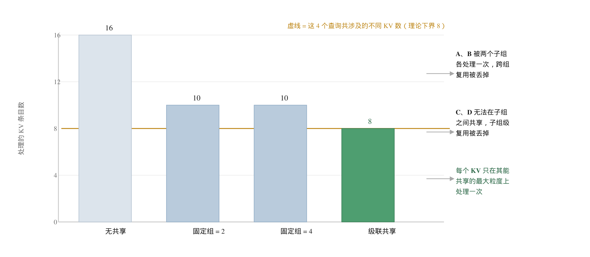

关键读数是：**固定组 = 2 与固定组 = 4 都停在 10**，但原因相反。组 = 2 丢掉了跨组复用，`A` 与 `B` 被两个子组各处理一次；组 = 4 丢掉了子组级共享，`C` 与 `D` 无法被两个子组共用。级联共享同时拿到这两层，于是到 8。相对无共享，级联的降幅是 50%，而两个固定分组都只有 37.5%。

---

## 7. 机制四：tile-aware 裁剪

### 7.1 共享段与硬件 tile 对不齐

级联会把 Top-K 工作负载切成若干共享段与私有段，而这些段的长度**普遍不会对齐硬件 tile 尺寸**。后果是：哪怕只剩几个 KV 条目，也会多触发一次 $QK$ / $PV$ tile，硬件利用率极低。

论文的形式化很简洁。设 $T$ 是每个 tile 的 KV 条目数，对某个共享段 $S$ 有 $|S| = qT + r$，其中 $0 \le r < T$，并引入一个 tile 利用率阈值 $\tau$（默认 50%）：

- 若 $r \ge \tau T$：把尾部补齐成一个满 tile，在当前共享粒度上处理，补进来的位置用掩码保证语义精确。
- 否则：把尾部**下推**到下一级联层，与更细粒度的负载合并，换取更好的 tile 利用率。

这一步下推是精确的——它用一点共享度换 tile 利用率，不改变计算结果。

### 7.2 最后一级：按打分裁剪，而不是随机裁

推到查询私有层之后就没有下一级了。论文在这里做了一件有风险的事：**近似裁剪**。依据来自图10——级联共享之后剩下的私有残差 KV，在原始 Top-K 排名上的分布明显偏向尾部，说明排名靠前的条目大多已经被前几级共享段吸收掉了。

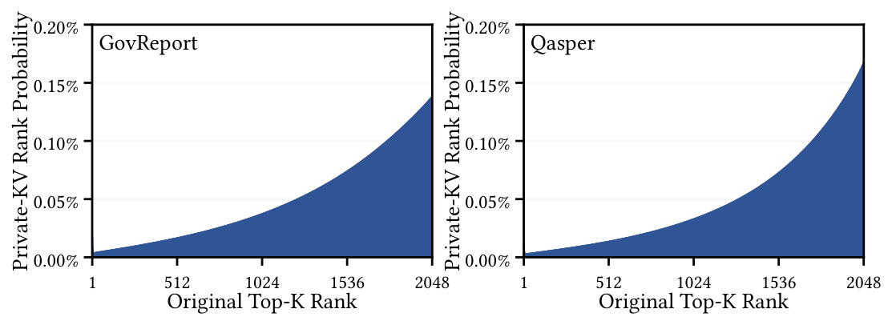

于是对残差集合 $|R| = q_i T + r_i$，保留索引器得分最高的 $q_i T$ 个、裁掉最低的 $r_i$ 个，最后一个利用率不足的 tile 就被消掉了。这是全篇**唯一的近似步骤**。

### 7.3 这一步值多少

性能上，图11 把完整 QUILT 与"保留全部私有残差、不裁剪"的精确版本作对比：GLM-5.3 上张量并行降 **23.71%**、序列并行降 **22.68%**，DeepSeek-3.2 上分别降 **24.44%** 与 **14.13%**。

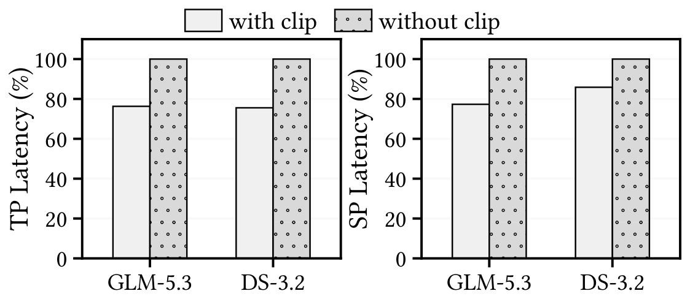

数值保真度上，图12 对比了两种裁剪强度相同的策略：**随机裁剪**与**按 indexer 打分裁剪**。均值口径两者几乎一样（head 级 0.9999 对 1.0000，hidden 级 0.9998 对 1.0000），但**最小值口径拉开了差距**：head 级最小余弦相似度从随机裁剪的 0.312 提升到 0.406，hidden 级从 0.664 提升到 0.719。

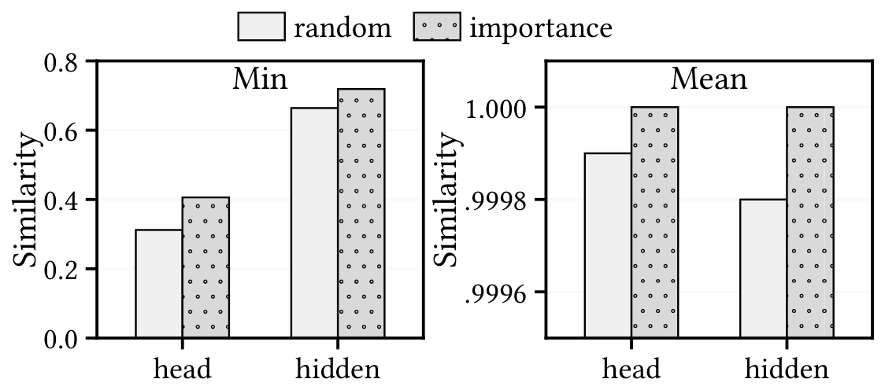

这组数字的读法是：**只看均值会完全漏掉尾部损伤**。均值两者都接近 1，差别只在小数点后第四位；而最小值说明随机裁剪确实把某些头打坏了（0.312 已经不能算"几乎无损"）。按打分裁剪把尾部损伤收窄了一半以上，这是它敢做近似的依据。

---

## 8. 结果：内核、端到端与精度

### 8.1 实验口径

| 项目 | 取值 |
| --- | --- |
| 硬件 | 16 张 Ascend 910C，单卡 64 GB HBM，卡间双向 D2D 带宽 784 GB/s |
| 软件栈 | CANN 9.1.0；内核基线取自 OPS-Transformer（Ascend 上高度优化的稀疏注意力实现） |
| 服务框架 | XY-Serve（ASPLOS 2026）；基线与 QUILT 共用同一套模型执行框架、请求调度、内存管理与运行时，唯一差异是注意力内核 |
| 模型 | GLM-5.3 与 DeepSeek-3.2，均使用模型原生稀疏注意力，Top-K = 2048 |
| 工作负载 | LongBench；主实验取 Qasper、GovReport、Musique、NarrativeQA |
| 并行配置 | 张量并行（TP）与序列并行（SP） |
| 精度口径 | 21 个 LongBench 数据集各自的官方指标 |

### 8.2 性能

图13 给出四个工作负载上的平均内核延迟降幅（不含 DeepSeek-3.2 的 SP 单点）。逐数据集看，GLM-5.3 在 TP 下降幅为 53.2% / 55.1% / 54.5% / 52.4%，在 SP 下为 44.6% / 45.0% / 42.3% / 41.9%。

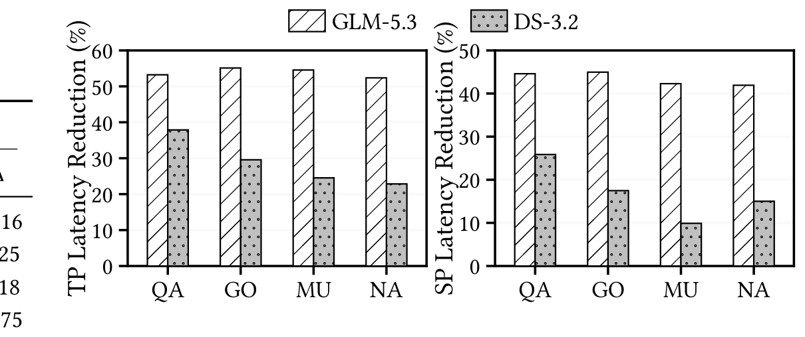

| 模型 | 并行 | 内核延迟降幅 | KV 处理量降幅 | TTFT 降幅 |
| --- | --- | --- | --- | --- |
| GLM-5.3 | TP | 53.8% | 54.7% | 35.6% |
| GLM-5.3 | SP | 43.4% | 54.7% | 10.4% |
| DeepSeek-3.2 | TP | 28.7% | 30.4% | 23.0% |
| DeepSeek-3.2 | SP | 17.1% | 30.4% | 3.4% |

表里有两处需要点明：

- **KV 处理量只有一列**。TP 与 SP 只改变查询负载如何切到各卡上，不改变 QUILT 处理的总 KV 条目数，所以同一个模型的两个并行配置共享一个数。
- **内核降幅与 KV 降幅数值接近**（GLM-5.3 是 53.8% 对 54.7%，DeepSeek-3.2 是 28.7% 对 30.4%），但**这两个量并不是同一件东西**：前者是时间，后者是逻辑工作量。它们为什么近似，见 8.5 节的验算。

图14 用合成负载隔离了"共享长度"这一个变量：把相邻查询之间人为构造的共享长度从 0 调到 2048，同时保持 Top-K 总长不变。内核延迟随共享长度单调下降——从 0 到 2048，GLM-5.3 在 TP / SP 下分别降 42.74% / 33.25%，DeepSeek-3.2 降 41.03% / 29.53%。图里还能看到共享很少时存在一点**负收益**，原因是集合分解工作还没被流水线完全遮住。

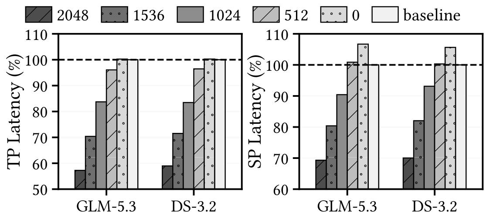

端到端结果见图15：TTFT 的降幅普遍小于内核降幅，且在序列并行下明显缩水——GLM-5.3 的 TP / SP 平均是 35.6% / 10.4%，DeepSeek-3.2 是 23.0% / 3.4%。

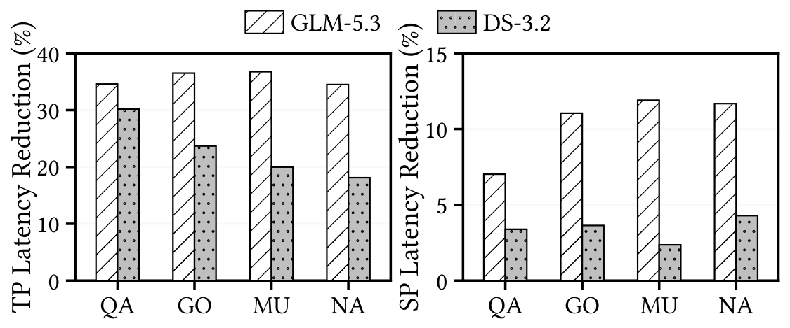

### 8.3 消融：三个机制各自的边际贡献

图16 把机制逐个叠加上去，纵轴是归一化到基线的延迟。朴素实现的值太大（2184%、3365% 等），超出纵轴范围，数值直接标在柱顶：

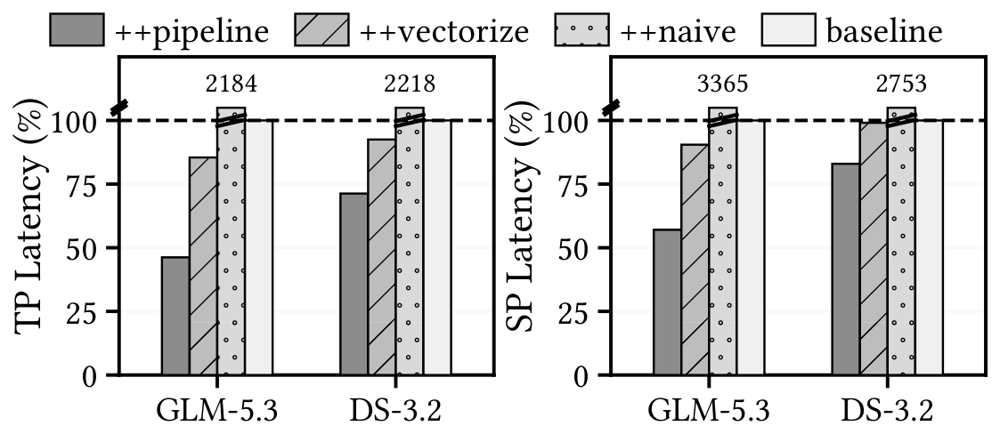

| 变体 | GLM-5.3 TP | GLM-5.3 SP | DeepSeek-3.2 TP | DeepSeek-3.2 SP |
| --- | --- | --- | --- | --- |
| 朴素（Torch 集合交） | 慢 21.84 倍 | 慢 33.65 倍 | 慢 22.18 倍 | 慢 27.53 倍 |
| 换用 SCSD | 再降 96.1% | 再降 97.3% | 再降 95.8% | 再降 96.4% |
| 再启用流水化 | 再降 45.9% | 再降 36.9% | 再降 22.9% | 再降 16.2% |

把百分比反推成归一化延迟，完整设计在四种配置下分别是基线的 46.1% / 57.3% / 71.8% / 83.0%，平均降幅 35.5%。

级联共享的单独消融见图17：它与固定分组 2 / 4 / 8 使用同样的 SCSD 与流水化，只有共享组织方式不同。对应地，已处理 KV 条目数（归一化到 OPS-Transformer）为——GLM-5.3：组 2 = 65.7%、组 4 = 57.2%、组 8 = 59.0%、级联 = 45.5%；DeepSeek-3.2：组 2 = 78.9%、组 4 = 82.9%、组 8 = 88.4%、级联 = 70.1%。

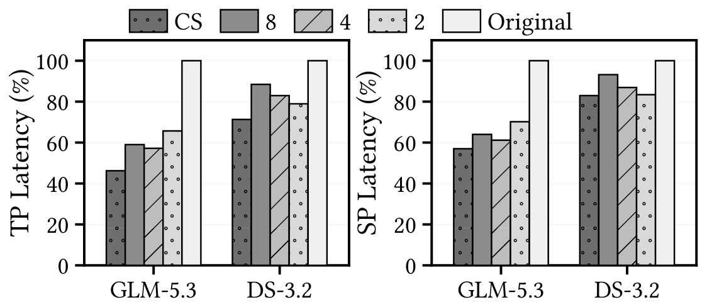

这组数字最有价值的地方是**最优固定分组在两个模型上不一致**：GLM-5.3 的最优固定分组是 4，DeepSeek-3.2 是 2。级联共享在两者上都优于各自的最优固定分组（相对处理量降 20.6% 与 15.4%）。

### 8.4 精度

21 个数据集上的完整对照如下（Δ 为 QUILT 减基线）：

| 数据集 | GLM-5.3 基线 | GLM-5.3 QUILT | Δ | DeepSeek-3.2 基线 | DeepSeek-3.2 QUILT | Δ |
| --- | --- | --- | --- | --- | --- | --- |
| qmsum | 22.48 | 22.60 | +0.12 | 22.86 | 23.02 | +0.16 |
| gov_report | 30.40 | 30.60 | +0.20 | 29.85 | 29.60 | -0.25 |
| narrativeqa | 32.20 | 31.36 | -0.84 | 31.94 | 31.76 | -0.18 |
| samsum | 45.81 | 46.09 | +0.28 | 43.94 | 44.69 | +0.75 |
| dureader | 28.64 | 28.89 | +0.25 | 26.11 | 26.84 | +0.73 |
| lsht | 57.50 | 57.50 | 0.00 | 47.00 | 47.75 | +0.75 |
| trec | 78.50 | 78.00 | -0.50 | 58.88 | 58.25 | -0.63 |
| 2wikimqa | 60.11 | 59.87 | -0.24 | 66.43 | 67.57 | +1.14 |
| hotpotqa | 63.76 | 64.18 | +0.42 | 67.99 | 66.54 | -1.45 |
| passage_retrieval_zh | 100.00 | 100.00 | 0.00 | 100.00 | 100.00 | 0.00 |
| qasper | 46.39 | 47.05 | +0.66 | 49.57 | 49.80 | +0.23 |
| vcsum | 12.30 | 12.19 | -0.11 | 14.66 | 14.44 | -0.22 |
| multifieldqa_zh | 62.11 | 62.80 | +0.69 | 65.28 | 66.32 | +1.04 |
| triviaqa | 91.07 | 91.60 | +0.53 | 93.98 | 92.63 | -1.35 |
| passage_count | 29.50 | 30.08 | +0.58 | 7.50 | 8.50 | +1.00 |
| multifieldqa_en | 50.45 | 51.45 | +1.00 | 55.80 | 56.14 | +0.34 |
| lcc | 74.35 | 73.44 | -0.91 | 73.61 | 74.09 | +0.48 |
| musique | 51.40 | 50.55 | -0.85 | 51.35 | 54.06 | +2.71 |
| repobench-p | 69.69 | 70.22 | +0.53 | 42.54 | 41.39 | -1.15 |
| passage_retrieval_en | 100.00 | 100.00 | 0.00 | 98.50 | 99.50 | +1.00 |
| multi_news | 26.84 | 26.74 | -0.10 | 23.38 | 23.26 | -0.12 |

论文给出的汇总口径是：平均绝对分差 **0.42 分**（GLM-5.3）与 **0.75 分**（DeepSeek-3.2），对应平均相对差 **0.90%** 与 **2.01%**。

### 8.5 交叉验算

本文对原文的收益口径做了六项重算，结果如下（重算所用的原始数字全部取自原文表格）：

| 验算项 | 原文数字 | 本文重算 | 结论 |
| --- | --- | --- | --- |
| 平均绝对分差 | 0.42 / 0.75 | 由 21 条 Δ 求绝对值的算术平均：0.4195 / 0.7467 | 一致 |
| 平均相对差 | 0.90% / 2.01% | 逐数据集"绝对差 ÷ 基线分"的**等权平均**：0.902% / 2.010% | 一致，但口径需说明（见下） |
| KV 处理量均值 | 54.7% / 30.4% | 由四个工作负载重算：54.65% / 30.375% | 一致 |
| 级联相对固定分组的降幅 | 30.8% / 20.6% / 22.9%（GLM-5.3） | 1 − 45.5÷65.7 = 30.8%；1 − 45.5÷57.2 = 20.5%；1 − 45.5÷59.0 = 22.9% | 一致 |
| 消融均值 | 35.5% | 反推四条归一化延迟 46.1 / 57.3 / 71.8 / 83.0，与 8.2 节分组均值推出的 46.2 / 56.6 / 71.3 / 82.9 相比，最大差 0.7 个百分点 | 一致 |
| KV 占比 vs 延迟降幅 | 内核降幅 53.8% | 55% × 54.7% = 30.1%，不足以解释 53.8% | **存在约 24 个百分点的差额** |

前五项都严丝合缝，值得展开的是第二项与最后一项。

**关于 2.01% 这个数。** 它是"逐数据集相对差"的等权平均，而不是"总绝对差 ÷ 总基线分"。两种口径会差近一倍：换成后一种算法，DeepSeek-3.2 是 1.46% 而不是 2.01%。等权平均在这个表里会被小尺度数据集放大——`passage_count` 的基线只有 7.50 分，从 7.50 到 8.50 的绝对差是 1.00 分，相对差却有 13.3%，单这一条就贡献了 2.01% 里的约 0.63 个百分点。读这张表时如果只抓汇总数字，容易把"某个低分数据集上的波动"当成整表精度损失。

**关于第 24 个百分点。** 把 5.2 节的量取结果与 8.2 节的结果放在一起会得到一个不能自洽的推论：如果被归入 KV 加载与反量化的那部分约占总时间 55%，而它被削减了 54.7%，那么延迟最多只能降 55% × 54.7% ≈ 30%，可实测是 53.8%。差额说明被归入 Others 的那部分**同样随已处理 KV 规模缩放**——在稀疏注意力内核里，这通常是索引处理、gather 寻址、掩码生成这类与"被触及的 KV 条目数"成正比的工作，加上打包执行带来的 tile 利用率提升。因此正确的读法不是"省掉了 55% 的 KV 搬运"，而是"内核中随 KV 规模缩放的那一整块被近似等比例削掉了，剩下的是与 KV 规模无关的固定开销"。这个解释是本文的推断，原文没有给出 CPU/加速器侧的成分分解。

---

## 9. 横向对比：设计空间与相关工作

### 9.1 设计空间里的五个落点

把论文的消融结果组织成"同一套 SCSD 与流水化 + 不同的共享组织方式"，就能看清 QUILT 在自家设计空间里的位置：

| 方案 | 集合分解 | 共享粒度 | tile 处理 | 与基线的相对处理量 | 与基线的相对延迟 |
| --- | --- | --- | --- | --- | --- |
| 朴素分组 | Torch 集合交 | 固定 2 | 无 | — | 慢 21.84 倍（TP）/ 33.65 倍（SP） |
| 仅向量化 | SCSD | 固定 2 | 无 | — | 基线附近（降 96.1% / 97.3%） |
| 固定分组 | SCSD + 流水 | 固定 2 / 4 / 8 | 无 | GLM-5.3：65.7% / 57.2% / 59.0%；DeepSeek-3.2：78.9% / 82.9% / 88.4% | 见图17 |
| 级联共享 | SCSD + 流水 | 级联 8 → 4 → 2 | 无 | GLM-5.3：45.5%；DeepSeek-3.2：70.1% | 相对最优固定分组再降 19.2%（GLM-5.3，TP） |
| **QUILT** | SCSD + 流水 | 级联 8 → 4 → 2 | 下推 + 打分裁剪 | 同上一行（裁剪只作用于私有残差） | 降 53.8%（GLM-5.3，TP）/ 43.4%（SP） |

### 9.2 和同期工作的位置关系

论文把相关工作分成几个方向，QUILT 与它们的关系是**层次不同**而不是优劣之差：

| 方向 | 代表工作 | 复用 / 优化发生在哪一层 | 与 QUILT 的关系 |
| --- | --- | --- | --- |
| 训练后稀疏化 | MInference、FlexPrefill、XAttention、SeerAttention | 决定"哪些 KV 参与注意力" | 正交：QUILT 只吃它们产出的 Top-K 集合 |
| 模型原生稀疏化 | NSA、DSA（DeepSeek-V3.2-Exp）、GLM-5 系列、DeepSeek-V4 系列、Hunyuan-4 | 同上，且与训练联合设计 | 正交，可叠加 |
| 解码期稀疏与压缩 | H2O、StreamingLLM、Scissorhands、FastGen、SnapKV、Quest、InfLLM、ArkVale | KV 的保留 / 淘汰策略 | 阶段不同：那些面向 decode，QUILT 面向 prefill |
| 解码期跨查询局部性 | RetroInfer、LiteCache、SparseServe | 主机 DRAM 与 HBM 之间的搬运层 | 层次不同：在内存管理层做缓存，QUILT 在内核内部做复用 |
| 高性能注意力内核 | FlashAttention 1/2/3、FlashInfer、FlashMLA、FlashPrefill | tile 划分与流水 | 同一层；QUILT 针对稀疏负载的跨查询结构 |

---

## 10. 反例：五个被实验推翻的直觉

论文的消融部分实际记录了五个"想做就该这么做"的直觉如何失效。这一节按"直觉 / 实测结果 / 机理 / 教训"整理。

| 直觉 | 实测结果 | 机理 | 教训 |
| --- | --- | --- | --- |
| 把集合交并换成并行实现就能获益 | 朴素 Torch 实现让内核慢 21.84 倍（GLM-5.3，TP）；换成 SCSD 后降到基线附近，仍然只是"不亏" | 稀疏注意力单查询计算量小，标量遍历与分支控制的记账成本占比极高；并行化只是把记账变规则，没有把它移出关键路径 | 结构性优化的收益取决于"新增开销是否在关键路径上"，与算法本身是否并行无关 |
| 分组越大，能共享的越多 | 四查询算例里固定组 = 2 与固定组 = 4 都停在 10 个 KV；实测中 GLM-5.3 的最优固定分组是 4，DeepSeek-3.2 是 2 | 大组的交集只保留"全组都选"的条目，子组级共享反而丢失 | 不存在跨模型通用的固定粒度，必须让粒度跟着共享结构走 |
| 处理更少的 KV 条目就该省下等比例的硬件时间 | SP 下 KV 处理量降 30.4%，内核延迟只降 17.1%，TTFT 只降 3.4% | 序列并行缩短了每卡的序列长度，流水线预热与固定开销摊不薄；注意力在 prefill 总时长中的占比也随之下滑 | "逻辑工作量"与"硬件时间"之间隔着固定开销与摊薄率，二者必须分别评估 |
| 裁剪残差 KV 一定伤害精度 | 按打分裁剪与随机裁剪在均值上几乎一样（head 级 0.9999 对 1.0000），但最小值差一倍量级（head 级 0.312 对 0.406） | 残差集中在原始 Top-K 排名的尾部，索引器得分低，裁掉它们对输出的扰动小；随机裁剪则会动到得分高的条目 | 近似的代价取决于"裁谁"，不只取决于"裁多少"；只看均值会漏掉尾部损伤 |
| 既然已经用了稀疏注意力，内核里没什么可挖了 | GLM-5.3 在 32K prefill 下，KV 加载与反量化约占内核时间的 55%（本文量取） | 稀疏化只减少了"参与计算的 KV"，没有减少"被重复搬进来的 KV" | 内核里非矩阵计算的部分可能才是大头，值得先做一次成分分解再动手 |

---

## 11. 洞察

**一、稀疏注意力内核的瓶颈常在数据通路，而不在矩阵计算。** GLM-5.3 在 32K prefill、64 头下内核耗时约 101.8 ms，其中 KV 加载与反量化约 56.6 ms，占约 56%（本文按像素量取）。这个比例解释了为什么一个只针对 KV 复用做文章的方案，能拿到 50% 以上的延迟收益。它也提示了一条通用做法：对稀疏注意力动手优化前，先给内核做一次"KV 数据通路 vs 其余"的成分分解。

**二、结构性优化必须连同"新增开销怎么被隐藏"一起设计。** 同一个分组执行机制，在三个版本里的结论完全相反：朴素集合交并让内核慢 21.84 倍；换成 SCSD 后降 96.1%，回到基线附近；再启用流水化后才真正拿到收益。图14 里"共享长度为 0 时存在负收益"也是同一件事的另一面——机制本身不便宜，它必须先被藏起来。

**三、共享粒度要按"哪一级能共享"来分，而不是按一个组大小来切。** 四查询算例里，固定组 = 2 与固定组 = 4 都停在 10 个 KV，而级联共享达到 8（理论下界）。实测里最优固定分组在两个模型上不一致，而级联共享在两个模型上都优于各自的最优固定分组。这一点对做类似复用优化的人直接可用：与其调组大小，不如把粒度做成可递归的。

**四、"处理更少的 KV"不等于"更少的硬件时间"，差额由固定开销与摊薄率决定。** GLM-5.3 在 TP 下 KV 降 54.7%、延迟降 53.8%，两者几乎相等；到 SP 下 KV 仍是 54.7%，延迟只剩 43.4%，TTFT 更只剩 10.4%。同一份算法收益，在两种并行配置下差了 3 倍以上，全部来自"每卡序列长度变短、预热摊不薄"。

**五、近似的伤害取决于"裁谁"，不取决于"裁多少"。** 同样裁掉相同数量的私有残差 KV，按 indexer 打分裁可以让 head 级最小余弦相似度保持在 0.406，随机裁只有 0.312；而两者的均值都在 1.0000 附近。如果评审只看均值口径，会把一个已经明显损伤尾部输出的方案判成"几乎无损"。

---

## 12. 局限与读图注意

**关于证据的版本一致性。** 动机部分的画像（图5）用的是 **DeepSeek-4.1**，主实验（图13、图15）用的是 **DeepSeek-3.2**。两者不是同一模型版本，因此"KV 占比低 → 收益小"这个对照只能当方向性参考，不能当严格结论。

**关于"up to"类数字。** 摘要里的 55.1%（内核延迟）、55.9%（KV 处理量）、36.8%（TTFT）都是单点最优：55.1% 来自 GLM-5.3 + GovReport + TP，36.8% 来自 GLM-5.3 + Musique + TP，55.9% 来自 GLM-5.3 + GovReport。对应的平均值分别是 53.8% / 54.7% / 35.6%。

**关于精度汇总口径。** 2.01% 是逐数据集相对差的等权平均；换成"总绝对差 ÷ 总基线分"是 1.46%。等权口径被 `passage_count`（基线 7.50，相对差 13.3%）单条拉高约 0.63 个百分点。表中还有两个数据集（`passage_retrieval_zh`、`passage_retrieval_en`）本来就接近满分 100，两列都是 100.00 或 98.50→99.50，这类数据集的 Δ 小但相对差不小。

**关于硬件覆盖。** 实验只在 16 张 Ascend 910C 上完成。论文明确写了方法不依赖 Ascend 专有特性（依赖的是"矩阵单元与向量单元分离""tile 化执行""异构流水"这些通用特征），但没有给出 GPU 上的实测数据。阅读时不宜把 Ascend 上的增益直接按比例搬到 GPU。

**关于评测范围。** 21 个数据集全部来自 LongBench，以长文本问答、摘要、代码补全为主，没有覆盖长链推理、多轮智能体这类负载；并行配置也只覆盖 TP 与 SP，未涉及专家并行或前后端分离部署。

**关于配图的固有信息损失。** 图7（流水化）是分区示意而不是时间轴，看不出矩阵侧与向量侧各段的实际时长比例；图14 是合成负载（人为构造共享长度），不是真实数据的分布。这两张图宜用来理解机制，不宜用来估收益。

**关于未给敏感性分析的超参。** 级联共享的默认起始组大小 8、tile 利用率阈值 50%、Top-K = 2048 都是给定值，论文没有给出这些超参的敏感性扫描。唯一有敏感性分析的是共享长度（图14）。

**关于第 8.5 节的那个差额。** 本文量取出的 KV 占比与实测延迟降幅之间存在约 24 个百分点的不能自洽之处，原因是量取口径（把内核分成"KV 加载与反量化"与"其余"两桶）与优化实际作用的范围（所有随 KV 规模缩放的工作）不重合。这个解释是本文的推断。

---

## 13. 原文资源

- 论文：QUILT: Rethinking Sparse-Attention Prefill through Shared Query Execution，arXiv:2610.11134v1，2026-10-08。https://arxiv.org/abs/2610.11134
- 对照内核：OPS-Transformer，CANN 的昇腾 Transformer 算子库。https://github.com/hicann/ops-transformer
- 服务框架：XY-Serve: End-to-End Versatile Production Serving for Dynamic LLM Workloads，ASPLOS 2026，pp. 314–329。doi:10.1145/3760250.3762228
- 评测基准：LongBench。arXiv:2308.14508
- 被评估模型：GLM-5（arXiv:2602.15763）、DeepSeek-V3.2（arXiv:2512.02556）、DeepSeek-V4.1-Flash（arXiv:2609.19969）
