# vLLM × AgentX 精读：面向真实智能体负载的全栈服务优化

> 本文精读 vLLM 官方博客《vLLM x AgentX: Optimizing for Real-World Agentic Serving》（2026-09-08，作者 vLLM Team 与 Inferact，约 24 分钟阅读量），并在原文之上补三件事：把散落在三个平面里的机制压成可对照的表；把原文给出的收益、口径与隐含前提逐条拆开并交叉验算；把它与同系列前作《Serving Agentic Workloads at Scale with vLLM x Mooncake》（2026-05-06）放在一起，看这四个月里"宣称口径"发生了什么变化。
>
> 全文 12 张图按出现顺序统一编号。其中 9 张取自原文（含 3 张 GIF 动画），3 张为自绘静态示意图：图1 与图5 用来替代原文中无法静态阅读的两张交互式页面，图3 是自绘的论证地图。

---

## 0. 一眼看懂

| 维度 | 结论 |
| --- | --- |
| 这篇文章在做什么 | 把智能体（agentic）负载的负载特征作为第一性输入，反过来重排 vLLM 的数据面、执行面与控制面，并在第三方公开基准上验证 |
| 测量的负载 | SemiAnalysis 的 AgentX：由价值约 300 万美元的真实智能体编码轨迹构成，1M 上下文；跑在超过 1000 张卡、约 2 MW 的公开基准设施上 |
| 最强的一组数字 | DeepSeek V4 Pro 1.6T，12 张 GB300、256 并发：**83K 每 GPU 每秒总 token（TPGS）**，P90 交互性 58.3 token/s；相对 Opus 5 API 定价有 **106 倍**成本优势 |
| 交互性最高的一组 | MiniMax M3 428B，仅 2 张 B300、24 并发：74.2 token/s，70K TPGS，**85 倍**成本优势 |
| 最大模型的一组 | Kimi K3 2.8T，16 张 GB300、48 并发：62.7 token/s，11.8K TPGS，**14.6 倍**成本优势 |
| 最值得带走的三条 | ① 并行策略的有效性由"KV 能不能切、子层多不多"决定，不由卡数决定；② 主线是把会话结构显式编码进缓存与路由，而不是某个单点 kernel；③ 调度层的旋钮性价比比模型侧改造高一个数量级 |
| 最稀缺的部分 | 正文用一整节写**失败实验**（PP 不适配热轮次、DCP 迁不到 DeepSeek V4、负载均衡打不过会话粘性），并给出"直觉为何失效"的机理解释 |

---

## 1. 背景：为什么智能体负载要另做一套优化

### 1.1 压力来自两个互相牵制的轴

自 2026 年 5 月第一篇智能体服务博客以来，智能体流量占比继续上升。原文引用 OpenAI 的公开数据：截至 2026 年 6 月，在企业客户中 Codex 贡献了 Codex 与 ChatGPT 合并输出 token 的 64%。

这类流量对服务基础设施同时施压：

- **成本**决定固定硬件预算内能同时容纳多少个智能体；
- **延迟**决定每个智能体走完一轮"推理 + 工具调用"循环有多快。

所以优化目标不是单点指标，而是整条**延迟–成本前沿**。这也是为什么原文后面反复用"帕累托前沿"而不是"峰值吞吐"来陈述结果。

### 1.2 负载画像：四个特征决定一切

| 特征 | AgentX 实测 | 直接后果 |
| --- | --- | --- |
| 长会话、多轮次 | 每会话中位 **43 轮** | 缓存要跨轮存活，不能按单次请求淘汰 |
| 长输入、短输出 | 中位输入 **142K** token，中位输出 **444** token | 算力大量花在 prefill 与 attention 上，decode 的算术量很小 |
| 前缀高度复用 | 前缀缓存命中率 **高于 96%** | 命中前缀的 prefill 近乎免费；真正的成本只剩新增的那一小段 |
| 子代理密集 | **44%** 的会话至少含 1 个子代理，这些会话中子代理 rollout 中位数为 **4** | 会话不再是线性链，而是会分叉、再合流的树；缓存与路由都要能处理分支 |

这四条不是统计巧合，而是智能体循环的必然产物：每一轮把最新的工具返回拼进累积上下文，再整段发回模型。于是输入单调增长，每轮真正新增的只是"很短的一段 prefill"。

图1 用静态方式还原了原文中可交互的"会话浏览器"所表达的形状：柱高就是输入长度，深蓝段是引擎已见过的前缀，顶端橙色小截才是新增 prefill；下面一排几乎等高的绿色短柱是输出。

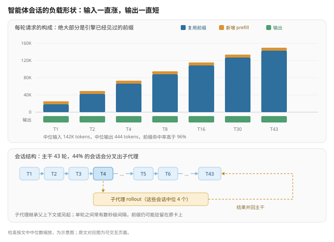

### 1.3 三个挑战

原文把上述画像收敛成三个工程难题，本节后续所有机制都对应其中之一：

1. **前缀缓存压力**。每一轮都重放整段对话，要同时维持很多会话就必须在轮次之间把 KV 换出。规模上去之后，KV 管理、前缀缓存、offload 必须跨 GPU、跨 P/D 分离实例、跨副本一致地工作。
2. **执行效率**。长上下文 + 紧延迟，意味着每步要处理更多 token、每个 token 要更少做事。这要求并行、kernel、调度、投机解码一起适配新的请求形状。
3. **P/D 配比难定**。上下文长度与命中率在会话之间、子代理之间剧烈波动，路由既要照顾缓存亲和性又要照顾负载均衡，最优 P/D 比例还随并发漂移。

---

## 2. 论证结构：三个挑战对应三个平面

原文用一张"全栈优化"总图（图2）把答案组织成三层：数据面管分布式共享 KV 缓存，执行面把每个模型映射到合适的并行与 kernel，控制面协调 P/D 比例与请求调度。

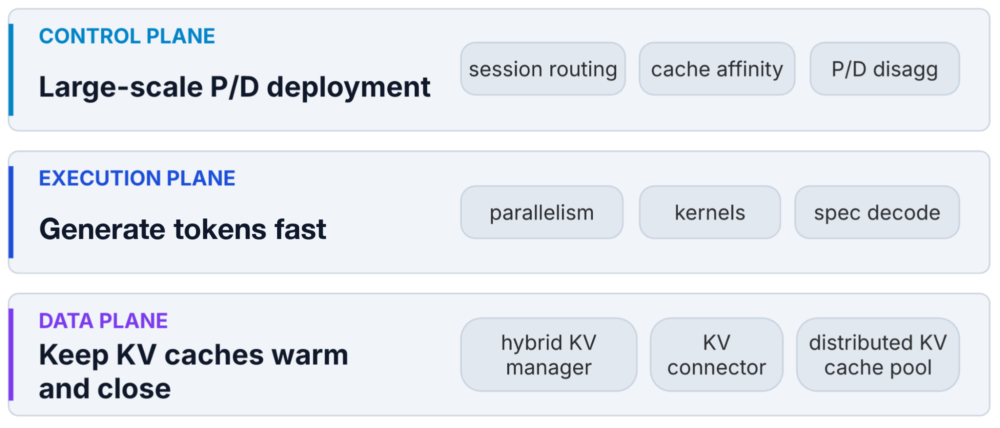

把挑战、平面、机制、证据四者对齐之后，整篇文章的骨架就变得可检查了——图3 就是这张对照地图，每行读作"一个挑战由哪个平面承载，用了哪些机制，文中给出的证据是什么，证据等级多高"。

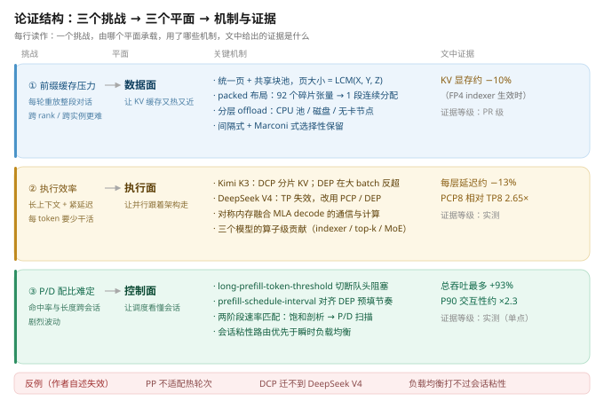

这张图里最有信息量的其实是**最后一列的等级差异**：数据面给出的"约 10% 显存节省"来自 PR 级证据；执行面与调度面的收益是实测数字，但其中一部分只有一个工作点（例如 +93% 与 2.3 倍只给了 DeepSeek V4 Pro on B300 这一组配置），另一部分（例如图9、图10 对应的调度行为）只有动画级的定性展示。读原文时把这三档分开，能避免把定性示意当成定量结论。

---

## 3. 数据面：让 KV 缓存又热又近

### 3.1 统一页 + 共享块池

混合模型同时包含全注意力、滑动窗口注意力和线性注意力，三者的缓存块尺寸与生命周期都不同：全注意力的 KV 随序列增长，滑动窗口与递归状态则是每请求固定的。按注意力类型静态划分容量，等于把一个随并发、上下文长度和前缀复用模式漂移的最优划分硬编码下来。

vLLM 的混合 KV 管理器（图4）给了一个很克制的答案：**一个统一页大小 + 一个共享块池**。页大小取各类型块尺寸的最小公倍数（LCM(X, Y, Z)），所有类型都从同一个池子里按需分配，不做静态切分。

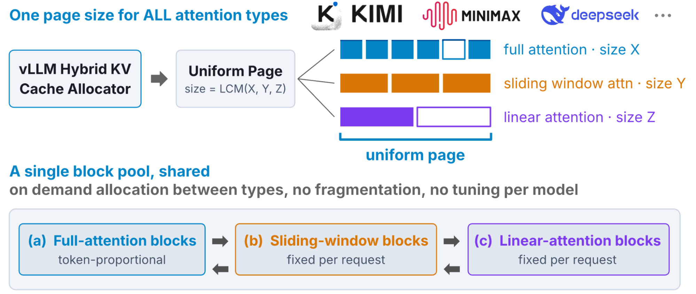

对应关系是：全注意力块是 token 正比的；滑动窗口块与线性注意力块是每请求固定的。共享池的价值在于"按需重分配"——池子里的容量可以在三者之间动态搬家，而不是一开始就分死。

### 3.2 DeepSeek V4：92 个碎片张量塌缩成 1 段连续分配

原文自陈的一个真实教训是：DeepSeek V4 最初的 KV 缓存布局把不同缓存类型碎片化成 3 个尺寸桶、分配了 **92 个独立张量**。它同时造成三件事——桶内尾部对齐产生 padding 浪费、描述符数量膨胀、P/D 传输与 KV offload 的搬运单位碎。

新方案（vllm-project/vllm PR #44577）改成**每个 block 一段连续的 backing 分配**，把所有缓存组与所有层塞进同一段内存，而不是 92 段。附带收益是：启用 FP4 indexer 时还能用更小的分配单元，KV 缓存显存**约下降 10%**（PR #48993）。

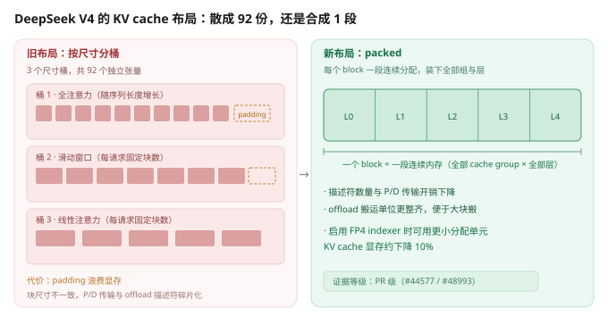

图5 用静态方式还原了原文中可交互的"布局浏览器"。这里的重点不在于 10% 这个数，而在于**布局是 P/D 传输与 offload 的共同底座**：搬运单位越整齐，后面所有跨卡、跨实例、跨层级的缓存动作都越便宜。

### 3.3 分层 offload 与会话感知保留

offload 部分以 Mooncake Store 作为分布式 KV 缓存池（设计见 5 月的前作），这次更新了四件事：

**模型架构对齐。** offload 在 vLLM 里保持一等公民地位，新架构（稀疏注意力、压缩注意力、线性注意力）全部支持，同时异步调度、P/D 分离、投机解码、并行的功能与性能不回退。这条听起来平淡，实际是数据面其余收益的前提——如果 offload 只支持纯全注意力模型，混合模型的会话就会退化成每次重算。

**分层扩展容量。** 通过 Mooncake 的 `standalone-store` 模式，把 CPU 池与磁盘层交给一个独立的外部 Mooncake 客户端持有，vLLM worker 退化成纯请求方。这样在每个节点上起一个 standalone 客户端，就能用纯 CPU 内存与磁盘自由扩池，且不需要 GPU 节点参与。同时与 Dynamo、llm-d 这类路由器打通——请求可以在任意实例上命中缓存，路由策略因此被简化。

**CPU 侧开销优化。** 混合模型必须为每种注意力类型分别构造 key、分别 lookup，CPU 开销成倍放大。原文给出的手段是更高效的数据结构、异步 lookup、把工作挪出调度器关键路径、收发并行（PR #46188、#45444、#45659、#47317）。

**会话感知的前缀缓存保留。** 这是三个正面机制里最能体现"把会话结构写进缓存"的一条。对含线性层或滑窗层的混合模型，复用前缀的前提是在复用边界上保住线性状态或滑窗缓存，而每个 token 都存快照太贵。原文用两个互补策略解决：

- **间隔式保留**（PR #43447）：在每一轮自动保留 prompt 末尾的缓存与线性状态。后续轮次与分叉出的子代理通常正是在复放并扩展前一轮上下文，因此能命中。
- **Marconi 式选择性保留**（PR #47782）：共享前缀往往在一轮内部就结束了，间隔式可能错过检查点。于是再加一条——当某个前缀被**第二次**观察到时，保留一个检查点；若某请求遇到一个曾经见过的前缀却没有可用检查点，就重算缺失状态并在该边界存一个检查点，供后续请求复用。

两条策略组合的效果是：在不把存储撑爆的前提下维持高命中率。

### 3.4 数据面小结

数据面的所有动作可以归成一句话：**把"会话"这个结构从请求里挖出来，变成缓存系统的显式概念**。统一页解决"谁和谁抢容量"，packed 布局解决"搬运单位是否整齐"，会话感知保留解决"状态该在哪些边界上存活"。三者都不是算力优化，但都直接决定命中率——而命中率正是后面成本结论的分子。

---

## 4. 执行面：让并行跟着模型架构走

### 4.1 并行轴与判据

现代推理系统暴露多条并行轴：张量并行（TP）、数据并行（DP）、专家并行（EP）、流水线并行（PP）、上下文并行（CP）。最优组合取决于模型架构、硬件拓扑、负载形状与延迟 SLO 四者，原文用两个代表模型（Kimi K3 与 DeepSeek V4）说明这一点，逻辑是统一的：**并行策略必须服从架构**。

### 4.2 Kimi K3：DCP 为什么赢

Kimi K3 用 MLA（多头潜在注意力）+ KDA。MLA 把 KV 压缩进单一潜在空间、只有一路头，因此朴素的 TP 会在每个 rank 上**复制**这份潜在缓存，效率不高。

替代方案是 DCP（decode 上下文并行）：沿序列维切分缓存，每个 rank 只持有 1/N 的 KV 状态。它对智能体负载有两点好处：

- **更低的 decode 延迟**。MLA 注意力是访存受限的，代价随上下文长度增长。智能体前缀越长，attention 在每步 decode 里占比越大；把它切到多卡上，这一步就短了。
- **更高的吞吐与 KV 容量**。不做 KV 复制就能让引擎同时维持更多序列，不会在 KV 准入上卡住。

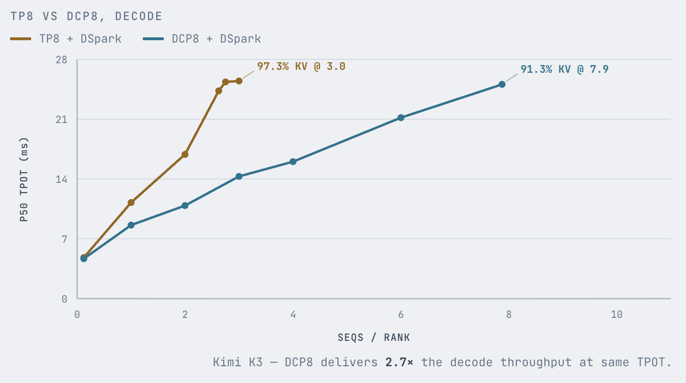

图6 的实际形状比文字更有说服力：TP8（配 DSpark）在每 rank 约 **3.0** 条序列处就撞到 97.3% 的 KV 占用而饱和；DCP8 能一路爬到每 rank **7.9** 条序列、KV 占用 91.3%，图内标注 DCP8 在相同 TPOT 下给出 **2.7 倍**的 decode 吞吐。两条曲线都带 DSpark（vLLM 的置信度调度验证式投机解码），是受控对比。

DCP 的代价是额外通信：缓存按序列切了，每个 MLA decode 层都需要 attention 前的 query gather 和 attention 后的部分结果归约。原文的做法是**用对称内存绕开 NCCL**：peer GPU 可以直接读写对方的缓冲；query 被多播进 attention kernel 直接消费的缓冲；每个 GPU 把部分注意力输出与 LSE（log-sum-exp）统计直接写进对端的接收槽位，各 rank 用在线 softmax 在本地合并。这些 GPU 间写在 kernel 内与计算融合，**每层延迟相比默认 DCP8 实现下降约 13%**。

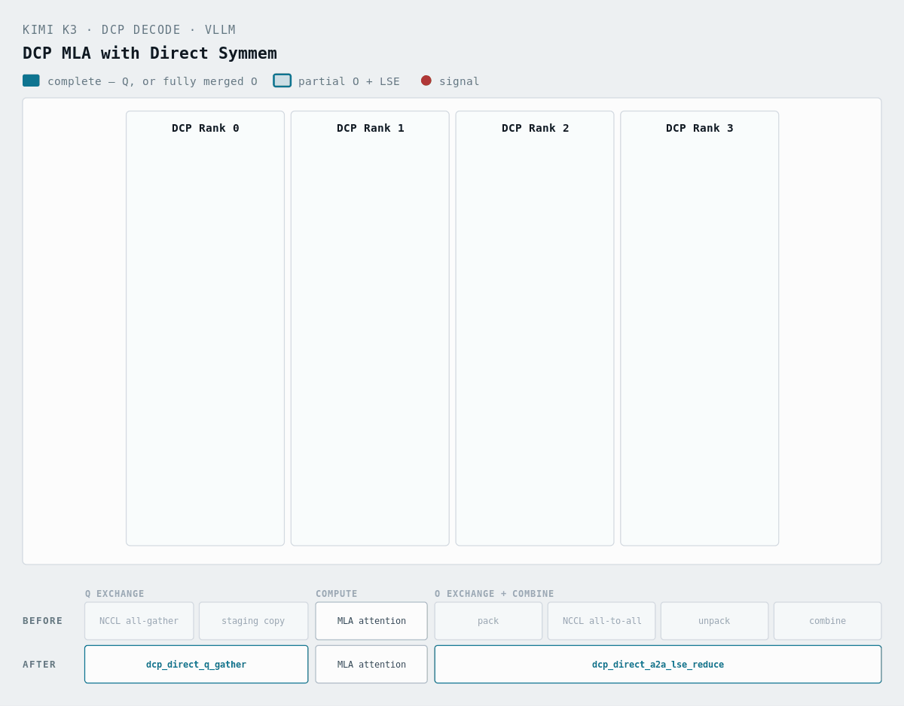

图7 是一段动画，展示的是把 NCCL all-gather、staging 拷贝、all-to-all、unpack 这一串动作替换成融合 kernel 的过程。值得注意的是这条路径并不依赖具体厂商：只要硬件提供可被 peer 直接读写的对称内存语义，"把集合通信消解成点对点写、并与计算融合进同一 kernel"这件事就成立。它是本文里可迁移度最高的一条思路。

### 4.3 Kimi K3：更大规模域上 DEP 反超 DCP

规模域一变，最优策略也变。在 NVL72 这类大 scale-up 域上，宽 EP 加数据并行（DEP）可以比 DCP 扩得更好，并在相同 decode 延迟 SLO 下给出更高吞吐。原文给的机理解释是：DCP 规模继续放大到多节点时，分片注意力的通信代价超过了它省下的算力；而 DEP 把请求及其 KV 缓存分配到不同 DP rank，**完全绕开 DCP 的注意力集合通信**，同时把 MoE 专家切到各 rank 上。

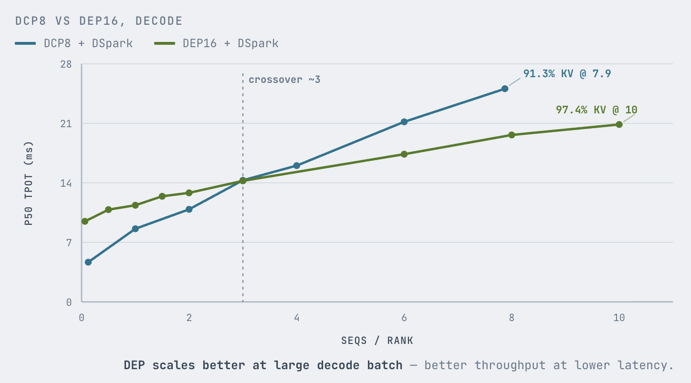

图8 给出的交叉点在每 rank 约 **3** 条序列：batch 更小的时候 DCP8 的延迟更低，越过交叉点之后 DEP16 一路领先，最终在每 rank 10 条序列处达到 97.4% KV 占用（DCP8 止步于 7.9 条 / 91.3%）。

### 4.4 DeepSeek V4：TP 为什么失效

DeepSeek V4 的 KV 同样是 MLA 风格、在 TP 下会被复制；更关键的是它的压缩稀疏注意力让 TP 的头切分计算上不划算，原文给了三条理由：

1. **压缩器路径每个压缩位置只产出一份共享 KV 表示**，而不是每个头各自独立的状态。于是 TP 无法沿 KV 头维切分计算，每个 rank 都把压缩器的工作重复一遍。
2. **indexer 虽然有 64 个头，但每 token 只产出一次全局 top-k**。当前 TP 路径因此在每个 rank 上复制整个 indexer——换来的是省掉 top-k 之前的稠密打分归约，代价是工作重复。
3. **稀疏 MLA 的耗时主体是扫描与 gather top-k 的 KV 条目，不是注意力算术**。TP 在每个 rank 上重复这段访存受限的工作，却只在更便宜的头维计算上做了切分。

原文给出的实践结论是：长预填用 **PCP**（prefill 上下文并行，切的是 prompt 序列即 query 张量），把压缩器与 indexer 的工作摊到各 rank，同时让稀疏 MLA 拿到更宽、更利于头局部性的形状——32K prompt 下 PCP8 相对 TP8 有 **2.65 倍** prefill 加速，直接压低 TTFT；但它仍然会复制 decode 侧状态，所以最适合专用 prefill worker。更广的服务条件下 **DEP** 是默认选择，因为它把请求与 decode token 分到各 DP rank、注意力路径完全本地化。DCP 在 DeepSeek V4 上反而不划算，原因见第 7 节。

### 4.5 五条并行策略横向对比

把分散在正文与反例里的结论收进一张表，可以得到本文最有复用价值的一页：

| 策略 | 沿什么切 | 对 MLA 的 KV 复制 | 主要代价 | 在本文中的结论 | 文中的量化证据 |
| --- | --- | --- | --- | --- | --- |
| TP | 头维 | **复制**潜在 KV | 头维被压缩后切分收益低；压缩器与 indexer 工作重复 | Kimi K3 上被 DCP 取代；DeepSeek V4 上计算不划算 | PCP8 相对 TP8 有 2.65× prefill 加速 |
| DCP | 序列维 | 每 rank 只持 1/N | query gather + 部分结果归约，每层通信 | 纯 MLA 与混合 MLA 上有效；DeepSeek V4 上只打平 | DCP8 达 7.9 条序列 / 91.3% KV，同 TPOT 下 2.7× 吞吐；对称内存再省约 13%/层 |
| DEP | 请求与 KV 缓存本身 | 不复制（各 rank 各管各的） | MoE all-to-all 迫使锁步 | 大 scale-up 域上的默认选择；DeepSeek V4 的默认选择 | 交叉点约每 rank 3 条序列，之后反超 DCP8 |
| PCP | prompt 序列（query 张量） | decode 侧状态仍复制 | 只适合专用 prefill worker | DeepSeek V4 长预填的首选 | 32K prompt 下相对 TP8 有 2.65× |
| PP / CPP | 层维 | 不复制 | 预填之间的流水气泡 | **不适配热轮次**，只适合冷且计算密集的预填 | 未给数字，属定性失败结论 |

这张表真正想说的是：**"切 KV"和"切算力"是两件不同的事**。MLA 把头维压掉之后，按头切（TP）失效，必须转向按序列切（DCP/PCP）或按请求切（DEP）。而当模型在 MLA 之上再加压缩器与 indexer 时，CP 需要协调的子层变多、可切性变差，收益从一个"净赚"退化成一个"打平"（DeepSeek V4 的 DCP）。判断某条 CP 值不值得上，可以先数三个数：子层有几个、其中几个可按头切、通信量随 rank 数怎么涨。

### 4.6 算子层：三个模型各自的 kernel 贡献

原文单列一节强调"智能体负载把 kernel 瓶颈推向了长上下文注意力、投机解码与通信"，并给出三个模型的实测收益。这些 kernel 全部开源，部分已被其他开源引擎采用。

| 模型 | 改动 | 实测收益 | 出处 |
| --- | --- | --- | --- |
| MiniMax M3 | CuteDSL 长上下文 indexer | GB300 上 indexer 延迟改善约 3% 至 31%，随形状变化 | PR #48582 |
| MiniMax M3 | upstream 的 MSA top-k 路径 | 最坏情况 kernel 性能最多 4×，AgentX 端到端吞吐约 +7% | 原文未给独立 PR 号 |
| MiniMax M3 | 投机验证路径 | 中等 batch 的 decode 性能约 +20% | 原文未给独立 PR 号 |
| Kimi K3 | GEMM 与 reduce-scatter 融合 | 改善序列并行通信 | PR #52079 |
| Kimi K3 | latent-tail MoE 融合 | 端到端延迟约 −5% | PR #53152 |
| DeepSeek V4 | MXFP4 MoE 与 HCA 压缩、多流 C4A、cluster-based top-k | 社区贡献，未给统一倍数 | PR #43584 / #44230 / #42925 / #43008 |

值得注意的是这些收益的量级与层次。真正落在端到端、且能直接折算成吞吐或延迟的是三项：AgentX 端到端吞吐约 +7%、Kimi K3 端到端延迟约 −5%、中等 batch 的 decode 约 +20%。其余数字（indexer 延迟改善 3% 至 31%、最坏情况 kernel 性能 4 倍）都是 kernel 级或最坏情况口径，不能当成端到端收益。把这个量级与第 5 节要讲的调度旋钮（TPGS +93%）并读，结论很有启发性——不是 kernel 不重要，而是在这类负载上，请求形状的规律性给调度层留下了更大的空间。

---

## 5. 控制面：调度与 P/D 配比

### 5.1 两级调度问题

智能体服务把两类请求混在一起：频繁的 append-only 请求（复用长前缀、只需很短的 prefill）与偶发的长新预填（几万 token）。这造出两个不同层次的调度问题——实例内，长预填会堵住短的交互轮次；DEP rank 之间，预填落点不匀会造成负载失衡。原文用两个互补的旋钮分别处理。

**切断队头阻塞。** 默认的分块预填调度器是先进先出：一个长预填可以连续多步吃掉整个 token 预算，同 rank 上排队的短轮次在它完成前根本排不进来。原文的对策很简单——用 `--long-prefill-token-threshold` 限制单个请求每步最多能调度多少 token。取 512 时，长预填会留出空间让短轮次挤进同一个 batch、更早开始 decode。在 DeepSeek V4 Pro on B300 上，这一个 cap 把 TPGS 最高抬高 **93%**、P90 交互性改善约 **2.3 倍**。代价是长请求自身的 TTFT 变高，所以对 TTFT 敏感的场景应该把阈值调大。

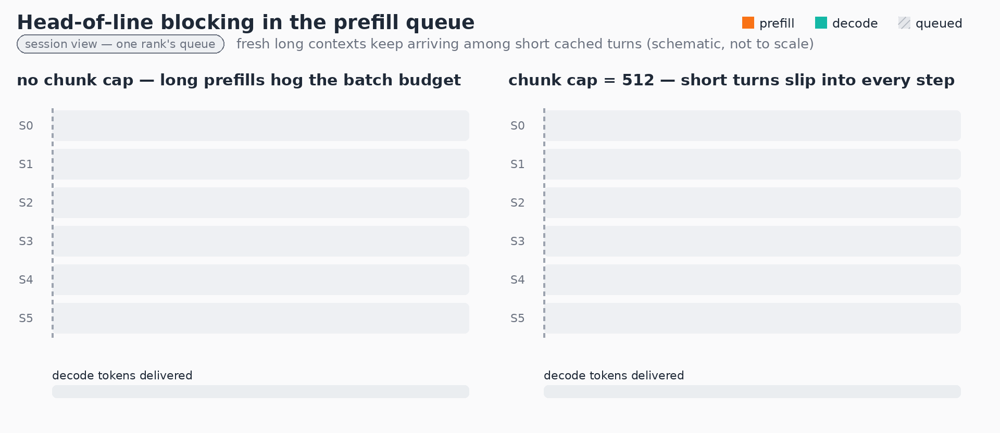

**对齐 DEP 预填节奏。** DEP 引入第二种低效：MoE 的 all-to-all 通信迫使各 rank 锁步推进，因此某个 rank 在跑预填时，整组都被拖慢；当预填在不同 rank 的不同 step 上到达，这个惩罚会被反复支付。对策是把 `--prefill-schedule-interval` 设为只在每第 N 个引擎 step 才接纳预填工作，用一个跨 DP rank 对齐的计数器，把预填集中到相同的 step 上，让剩下的 step 变成纯 decode。图10 展示了 DEP8 组内的节奏对齐。

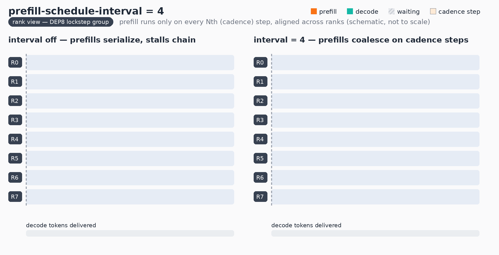

### 5.2 两阶段速率匹配方法

原文明确否掉了一个常见直觉：**更多 GPU 或更多分离不自动改善前沿**。单引擎调优不够，prefill 与 decode 必须被"速率匹配"。方法是标准化的两阶段，且可被智能体工作流自动执行：

- **阶段一：饱和剖析。** 把 prefill-only 与 decode-only 部署分别压测，扫描并行策略（TP 对比宽 EP）与部署规模（8、16、32 卡），逐步提高并发直到吞吐饱和。输出是一张饱和表：每个（并行策略，规模）组合的最大 prefill/decode 请求每秒。
- **阶段二：P/D 扫描。** 用阶段一的饱和点推导每个组合的 P/D 比例，再在合并后的分离部署上扫描并发，收集整个工作区间内的指标。

这套方法的价值不在算法新颖，而在于把一个容易做成"调参玄学"的事情变成了可枚举、可自动化的两阶段流程——对工程落地而言这比任何单点优化都更能复现。

### 5.3 控制面的性价比观察

把第 4 节与本节并读，会得到一个不算舒服但很实在的结论：

- 模型侧最精细的一次改造——把 all-gather、staging、all-to-all、unpack 四个动作用对称内存融进同一个 kernel——换来每层 13%。
- 调度侧一个 cap（`--long-prefill-token-threshold`）换来 TPGS +93%、P90 交互性 2.3 倍；一个对齐计数器（`--prefill-schedule-interval`）解决了锁步组的预填抖动。

差距来自负载的可预测性。智能体流量在形状上高度规律（长前缀 + 短追加 + 固定轮次），这种规律一旦被写进调度器，就能在**不改一行 kernel 的前提下**反复兑现。这也是本文最容易被低估的一条经验。

---

## 6. 结果对比

### 6.1 性能：三模型 × 多硬件

原文在 AgentX 上独立验证，取每个模型中"维持在 P90 交互性高于 50 token/s/user 前提下吞吐最高"的 vLLM 配置。这个 50 的 SLO 是人为选定的，但它是一个偏严格的公共点，便于横比。

| 模型 | GPU 数 / 并发 | TPGS（P90 高于 50 token/s 时） | P90 交互性 |
| --- | --- | --- | --- |
| DeepSeek V4 Pro 1.6T | 12 张 GB300 / 256 | **83K** | 58.3 token/s |
| MiniMax M3 428B | 2 张 B300 / 24 | 70K | **74.2 token/s** |
| Kimi K3 2.8T | 16 张 GB300 / 48 | 11.8K | 62.7 token/s |

TPGS 的口径需要留意：它把**输入、输出与已缓存 token 一起计入**，因此不能与常规的"输出 token/s"类指标直接比较。表中 83K 是 P90 高于 50 token/s 这个 SLO 下的吞吐最高点；原文 TL;DR 中"最高 130K"对应的是更低交互性、更靠成本效率一端的另一个工作点，两者不是同一组配置。

图11 与图12 是同一件事的两种视图：前者是 vLLM 汇总的三模型前沿，后者直接取自 SemiAnalysis 的公开看板，可以看到不同硬件（B200、B300、GB200、GB300、MI355X）与不同并行配置（TP8、TP16、TP8PP2、TP8/DCP8、TP16/DCP16 等）的完整散点。

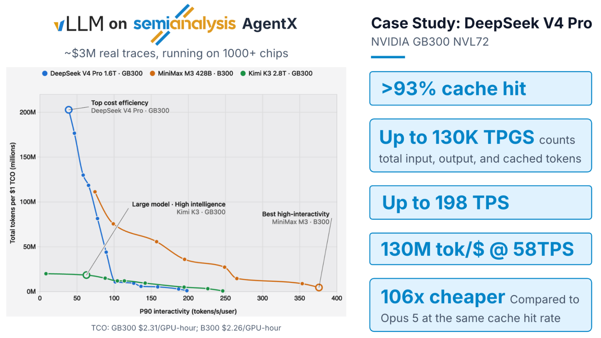

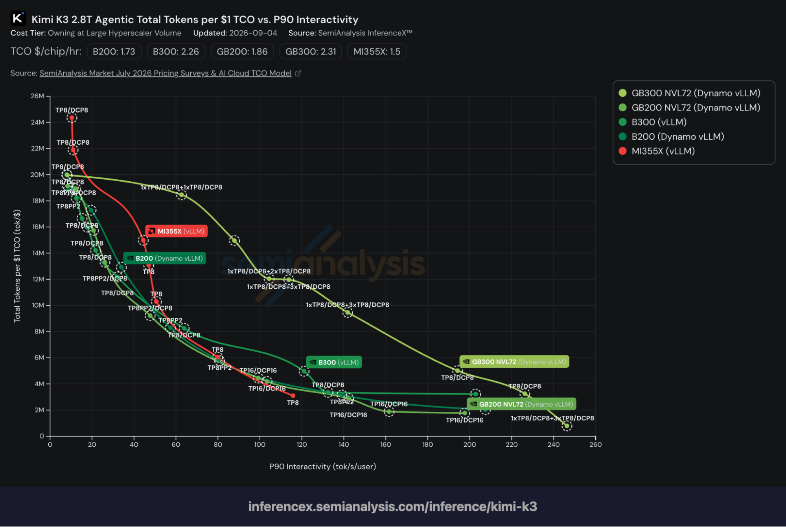

### 6.2 成本：与 Opus 5 API 定价对比

| 模型 | GPU TCO（美元/小时） | 等价 Opus 5 成本（美元/小时） | 成本优势 |
| --- | --- | --- | --- |
| DeepSeek V4 Pro 1.6T | 27.72 | 2,926 | **106×** |
| MiniMax M3 428B | 4.52 | 384 | **85×** |
| Kimi K3 2.8T | 36.96 | 538 | **14.6×** |

原文给出的 Opus 5 口径是：缓存输入按 0.50 美元每百万 token、未缓存输入按 5 美元每百万 token、输出按 25 美元每百万 token 计算，且**假定理论完美缓存命中率**，同时**排除缓存写入费用与长上下文定价溢价**。原文明确承认这套算法"保守且对 Opus 有利"，并声明这是服务成本对比、不涉及模型质量。

### 6.3 交叉验算：两张表彼此自洽，但成本倍数不能读成"每 GPU 效率比"

把两张表与图11 的标注放在一起验算，可以确认它们完全自洽，同时也暴露出一个容易被误读的地方。

先验证 GPU TCO 每小时这一列。图11 标注 GB300 为 2.31 美元/GPU·小时、B300 为 2.26 美元/GPU·小时，于是：12 × 2.31 = 27.72、2 × 2.26 = 4.52、16 × 2.31 = 36.96，三行与表中数字逐位吻合。

再验证"每 1 美元 TCO 能处理多少 token"这一列。定义

$$
R = \mathrm{TPGS} \times N \times 3600 / C
$$

其中 R 是每 1 美元 TCO 可处理的 token 数，TPGS 是每 GPU 每秒总 token 数，N 是 GPU 数量，C 是每 GPU 每小时的 TCO。代入 DeepSeek V4 Pro 得 83,000 × 12 × 3600 / 27.72 ≈ 1.29 亿，正好对上图11 右侧案例卡里"130M token 每美元 @ 58 TPS"的标注；代换成 130K TPGS 则得 2.03 亿，也正好对上该曲线最左端顶点（图中标注为 Top cost efficiency）的纵坐标。这说明图11 的纵轴就是 R 本身，两张表与图是同一套数字的三种呈现。

最后看成本倍数。由定义可知它等于 R 乘以"Opus 5 等效单价"，因此反推三个模型各自的等效单价（本文按表中数字推算）：

| 模型 | 每 1 美元 TCO 的 token 数（推算） | Opus 5 等效单价（美元/百万 token，推算） | 成本倍数 |
| --- | --- | --- | --- |
| DeepSeek V4 Pro 1.6T | 约 1.29 亿 | 约 0.82 | 106× |
| MiniMax M3 428B | 约 1.12 亿 | 约 0.76 | 85× |
| Kimi K3 2.8T | 约 0.18 亿 | 约 0.79 | 14.6× |

**这里的推论比数字本身重要。** 如果三个模型服务的是同一种 token 构成，那么 Opus 5 等效单价应该完全相同、成本倍数应当严格正比于 TPGS。实际推出来的单价在 0.76 至 0.82 之间漂移，说明三次运行实际服务的 token 构成（缓存读、未缓存输入、输出三者的配比）并不一致。因此"Kimi K3 只有 14.6 倍优势"**不能**直接读成"Kimi K3 的每 GPU 效率只有 DeepSeek 的七分之一"——它同时被"单位时间服务的 token 量更少"和"token 构成不同"两个因素放大。真正的分母只有一个：**前缀命中率**。原文反复强调"成本优势来自 96% 以上的缓存命中率"，因为一旦命中率掉下来，成本优势会以接近线性的方式蒸发。

### 6.4 与前作相比，宣称口径变了什么

同系列的前作（2026-05-06，Mooncake Store 集成）与本文相隔四个月，两者的差异几乎覆盖了"研究原型"到"公开可验证平台"的全部跨度。

| 维度 | 前作（2026-05-06） | 本文（2026-09-08） |
| --- | --- | --- |
| 负载来源 | Codex 与 GPT-5.4 在 SWE-bench Pro 上的轨迹，610 条，中位 33 轮 | SemiAnalysis AgentX，价值约 300 万美元的真实智能体编码轨迹，1M 上下文 |
| 负载画像 | 命中率 94.2%，输入输出比 131:1，每轮上下文增长约 2242 token，中位上下文 12K → 80K，轮间延迟中位 5.2 s、P99 81.4 s | 中位 43 轮，中位输入 142K、输出 444（约 320:1），命中率高于 96%，44% 会话含子代理 |
| 模型与配置 | 单模型：Kimi-2.5 NVFP4，1P1D、共 12 张 GB200 | 三模型：DeepSeek V4 Pro、MiniMax M3、Kimi K3，跨 B200/B300/GB200/GB300/MI355X |
| 结果口径 | 相对自身基线：吞吐 3.8×、P50 TTFT 降 46×、端到端降 8.6×，命中率 1.7% → 92.2%；扩展到 60 卡 | 绝对效率与成本：TPGS、P90 交互性、相对 Opus 5 API 定价的 14.6× 至 106× |
| 验证方式 | 自有基准脚本与 artifact 仓库 | 第三方公开基准 + 公开 harness，每个数字链到看板上的一次可复现 run |
| 是否包含失败结论 | 无 | 单列一节讲三条负面结果 |

更值得看的是前作"下一步计划"里四条承诺的兑现情况：

| 前作承诺 | 本文状态 |
| --- | --- |
| 分布式磁盘 offload | 已落地：通过 `standalone-store` 模式把 CPU 池与磁盘层交给外部客户端 |
| 混合模型的 KV offload | 已落地：模型架构对齐 + 间隔式/Marconi 式会话感知保留 |
| 缓存感知路由 | 部分落地：会话粘性路由胜出、与 Dynamo / llm-d 打通；"首轮与第 2 轮以上分流"仍在计划中 |
| 进一步数据通路优化（多节点 NVLink、DualPath 式双路径加载） | 本文未提及，仍未落地 |

这份对照也提示了一个阅读方法：**当一个系统博客开始引用第三方公开基准、并把每个数字链到可复现的 run 时，它的宣称重心已经从前作那种"机制有多巧"转向"效果能不能被外部核验"**。代价是细节密度下降——四个月前那种逐层讲 GPUDirect RDMA、SM-free 传输的篇幅，在本文里被压缩成了几句话。

---

## 7. 反例：三条负面结果

原文用一整节写"失败"，并且给的不是"这条路很难"这类含糊表述，而是可复述的机理解释。这三条对读者的价值高于任何一条正面收益。

| 直觉 | 实测结果 | 原文给出的机理 | 教训 |
| --- | --- | --- | --- |
| PP（含 CPP）通用，能靠流水线提吞吐 | 在热轮次上无效 | 大部分智能体轮次已有系统提示与历史轮缓存，每轮新增只有几百到几千 token，新计算不足以填满流水线，气泡吃掉大部分潜在收益 | PP 对"冷且计算密集"的预填有效，但不应是"热且前缀密集"轮次的默认 |
| DCP 在 MLA 上有效，迁移到 DeepSeek V4 也应有效 | 投入大量通信–计算重叠与 kernel 优化之后，**只追平 DEP，从未反超** | DeepSeek V4 的压缩稀疏注意力含 indexer、额外压缩器与主注意力三层，CP 必须对全部子层做划分与协调，通信与实现复杂度大幅上升 | 并行策略必须服从模型架构；在一种潜在注意力模型上成功的策略不保证可迁移 |
| 按队列深度、运行 token 数或 KV 占用率做负载均衡，应优于固定路由 | 三种均衡策略**全部**输给简单的会话粘性路由 | 智能体会话轮间延迟很短，下一轮往往在原卡上仍然驻留着前缀。把会话搬到负载更轻的 rank 会强制取回 KV；取回虽异步且与计算重叠，但并非免费，预取块还会临时占用目标卡的 KV 容量，反而降低它能接纳的序列数 | 对短轮间延迟的负载，保住会话局部性比瞬时负载均衡更值钱；路由必须看 worker 上"已有什么状态"，而不只是"排了多少活" |

第三条最反直觉，也最有普适性：它把一个通常被当作纯工程问题的"路由"重新定义成了**状态放置问题**。原文的措辞是"系统可以达到更均衡的队列，但同时处理的并发请求更少"——均衡的是一个二阶指标，损失的是吞吐。

---

## 8. 总结

**一、并行策略的有效性由"KV 能不能切、子层多不多"决定，而不是由卡数决定。** MLA 把头维压成一路潜在表示之后，按头切（TP）会退化成复制；必须转向按序列切（DCP、PCP）或按请求切（DEP）。而当模型在 MLA 之上再叠压缩器与 indexer，CP 需要协调的子层变多、可切性变差，收益从"净赚"退化为"打平"——DeepSeek V4 的 DCP 就是这条规律的实测反例。判据可以量化为：CP 的净收益约等于它省下的 attention 时间减去子层协调通信，子层越多、越不可切，收益越低。

**二、本文真正的主线是"把会话结构显式编码进缓存与路由"，而不是任何单点优化。** 三个正面机制——间隔式保留、Marconi 式选择性保留、会话粘性路由——都在利用同一件事：智能体请求不是独立的，而是属于一个有轮次、有分叉、有生命周期的会话。反面参照正是"按瞬时负载做负载均衡"：一个在直觉上更公平的策略，实测全面落败。这条主线的可迁移性最强，因为它不依赖具体硬件。

**三、调度层的旋钮是本文性价比最高的一类改动。** 一个 512 token 的 cap 换来 TPGS +93% 与 P90 交互性 2.3 倍；一个跨 rank 对齐计数器解决了锁步组的预填抖动。相比之下，模型侧最精细的对称内存融合换来的是每层 13%。差距来自智能体负载的高度可预测性——规律一旦被写进调度器，就能在不改 kernel 的前提下反复兑现。

**四、公开可核验的负面结果，是这篇文章最稀缺的资产。** PP 在冷预填上有效但在热轮次上无效、DCP 在纯 MLA 上有效但在 DeepSeek V4 上只打平、负载均衡在原理上正确但在缓存局部性面前失效——三条失败指向同一个判据：局部最优不等于全局最优，端到端测量是唯一裁判。这也解释了为什么验证放在第三方公开基准上、且每个数字都链到一次可复现的 run。

**五、成本数字要打折读，但方向可信，且真正的杠杆只有命中率一个。** 14.6 倍到 106 倍这个区间里，分子（Opus 5 等价成本）带有"完美缓存命中、排除缓存写入与长上下文溢价"的有利假设，分母（GPU TCO）是"大规模自持硬件"口径。但决定数量级的不是硬件单价，而是 96% 以上的前缀命中率。同时，三个模型之间的成本倍数差额里混着"token 构成不同"这一项，因此不能把 14.6× 与 106× 直接读成每 GPU 效率之比。

---

## 10. 原文资源

- 原文：vLLM 官方博客，2026-09-08，作者 vLLM Team 与 Inferact，标签为 agentic、kv_cache、parallelism、large-scale-serving、disaggregation、performance
- 基准：SemiAnalysis AgentX，`SemiAnalysisAI/agentx-harness`；全部结果可在 InferenceX 看板上按模型与配置复现
- 前作：`2026-05-06` 的 Mooncake Store 集成；文中另引用 `2026-07-27` 的 Kimi K3 博客与 `2026-08-07` 的 decode 上下文并行博客作为细节来源
- 主要 PR：KV 布局 #44577 / #48993；会话感知保留 #43447 / #47782；offload 性能 #46188 / #45444 / #45659 / #47317；kernel 贡献 #48582 / #52079 / #53152 / #43584 / #44230 / #42925 / #43008
- 关键配置项：`--long-prefill-token-threshold`、`--prefill-schedule-interval`
